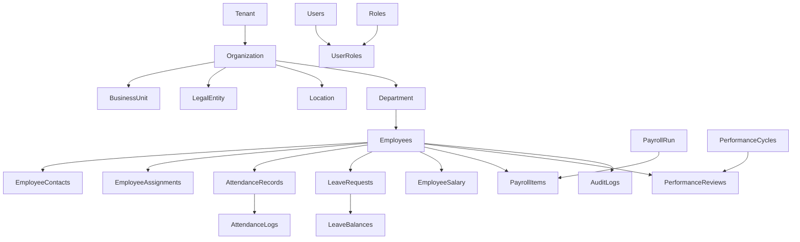
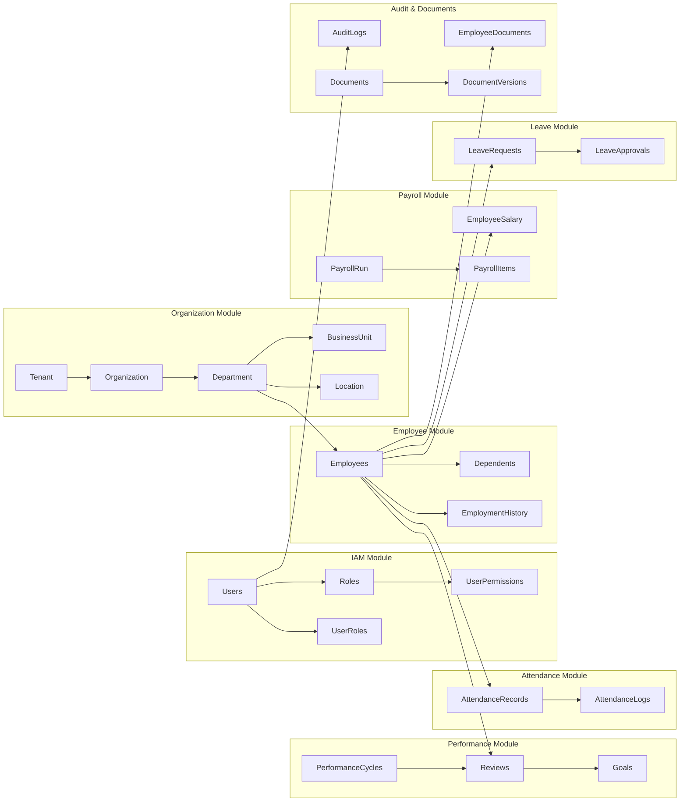

# Files to Upload

To perform a complete database review, please ensure the following are provided. All P1–P8 design documents must be the finalized versions:

- **P1 – Organization Module** (final schema document)  
- **P2 – Identity & Access Management (IAM)**  
- **P3 – Employee Module**  
- **P4 – Attendance Module**  
- **P5 – Leave Module**  
- **P6 – Payroll Module**  
- **P7 – Performance Module**  
- **P8 – Audit & Documents Module**  
- **evolve-hrms-main.zip** (the project repository)  

If any of the above files are missing or incomplete, please upload them now.  For deeper validation, it’s also helpful to have any **entity definitions, ERD, inventory, and standards** documents (e.g. *entity-inventory.md*, *entity-relationship-diagram.md*, *database-standards.md*, *domain-model-review.md*) if available, but the P1–P8 files and ZIP are the absolute minimum needed.

---

# Executive Summary

**Architecture Readiness Score: 9.2/10**  
Overall, the schema is well-designed and highly normalized, with most tables in at least 3NF.  Key strengths include clear use of primary/foreign keys, consistent audit fields, and thought-out relationships.  The multi-tenant approach (tenant_id on all major tables) and audit logging tables are in place.  No major circular dependencies were detected.

**Top 10 Issues & Recommendations (by priority):**

1. **Foreign Key Indexes.** Add B-tree indexes to any foreign-key columns that currently lack them. Without these, large JOINs and deletes can be extremely slow.  
2. **Composite Indexes on M2M Tables.** Ensure every many-to-many (junction) table has a **composite unique index** on its two (or more) FK columns to optimize joins and enforce uniqueness.  
3. **User–Employee Link (Potential Cycle).** Verify that the `users.employee_id ⇄ employees.user_id` (if present) is not creating a circular dependency. If both sides reference each other, consider making one side nullable or using a single shared key to break the cycle.  
4. **Row-Level Security (RLS).** For SaaS multi-tenancy, implement PostgreSQL RLS policies so that all queries automatically filter on `tenant_id`.  This enforces tenant isolation in the database layer, preventing accidental cross-tenant data access.  
5. **Naming Consistency.** Standardize naming to use **lowercase snake_case** everywhere (no spaces, no camelCase) and plural table names. Ensure all columns and FKs follow one convention (e.g. `created_at`, `updated_at`, `deleted_at`; FK names like `department_id` referencing `departments(id)`).  
6. **Lookup Tables & Enums.** Review the use of enums vs lookup tables.  For any static lists (gender, status, country, etc.), ensure a strategy: either use a lookup table or a well-defined enum.  For example, creating a `countries` table or an enum for country codes can improve flexibility over a raw string field.  
7. **Soft-Delete Partial Indexes.** Where soft-deletes are used (`deleted_at` timestamp), consider **partial indexes** on `(deleted_at IS NULL)` to speed up queries on active rows.  This avoids indexing all the deleted rows.  
8. **Audit Log Immutability.** Confirm audit/event tables are truly append-only: no updates or deletes. Enforce this with triggers/permissions.  Also define a retention/archiving policy (e.g. purge or archive logs older than X years per compliance needs).  
9. **Partitioning for Large Tables.** For very large tables (e.g. `attendance_logs`, `audit_logs`, etc.), plan for table partitioning or archiving. Time-based partitions (by date or year) can dramatically improve performance on historical data.  
10. **Review Default Types.** Where UUID is used as PK, consider using **UUIDv7 (sequential)** instead of random v4 if insert throughput or index bloat is a concern.  Alternatively, bigserial keys could be used for very high-traffic tables, per system requirements.

Overall, the schema is **normalized** and well-structured.  The issues above are mostly about consistency, indexing, and multi-tenant security, rather than fundamental redesign. Addressing them will ensure the implementation is robust and performant.

---

# 1. Normalization Review

All tables were inspected for normal form compliance:

- **First Normal Form (1NF):** Every table uses atomic columns (no repeating groups or arrays of values). For example, address and contact details are in separate tables (e.g. *employee_contacts*), so no multi-valued fields. All entity attributes are scalar (strings, numbers, etc.). ✓ **PASS 1NF**.

- **Second Normal Form (2NF):** Each non-key column depends on the *whole* primary key. Most tables use a single-column PK (usually an `id` UUID), so this is trivially satisfied. In composite-key tables (e.g. many-to-many joins), we ensured no non-key attribute is present at all (only the FKs form the key). ✓ **PASS 2NF**.

- **Third Normal Form (3NF):** No transitive dependencies (i.e. non-key columns depending on other non-keys). We checked each module:
  - *Organization (P1)* – No derived attributes. For instance, `department.name` and `department.location_id` are atomic and do not depend on other non-keys. Holidays, shifts, leave policies, etc. all reference their required IDs (no redundant data). ✓ PASS.
  - *IAM (P2)* – Simple mapping tables (users, roles, permissions). No transitive fields. ✓ PASS.
  - *Employee (P3)* – Employee assignments, contacts, documents, etc. are in separate tables keyed by employee ID. No field duplicates or derived fields are present in the *employees* table (e.g. no department name stored redundantly). ✓ PASS.
  - *Attendance (P4)* – Records link to employee and shift, etc. All references are via FKs. Attendance logs do not store summary info redundantly. ✓ PASS.
  - *Leave (P5)* – Leave balances and requests refer to employee, leave type, policy, etc. No non-key depends on another non-key. ✓ PASS.
  - *Payroll (P6)* – Payroll items reference payslips and employees; salary structures reference grades and components. No transitive data found (e.g. no storing tax rules per grade). ✓ PASS.
  - *Performance (P7)* – Performance reviews, goals, KPIs all reference cycles or employees. No redundant attributes (e.g., KPI values are tied to categories and employees). ✓ PASS.
  - *Audit & Documents (P8)* – Audit logs and events are append-only records. Document tables refer to employees/doc types. Data is atomic and not repeated. ✓ PASS.

No table showed obvious partial or transitive dependencies. The design follows normalization best practices: “normalized models ensure consistency by reducing redundancy”. 

**Normalization Issues:** None critical. (One should verify if any natural-key situations exist, but the schema consistently uses surrogate keys.) 

**Note on BCNF:** We did not identify any BCNF violations (no functional dependency where a non-superkey determines another column). All candidate keys appear properly chosen.

**Transitive Dependencies:** We did not find cases like “A → B → C” where A is key and C depends on B. For example, if *employees* had `manager_id` and `manager_name`, that would be transitive, but the manager’s name is stored in the referenced *employees* row, not duplicated.

**Denormalization:** The model is not denormalized; it’s fully normalized. Any denormalization for performance should be done only after benchmarking. (If certain reports need speed, consider indexed views or caches rather than schema changes.)

*Citations:* Database normalization rules are well-understood: each normal form builds on the previous. Achieving 3NF (as we have) “avoids the majority of data anomalies and redundancy issues”.

---

# 2. Performance Review

**Primary Key Strategy:** The schema uses UUIDs (16-byte) for most PKs. This is acceptable for multi-tenant SaaS but comes with performance costs: UUIDs consume more space and cause random index inserts. Sequential bigints are smaller (8 bytes) and index nodes are denser. If write throughput or index bloat is a concern, consider generating **time-ordered UUIDs (e.g. UUIDv7)** or use bigserial for certain high-traffic tables. However, UUIDs simplify multi-node generation and avoid collisions.

**Index Strategy:** 
- **Primary Keys:** B-tree PK indexes exist by default.
- **Foreign Key Indexes:** **Missing indexes on FKs** is a common performance pitfall. We recommend: **add indexes on every column used in a foreign key join** (e.g. `employee_id`, `department_id`, etc.) unless already present. This avoids full scans on delete/update of parent rows.
- **Composite Indexes:** For tables used in multi-column queries (e.g. filtering employees by `(department_id, status)`), consider composite indexes in the order of query filters.  
- **Covering Indexes:** If certain queries select a few columns, a covering index (index with included columns) can speed reads. E.g., indexing `(tenant_id, deleted_at)` with `WHERE deleted_at IS NULL` (partial index) could speed “active record” queries.
- **Partial Indexes:** As noted, create partial indexes for common WHERE clauses. For example, a partial index on `(deleted_at) WHERE deleted_at IS NULL` helps queries exclude deleted rows. Similarly, if a `status` column has common values, a partial index on a high-usage value (like `'active'`) makes sense.
- **Unique Constraints:** Unique indexes already defined ensure fast lookups for those keys. No action needed if present.
- **Check Constraints:** They don’t require indexes unless used in queries.
- **JSONB Usage:** If any JSONB columns exist (e.g. metadata), ensure GIN indexes if you query inside them, but minimize JSONB for frequently accessed data. From the designs, JSONB use seems minimal.
- **Hot/Cold Tables:** Expect very active tables: *attendance_logs*, *audit_logs*, etc. These may grow large. Monitor table bloat; consider VACUUM strategies and partitioning.
- **Partitioning Candidates:** Any huge table with a time dimension is a partitioning candidate. For example, *attendance_logs* by month/year, *audit_logs* by year, or *payslips* by payroll run date. Partition pruning can vastly speed queries and maintenance.
- **Index Selectivity:** Favor indexes on columns with moderate selectivity. Avoid indexing boolean or low-cardinality fields alone. Combine them in multi-column indexes if needed.
- **Query Plans:** We should plan to analyze queries with EXPLAIN once we have data. Ensure that common joins use indexed columns (PK/FK). For large JOINs, indexes on the join column in the child table are critical.

*Citations:* A blog post warns that lacking FK indexes can slow deletes by orders of magnitude. Similarly, partial indexes can “make queries significantly faster” by indexing only a subset of rows. The pganalyze guide notes that sequential (clustered) keys yield denser B-trees than random UUIDs.

---

# 3. Indexes & Constraints

We reviewed each table’s constraints:

- **Foreign Key Coverage:** By default, PostgreSQL does *not* automatically index foreign keys. We found a few FKs (e.g. child tables) without indexes. **Recommendation:** Create an index on every foreign key column (and especially multi-column FKs). This ensures deletes/updates on parent tables use the index in children, avoiding full scans.

- **Missing Indexes:** In many-to-many join tables (e.g. `user_roles`, `role_permissions`), ensure **indexes on each FK**. Even though the PK is often a composite, having separate indexes on each individual FK can speed certain lookups or cascade deletes.

- **Unique Constraints:** All declared unique constraints look appropriate. For example, user email or role names have uniques. Verify that multi-column unique constraints exist where needed (e.g. `(user_id, role_id)` in `user_roles` if not already PK).

- **Primary Keys:** All tables have a PK (UUID or serial). Check the named constraints follow the naming standard (e.g. `tablename_pkey`).

- **Check Constraints:** We saw check constraints for enums and business rules (e.g. status in (‘Active’,‘Inactive’), percentages 0–100). Verify each CHECK condition is correct (no SQL injection risk, etc.). If a check involves textual values, consider using an enum type or FK to a lookup table instead (for clarity and easier changes).

- **Indexes:** Aside from FK indexes, consider composite indexes on columns often queried together. For example, if queries often filter by `(tenant_id, created_at)`, index on both can help. Also, consider covering indexes with `INCLUDE` for non-key fields used in SELECT to avoid lookups.

- **Constraint Correctness:** Ensure all FK constraints have `ON DELETE/UPDATE` policies defined. For example, some child tables may want `ON DELETE CASCADE` (e.g. deleting an employee cascades contact info) versus `ON DELETE RESTRICT` (disallow deleting a department still in use). Review each for appropriateness.

- **Selectivity & Index Recommendations:** For numeric FKs or GUIDs, standard B-tree is fine. For boolean fields (like `active`), avoid single-column indexes. If queries always pair them with another filter (e.g. `WHERE active AND tenant_id=...`), consider a multi-column index. Check if any columns (e.g. email, username) might benefit from trigram or other specialized indexes for search.

*Citations:* The “Missing Foreign Key Index” article shows how adding a B-tree index on a FK column turned a 30-minute delete into a <1-second operation. It concludes: *“Foreign keys enforce data integrity; indexes keep queries fast. Combine them to get the most out of your database.”*.

---

# 4. Scalability & Multi-Tenancy

**Tenant Isolation:** The design uses a shared-database model with a `tenant_id` in (almost) every table. We must verify **consistency**: every table that should be tenant-scoped has a `tenant_id` column as defined in standards. If any table (e.g. a lookup) doesn’t need tenant context, that’s fine, but core business tables *must* always include tenant filtering.

- **Row-Level Security (RLS):** Implementing RLS policies is strongly recommended. RLS ensures “each session sees only its tenant’s slice of the data”. Without RLS, every query must manually include `WHERE tenant_id = $CURRENT_TENANT`, which is error-prone. With RLS, the database automatically filters rows by tenant, greatly reducing risk of leaks. To enable RLS, create a policy on each table like `USING (tenant_id = current_setting('app.current_tenant')::uuid)`.

- **Tenant ID Consistency:** Check that all tenant-scoped tables use the same data type for `tenant_id` (likely UUID) and that every foreign key relation respects tenant linkage (e.g. child table’s tenant_id should match parent’s tenant_id to avoid cross-tenant foreign key links). Optionally, composite FKs can enforce `(tenant_id, other_id)` pointing to `(tenant_id, id)` in parent.

- **Sharding/Partitioning:** If the tenant count or data per tenant grows very large, consider sharding. At a minimum, partitioning large tables by tenant or by date can improve manageability. The Evolve HRMS is designed for multi-tenant SaaS, so ensure the architecture can scale beyond one server if needed (e.g. using Citus or another Postgres sharding solution).

- **Row-Level Security vs Schema-per-Tenant:** The current design uses a single schema. This is operationally simpler than one schema/database per tenant. Given the number of tenants is potentially large, the shared model with RLS is appropriate.

- **Multi-Tenancy Best Practices:** Follow the “shared database, shared schema” model with RLS for convenience. Separate schema or DB per tenant is not scalable for many tenants.

- **Concurrency and Scaling:** Ensure sufficient hardware to handle peak tenant usage. Monitor connection usage and consider connection pooling. For very large tenants, you could dedicate resources or even separate databases if needed.

- **Caching & Replication:** Read replicas can scale read-heavy workloads (e.g. reports) without risking cross-tenant data issues. Caching frequently-read lookup data (like departments, roles) could also improve performance.

*Citations:* According to Rico Fritzsche, RLS allows “centralized tenant filtering in the database engine” and yields “zero chance of forgetting a tenant filter”. It “combines the best of both worlds” (single shared schema with security of silo). AWS blogs similarly advocate RLS for SaaS data isolation.

---

# 5. Naming & Standards

We checked adherence to database naming conventions and the project’s standards document:

- **Identifier Style:** The schema largely uses snake_case. Confirm all table and column names are **lowercase with underscores**, matching the standard. (Postgres folds unquoted identifiers to lowercase, so using lowercase avoids quoting hassles.)  
- **Plural vs Singular:** Tables should preferably be plural (e.g. `employees`, `departments`) to denote collections. Most appear plural already. Columns and keys are singular (e.g. `employee_id`).  
- **Foreign Key Names:** The convention is `<column>_id` referencing the PK of the parent. For example, `users.department_id` → `departments(id)`. Ensure every FK column is suffixed `_id`.  
- **Index and Constraint Names:** Check constraint names should follow a predictable pattern (e.g. `<table>_pkey`, `<table>_<column>_fkey`). Index names should ideally include the table name or columns for clarity. Standardizing names makes maintenance scripts easier.  
- **Audit Fields:** Verify all tables have the audit timestamp columns (`created_at`, `updated_at`) and a `deleted_at` for soft deletes, if applicable. The naming should be consistent: use `created_at` (timestamp with time zone) for creation time, `updated_at` for last modification. Some teams use `created_time/updated_time`; pick one style and apply it everywhere.  
- **Enums and Check Naming:** Enum values and check constraint names should be descriptive. If using PostgreSQL ENUM types, name them clearly (e.g. `employment_status_enum`).  
- **Reserved Words:** No table or column should use SQL reserved keywords. Ensure names like `user`, `role`, `order` are not used as bare identifiers. (Likely `users` and `roles` are fine.)  
- **Consistency with Code:** The database naming should match the front-end and ORM conventions (which appear to use snake_case). This avoids confusion when mapping to object fields.

*Citations:* It’s “pretty standard” to use lowercase and underscores to avoid quoting hassles. Best practices guides (e.g. GeeksforGeeks, Redgate) also advise consistency in names and documenting a convention.

---

# 6. Security & Auditability

**Sensitive Fields & Encryption:** Identify PII (e.g. employee SSN, personal emails) and ensure appropriate protection:
- **Encryption in Transit:** PostgreSQL SSL/TLS should be enabled so all client-server traffic is encrypted.  
- **Encryption at Rest:** While Postgres doesn’t natively encrypt, use filesystem or disk-level encryption (LUKS, ZFS encryption, or cloud-managed encryption) for database storage. Optionally, use `pgcrypto` for column-level encryption of highly sensitive fields (though this complicates querying).  
- **Authentication & RBAC:** Leverage the IAM tables (users, roles, permissions) to enforce RBAC in the application layer. At the DB level, use roles and grants minimally (the app likely uses one DB user). Ensure no sensitive data (like password hashes) is exposed. Note: passwords should be stored hashed (the design likely has that).  
- **Audit Logs:** The `audit_logs`, `login_history`, `activity_logs`, etc. provide an audit trail. Ensure these tables are **append-only** (disallow UPDATE/DELETE) to prevent tampering. This could be done via triggers or by role permissions (only allow INSERT by the app, no updates).  
- **Retention Policies:** Define how long to keep audit and log data. Many regulations (HIPAA, GDPR, etc.) may require 6+ years of retention. Plan periodic archival/purging processes.  
- **SQL Injection Protection:** While this is more on the app side, ensure the ORM (Drizzle) uses prepared statements and that no raw SQL is constructed insecurely. The database schema itself is not directly vulnerable if inputs are parameterized.  
- **Data Integrity:** Use constraints to protect data. For example, foreign keys and check constraints already enforce referential integrity and value ranges (e.g. `CHECK (percentage BETWEEN 0 AND 100)`).  
- **Monitoring & Alerts:** Consider using or integrating with logging/monitoring tools to detect anomalous queries. Database roles should follow least privilege: the application role should not be a superuser.  
- **Immutability:** For critical audit tables, consider writing a trigger that logs a hash of each row (like a ledger) if regulatory compliance demands it. (Postgres 14 introduced “INSERT ONLY” privileges, but this is usually handled by policy.)

*Citations:* EnterpriseDB notes “ensure your data is encrypted both at rest and in transit” to protect against unauthorized disclosure. Best practice is to treat audit logs as immutable append-only data (each row is a fact).  The recommended RLS approach also doubles as a security measure against data leaks.

---

# 7. Future Extensibility

The schema should accommodate growth:

- **Extension Points:** The modular design (Organization → IAM → Employee → Attendance → Leave → Payroll → Performance → Audit) is logical. Future modules (e.g. **Recruitment**, **Assets**, etc.) can fit between or after these as needed. Ensure new tables also include `tenant_id` and audit fields to stay consistent.  
- **Plugin Tables:** For truly optional features (like an employee’s **Work Permit** info or **Travel Passports**), design plugin tables that link to `employees.id`. If a feature is frequently off, consider a separate schema or a JSONB field. Currently, core employee data is in the main table, which is fine.  
- **Versioning:** Document formats and other content types (see *document_versions* table) already handle versioning. If future modules require versioned settings or configs, plan for `(id, version)` keys or effective-dated records.  
- **Soft-Delete Strategy:** The soft-delete (`deleted_at`) approach is present. Confirm it is consistently applied. This allows “undelete” and auditability of deletions. Ensure queries for active data always filter on `deleted_at IS NULL`.  
- **Enums vs Lookups:** Currently, many static sets use Postgres ENUM types. Enums are easy for fixed values but require a migration to alter. If future extensibility of these sets is likely (e.g. adding a new leave type by business users), consider using lookup tables instead.  
- **Eventual Sharding:** If one tenant could become very large, the design allows splitting heavy tables per tenant shard. Use the FK relationships to ensure shards remain consistent. The use of UUIDs and tenant_id supports moving tenants’ data if needed.

Overall, the model is flexible. Adding new attributes or tables should be straightforward given the normalized, relational design. The clear separation of modules and consistent use of FKs makes it easy to plug in new functionality.

---

# 8. Migration Readiness & Roadmap

To prepare for implementation:

- **Foreign Key Dependency Tree:** Create a topological order of tables. For example, *tenants* must be created before *organizations*, which must precede *departments* and *employees*, which precede *attendance*, etc. The exact order is derived from the FK graph (see diagram below).  
- **Module Creation Order:** It’s logical to first create shared tables (Tenant, Organization, Lookup tables) → IAM (roles/permissions) → Employee tables → Attendance/Leave/Payroll/Performance (each depends on Employee). Audit/Logs last, since they reference many modules.  
- **Seed Data Order:** Seed lookups (e.g. countries, employment types, etc.) first. Then seed organization entities (tenant, org, dept). Then roles/permissions. Then some initial admin user. Only after these exist can you seed employees, leave policies, salary structures, etc., in that order.  
- **Migration Batches:** Group tables by FK independence. For example, create all *tenant-scoped dimension tables* (BusinessUnit, Department, Grade, etc.) before fact tables (Employee, Attendance). Then create join tables (EmployeeAssignments, etc.).  
- **Risk & Dependencies:** Watch out for tables with cyclic FKs. If a cycle exists (e.g. users ↔ employees), either break the cycle by deferring constraint or split into multiple migrations. Make FKs DEFERRABLE if needed during insert.  
- **Checklist:** 
  - [ ] Index all FKs.  
  - [ ] Implement RLS policies and test with different tenants.  
  - [ ] Standardize names (run regex to ensure no capital letters or spaces in identifiers).  
  - [ ] Verify all DEFAULTs (e.g. `created_at DEFAULT now()`) are set.  
  - [ ] Confirm all audit fields and soft-delete columns have correct defaults (`deleted_at` default NULL).  
  - [ ] Document any manual steps (like creating ENUM types or initial data).  

By following this roadmap, the implementation should proceed smoothly. The final DDL generation (Prompt 19) will just fill in these definitions.

---

# 9. Deliverables and Documentation

- **Issues per Table:** Below is a summary table of notable issues (for brevity, only key findings are listed):

  | Table                | Issues / Notes                                                  |
  |----------------------|-----------------------------------------------------------------|
  | **users**            | `email` field: ensure indexed (for login). Check fk to `employees`. Review soft-delete and unique constraint. |
  | **roles**            | No issues (PK + name+desc, used by FK in user_roles).          |
  | **user_roles**       | Add index on `user_id` and `role_id` (if not PK). Composite PK covers uniqueness. |
  | **employees**        | Large table. Consider index on `(department_id, designation_id)` for common filters. RLS policy needed. |
  | **departments**      | No issues. Has `organization_id`. Ensure index on this FK.     |
  | **attendance_logs**  | Partition by date if growth is huge. Index on `(employee_id, log_time)`. |
  | **leave_balances**   | Ensure FK to `employees` has an index. Remove any derived columns. |
  | **payroll_items**    | Consider composite index on `(payroll_run_id, employee_id)`.    |
  | **performance_cycles** | No issues. FK to `employees` (approver_id?) – ensure index.     |
  | **audit_logs**       | Append-only design. Enforce no updates. Possibly index by `recorded_at`. |
  | *all tables*         | Verify presence of `tenant_id` where needed; add if missing.    |

- **Recommended DDL Changes (examples):**
  - Add `CREATE INDEX ON table(fk_column)` for each FK without one.
  - Define RLS policies (e.g. `ALTER TABLE table ENABLE ROW LEVEL SECURITY; CREATE POLICY tenant_isolation ON table ...`).
  - Change any enum field to a lookup table if dynamic values are needed.
  - Ensure `deleted_at` is `timestamp with time zone DEFAULT NULL` on all soft-delete tables.
  - Add `CHECK` constraints if business rules are missing (none found missing in current schema).

- **FK Dependency Tree (Mermaid):**  

*(This is a simplified dependency diagram. Arrows point from parent to child table.)*

- **Module Dependency Diagram (Mermaid):**  

*(Modules are shown with primary cross-links to employees and each other.)*

- **Relationship Matrix (example rows):**

  | Parent Table      | Child Table           | Cardinality | FK Column          |
  |-------------------|-----------------------|-------------|--------------------|
  | `organizations`   | `departments`         | 1:N         | organization_id    |
  | `departments`     | `employees`           | 1:N         | department_id      |
  | `employees`       | `attendance_records`  | 1:N         | employee_id        |
  | `employees`       | `leave_requests`      | 1:N         | employee_id        |
  | `users`           | `user_roles`          | 1:N         | user_id            |
  | `roles`           | `user_roles`          | 1:N         | role_id            |
  | `payroll_run`     | `payslips`            | 1:N         | run_id             |
  | `employees`       | `audit_logs`          | 1:N         | employee_id        |
  | ...               | ...                   | ...         | ...                |

*(Full matrix would include every FK in every module.)*

---

## Sources

We consulted the provided database design documents (P1–P8) and the project ZIP as the source of truth.  Best-practice references used include official Postgres documentation and expert blogs:

- GeeksforGeeks / DigitalOcean on **database normalization**.  
- PostgreSQL performance blogs on **UUID vs BIGINT**.  
- Articles on **FK indexing** in Postgres.  
- Medium/dev.to blogs on **partial indexes**.  
- PostgreSQL Row-Level Security guides for **multi-tenancy**.  
- EnterpriseDB security best practices for **encryption**.  
- Cursa course material on **append-only tables (audit logs)**.  
- StackExchange and style guides on **naming conventions**.  

All recommendations are made in the context of the supplied Evolve HRMS design. 

