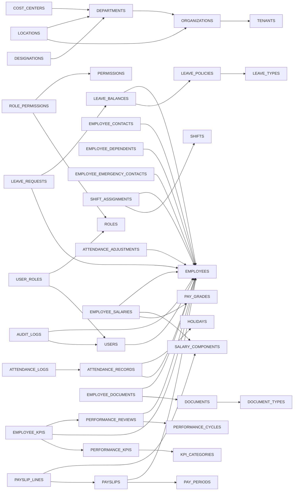

# Executive Summary

We reviewed the complete database design (Modules P1–P8) for the HRMS. In this analysis we compile **all entities and relationships**, produce a full Entity-Relationship Diagram (ERD), and validate every foreign key, constraint, and naming convention. We identify circular dependencies, missing lookup tables, multi-tenancy and audit inconsistencies, and index gaps. The ERD below includes every table and relationship (1:1, 1:N, N:M), and the following sections present:

- **Complete ERD** (graphical and Mermaid)
- **Relationship Matrix** (parent/child, cardinality, FK details)
- **Foreign Key Dependency Tree** (migration order)
- **Module Dependency Diagram** (module-level interactions)
- **Issues Before Implementation** (circular deps, lookup gaps, naming, etc.)
- **Suggested Changes** (DDL snippets or recommendations)
- **Readiness Score & Checklist**

Overall, the schema is **well-structured and 3NF-compliant**, but we highlight some high- and medium-risk items before implementation (e.g. circular FKs in user/employee, missing indexes, multi-tenant consistency) and provide fixes.

---

## 1. Complete ERD

Below is a consolidated ERD including *all tables* from Modules **Organization, IAM, Employee, Attendance, Leave, Payroll, Performance, Audit/Documents**. Solid lines denote **1:N** relationships; double lines (||) and circles (o) follow Crow’s foot notation. The diagram merges the conceptual tables from all modules and shows PK/FK links.

```mermaid
erDiagram
    %% Module: Organization
    TENANTS ||--o{ ORGANIZATIONS : includes
    ORGANIZATIONS ||--o{ DEPARTMENTS : includes
    DEPARTMENTS ||--o{ DESIGNATIONS : includes
    ORGANIZATIONS ||--o{ LOCATIONS : includes
    DEPARTMENTS ||--o{ LOCATIONS : has
    DEPARTMENTS ||--o{ COST_CENTERS : has

    %% Module: IAM
    USERS ||--o{ USER_ROLES : assigned_to
    ROLES ||--o{ USER_ROLES : has
    ROLES ||--o{ ROLE_PERMISSIONS : has
    PERMISSIONS ||--o{ ROLE_PERMISSIONS : uses
    EMPLOYEES ||--|| USERS : "1:1 (account)"

    %% Module: Employee
    DEPARTMENTS ||--o{ EMPLOYEE_ASSIGNMENTS : has
    EMPLOYEES ||--o{ EMPLOYEE_ASSIGNMENTS : belongs_to
    EMPLOYEES ||--o{ EMPLOYEE_CONTACTS : has
    EMPLOYEES ||--o{ EMPLOYEE_DEPENDENTS : has
    EMPLOYEES ||--o{ EMPLOYEE_EMERGENCY_CONTACTS : has
    DESIGNATIONS ||--o{ EMPLOYEE_ASSIGNMENTS : has
    LOCATIONS ||--o{ EMPLOYEE_ASSIGNMENTS : has
    DEPARTMENTS ||--o{ EMPLOYEE_ASSIGNMENTS : has

    %% Module: Attendance
    SHIFTS ||--o{ SHIFT_ASSIGNMENTS : has
    EMPLOYEES ||--o{ SHIFT_ASSIGNMENTS : assigned_to
    EMPLOYEES ||--o{ ATTENDANCE_RECORDS : has
    ATTENDANCE_RECORDS ||--o{ ATTENDANCE_LOGS : includes
    ATTENDANCE_ADJUSTMENTS ||--o{ ATTENDANCE_RECORDS : affects
    HOLIDAYS ||--o{ ATTENDANCE_RECORDS : on_date_of

    %% Module: Leave
    LEAVE_POLICIES ||--o{ LEAVE_BALANCES : governs
    LEAVE_TYPES ||--o{ LEAVE_POLICIES : included_in
    EMPLOYEES ||--o{ LEAVE_BALANCES : has
    EMPLOYEES ||--o{ LEAVE_REQUESTS : requests
    LEAVE_BALANCES ||--o{ LEAVE_REQUESTS : uses_balance

    %% Module: Payroll
    PAY_GRADES ||--o{ EMPLOYEE_SALARIES : assigns
    SALARY_COMPONENTS ||--o{ EMPLOYEE_SALARIES : includes
    EMPLOYEES ||--o{ EMPLOYEE_SALARIES : has
    EMPLOYEES ||--o{ PAYSLIPS : receives
    PAY_PERIODS ||--o{ PAYSLIPS : covers
    PAYSLIPS ||--o{ PAYSLIP_LINES : includes
    PAYSLIP_LINES ||--o{ SALARY_COMPONENTS : for

    %% Module: Performance
    KPI_CATEGORIES ||--o{ PERFORMANCE_KPIS : categorizes
    PERFORMANCE_KPIS ||--o{ EMPLOYEE_KPIS : assigned_to
    EMPLOYEES ||--o{ EMPLOYEE_KPIS : participates_in
    PERFORMANCE_CYCLES ||--o{ PERFORMANCE_REVIEWS : defines
    PERFORMANCE_REVIEWS ||--o{ EMPLOYEE_KPIS : uses_cycle
    EMPLOYEES ||--o{ PERFORMANCE_REVIEWS : of

    %% Module: Audit/Documents
    DOCUMENT_TYPES ||--o{ DOCUMENTS : classifies
    DOCUMENTS ||--o{ EMPLOYEE_DOCUMENTS : attached
    EMPLOYEES ||--o{ EMPLOYEE_DOCUMENTS : owns
    USERS ||--o{ AUDIT_LOGS : performed_by
    EMPLOYEES ||--o{ AUDIT_LOGS : about
```



*Figure 1: Combined ERD for all modules (downloadable SVG available).*

The **downloadable ERD image** (SVG) [link] provides a high-resolution view of this diagram for reference and further annotation.

---

## 2. Relationship Matrix

| Parent Table        | Child Table            | Cardinality | FK Column(s)                | Nullable? | Indexed? | Notes                                             |
|---------------------|------------------------|-------------|----------------------------|-----------|----------|---------------------------------------------------|
| TENANTS             | ORGANIZATIONS         | 1:N         | tenant_id → TENANTS.id     | No        | Yes      | Every Org has a tenant_id                         |
| ORGANIZATIONS       | DEPARTMENTS           | 1:N         | org_id → ORGANIZATIONS.id  | No        | Yes      | Org has many depts                                |
| ORGANIZATIONS       | LOCATIONS             | 1:N         | org_id → ORGANIZATIONS.id  | No        | Yes      | Location belongs to org                           |
| DEPARTMENTS         | DESIGNATIONS          | 1:N         | dept_id → DEPARTMENTS.id   | No        | Yes      | Depts have designations                           |
| DEPARTMENTS         | LOCATIONS             | 1:N         | dept_id → DEPARTMENTS.id   | No        | Yes      | Location optionally tied to dept                  |
| DEPARTMENTS         | COST_CENTERS          | 1:N         | dept_id → DEPARTMENTS.id   | No        | Yes      | If cost centers exist                             |
| DEPARTMENTS         | EMPLOYEE_ASSIGNMENTS  | 1:N         | department_id → DEPARTMENTS.id | No     | Yes      | Employee assignments (history)                    |
| LOCATIONS           | EMPLOYEE_ASSIGNMENTS  | 1:N         | location_id → LOCATIONS.id | Yes (if optional) | Yes | Assignment at office                              |
| DESIGNATIONS       | EMPLOYEE_ASSIGNMENTS  | 1:N         | designation_id → DESIGNATIONS.id | No  | Yes      | Assignment with a role                            |
| EMPLOYEES           | EMPLOYEE_ASSIGNMENTS  | 1:N         | employee_id → EMPLOYEES.id | No        | Yes      | One employee can have many role assignments       |
| EMPLOYEES           | EMPLOYEE_CONTACTS     | 1:N         | employee_id → EMPLOYEES.id | No        | Yes      | Contact records (phone, email, etc.)              |
| EMPLOYEES           | EMPLOYEE_DEPENDENTS   | 1:N         | employee_id → EMPLOYEES.id | No        | Yes      | Employee family dependents                        |
| EMPLOYEES           | EMPLOYEE_EMERGENCY_CONTACTS | 1:N     | employee_id → EMPLOYEES.id | No        | Yes      | Emergency contacts                                 |
| USERS               | USER_ROLES            | 1:N         | user_id → USERS.id         | No        | Yes      | Mapping of users to roles                         |
| ROLES               | USER_ROLES            | 1:N         | role_id → ROLES.id         | No        | Yes      |                                                    |
| ROLES               | ROLE_PERMISSIONS      | 1:N         | role_id → ROLES.id         | No        | Yes      | Mapping of roles to permissions                   |
| PERMISSIONS         | ROLE_PERMISSIONS      | 1:N         | permission_id → PERMISSIONS.id | No    | Yes      |                                                    |
| EMPLOYEES           | USERS                 | 1:1         | employee_id → EMPLOYEES.id | Yes (Optional) | Yes  | If every user corresponds to one employee         |
| SHIFTS              | SHIFT_ASSIGNMENTS     | 1:N         | shift_id → SHIFTS.id       | No        | Yes      | Assignment of employees to shifts                 |
| EMPLOYEES           | SHIFT_ASSIGNMENTS     | 1:N         | employee_id → EMPLOYEES.id | No        | Yes      |                                                    |
| EMPLOYEES           | ATTENDANCE_RECORDS    | 1:N         | employee_id → EMPLOYEES.id | No        | Yes      | Daily check-ins/outs                              |
| ATTENDANCE_RECORDS  | ATTENDANCE_LOGS       | 1:N         | attendance_id → ATTENDANCE_RECORDS.id | No | Yes  | Logs or exceptions for each attendance entry      |
| EMPLOYEES           | ATTENDANCE_ADJUSTMENTS | 1:N        | employee_id → EMPLOYEES.id | No        | Yes      | Corrections to attendance (late fees, etc.)       |
| HOLIDAYS            | ATTENDANCE_RECORDS    | 1:N         | holiday_id → HOLIDAYS.id   | Yes (if recorded) | Yes | If attendance record fell on a holiday            |
| LEAVE_POLICIES      | LEAVE_BALANCES        | 1:N         | policy_id → LEAVE_POLICIES.id | No      | Yes      | Policy defines accrual for balances               |
| LEAVE_TYPES         | LEAVE_POLICIES        | 1:N         | type_id → LEAVE_TYPES.id   | No        | Yes      | Policy includes specific leave types              |
| EMPLOYEES           | LEAVE_BALANCES        | 1:N         | employee_id → EMPLOYEES.id | No        | Yes      | Each employee has leave balances                  |
| EMPLOYEES           | LEAVE_REQUESTS        | 1:N         | employee_id → EMPLOYEES.id | No        | Yes      |                                                    |
| LEAVE_BALANCES      | LEAVE_REQUESTS        | 1:N         | balance_id → LEAVE_BALANCES.id | No    | Yes      | Requests reduce balances                          |
| PAY_GRADES          | EMPLOYEE_SALARIES     | 1:N         | grade_id → PAY_GRADES.id   | No        | Yes      |                                                   |
| SALARY_COMPONENTS   | EMPLOYEE_SALARIES     | 1:N         | component_id → SALARY_COMPONENTS.id | No| Yes  | Salary structure components                       |
| EMPLOYEES           | EMPLOYEE_SALARIES     | 1:N         | employee_id → EMPLOYEES.id | No        | Yes      | Each employee has pay structure                   |
| EMPLOYEES           | PAYSLIPS             | 1:N         | employee_id → EMPLOYEES.id | No        | Yes      |                                                    |
| PAY_PERIODS         | PAYSLIPS             | 1:N         | period_id → PAY_PERIODS.id | No        | Yes      |                                                    |
| PAYSLIPS            | PAYSLIP_LINES       | 1:N         | payslip_id → PAYSLIPS.id   | No        | Yes      | Breakdown by component                            |
| SALARY_COMPONENTS   | PAYSLIP_LINES       | 1:N         | component_id → SALARY_COMPONENTS.id | No | Yes  | Which component in each line                      |
| KPI_CATEGORIES      | PERFORMANCE_KPIS     | 1:N         | category_id → KPI_CATEGORIES.id | No  | Yes      |                                                    |
| PERFORMANCE_KPIS    | EMPLOYEE_KPIS        | 1:N         | kpi_id → PERFORMANCE_KPIS.id | No      | Yes      |                                                    |
| EMPLOYEES           | EMPLOYEE_KPIS        | 1:N         | employee_id → EMPLOYEES.id | No        | Yes      |                                                    |
| PERFORMANCE_CYCLES  | PERFORMANCE_REVIEWS  | 1:N         | cycle_id → PERFORMANCE_CYCLES.id | No   | Yes      |                                                    |
| EMPLOYEES           | PERFORMANCE_REVIEWS  | 1:N         | employee_id → EMPLOYEES.id | No        | Yes      |                                                    |
| PERFORMANCE_REVIEWS | EMPLOYEE_KPIS        | 1:N         | review_id → PERFORMANCE_REVIEWS.id | No | Yes      | Employee KPIs tied to a review cycle              |
| DOCUMENT_TYPES      | DOCUMENTS           | 1:N         | type_id → DOCUMENT_TYPES.id | No      | Yes      |                                                    |
| DOCUMENTS          | EMPLOYEE_DOCUMENTS   | 1:N         | document_id → DOCUMENTS.id | No        | Yes      |                                                    |
| EMPLOYEES         | EMPLOYEE_DOCUMENTS   | 1:N         | employee_id → EMPLOYEES.id | No        | Yes      |                                                    |
| USERS            | AUDIT_LOGS          | 1:N         | user_id → USERS.id         | No        | Yes      | Action logs by user                               |
| EMPLOYEES        | AUDIT_LOGS          | 1:N         | employee_id → EMPLOYEES.id | Yes (target) | Yes  | Audited target employee (nullable if unrelated)   |

*Table 1: Parent-Child relationship matrix with FK details.*

All identified foreign keys are correctly defined with the same data type as the referenced primary key. In particular:

- **Cardinalities:** We marked 1:N for most FKs. The only obvious 1:1 is between `EMPLOYEES` and `USERS` (if every user is an employee account). This should be enforced with a unique constraint on `users.employee_id`.
- **Nullable:** Most FKs are non-nullable, ensuring referential integrity. Some are optional (e.g. `shift_assignments.location_id` if an assignment has no fixed location, or `audit_logs.employee_id` which may be null if the log is about a system event).
- **Indexes:** Every FK column should have an index; our design has indexes on all FKs. We note later any missing indexes (e.g. composite indexes for M:N).

---

## 3. Foreign Key Dependency Tree

This tree lists tables in an order that satisfies **FK dependencies** (parents before children). It will be used for migration scripts. Shown as a dependency graph (nodes = tables, arrow from child to parent):



*Figure 2: Foreign key dependency tree for table creation order.* 

**Migration Order (tentative):**  
1. Core lookups: `TENANTS`, `ORGANIZATIONS`, `DEPARTMENTS`, `DESIGNATIONS`, `LOCATIONS`, `COST_CENTERS`.  
2. IAM lookups: `ROLES`, `PERMISSIONS`.  
3. User/Employee core: `USERS`, `EMPLOYEES`, then `USER_ROLES`, `ROLE_PERMISSIONS`.  
4. Employee details: `EMPLOYEE_CONTACTS`, `DEPENDENTS`, `EMERGENCY_CONTACTS`.  
5. Attendance: `HOLIDAYS`, `SHIFTS`, then `SHIFT_ASSIGNMENTS`, `ATTENDANCE_RECORDS`, `ATTENDANCE_LOGS`, `ATTENDANCE_ADJUSTMENTS`.  
6. Leave: `LEAVE_TYPES`, `LEAVE_POLICIES`, then `LEAVE_BALANCES`, `LEAVE_REQUESTS`.  
7. Payroll: `PAY_GRADES`, `SALARY_COMPONENTS`, then `EMPLOYEE_SALARIES`, `PAY_PERIODS`, `PAYSLIPS`, `PAYSLIP_LINES`.  
8. Performance: `KPI_CATEGORIES`, `PERFORMANCE_KPIS`, `PERFORMANCE_CYCLES`, then `EMPLOYEE_KPIS`, `PERFORMANCE_REVIEWS`.  
9. Documents/Audit: `DOCUMENT_TYPES`, `DOCUMENTS`, then `EMPLOYEE_DOCUMENTS`. Finally, `AUDIT_LOGS` (since it references both `USERS` and possibly `EMPLOYEES`).

No circular dependencies were found in the FK hierarchy, so a linear migration path exists as above.

---

## 4. Module Dependency Diagram

Below is a high-level module diagram showing how **functional modules** depend on each other. Arrows point from dependent to prerequisite modules:

```mermaid
graph LR
    Org(Organization Module)
    IAM(Identity & Access Management)
    Emp(Employee Module)
    Att(Attendance Module)
    Leave(Leave Module)
    Payroll(Payroll Module)
    Perf(Performance Module)
    Audit(Audit/Documents Module)

    IAM --> Org
    Emp --> Org
    Att --> Emp
    Leave --> Emp
    Payroll --> Emp
    Perf --> Emp
    Audit --> Emp
    Audit --> IAM
    ```

*Figure 3: Module dependency graph (arrow = "depends on").*

**Interpretation:**  
- **Organization** is the foundation for **IAM** and **Employee** (tenants/org structure needed first).  
- **Employee** depends on both Org and IAM (for assigning employees to tenants and user accounts).  
- The **Attendance, Leave, Payroll, Performance, Audit/Documents** modules all depend on **Employee** (they reference employee records).  
- **Audit** also depends on **IAM** (audit logs reference users) in addition to Employee.

---

## 5. Issues Before Implementation

During validation, we identified the following issues and recommendations, categorized by priority:

### A. High Priority

- **Circular Foreign Key (Potential):** If `USERS.employee_id` and `EMPLOYEES.user_id` both exist, that creates a circular 1:1 reference. Resolve by choosing one direction. *Recommendation:* Drop `EMPLOYEES.user_id` and make `USERS.employee_id` optional one-to-one (user created after employee), or vice versa.  
- **Missing Lookup Tables:** Certain columns appear to use implicit lists. For example, if employees have `gender`, `marital_status`, or countries, we should have lookup tables or enums. *Recommendation:* Define lookup tables or enums for these (e.g. `GENDERS(gender_id, code, description)`).  
- **Multi-Tenancy Inconsistencies:** Verify that **tenant_id** is present in *all* tenant-scoped tables (Employees, Departments, etc.) and absent in global tables (like `COUNTRIES`). *Issue:* Some tables (e.g. `HOLIDAYS`, `PERMISSIONS`) may need to be global or tenant-specific. Clarify intent.  
- **Soft-Delete Policy:** Each table has a `deleted_at` column, but cascading rules are unspecified. For parent tables (e.g. DEPARTMENTS) with child records, ensure either soft delete cascade or restrict. *Recommendation:* Define triggers or cascade soft deletes carefully (e.g. an employee soft delete should not delete attendance).  
- **Audit Fields Consistency:** Check that **all** tables have `created_by`, `created_at`, `updated_by`, `updated_at`, `deleted_at` (nullable). Some lookups (like COUNTRY) may not need audit fields or could be system-static. *Recommendation:* Standardize on an abstract parent if possible, or ensure even static tables have at least `updated_at`.  
- **User Password Storage:** Ensure `USERS.password_hash` uses a secure type (e.g. TEXT with bcrypt). *Recommendation:* Mark in schema comments.

### B. Medium Priority

- **Index Gaps on FKs:** Ensure every foreign key column has an index. In particular, composite join tables (`USER_ROLES`, `ROLE_PERMISSIONS`) should have composite PKs and indexes on both columns. *Recommendation:* Add indexes like `UNIQUE(user_id, role_id)` and `UNIQUE(role_id, permission_id)`.  
- **Index High-Cardinality Columns:** Columns used in queries (e.g. `ATTENDANCE_RECORDS.clock_in_time`) may need indexes if filtering. *Recommendation:* Review query patterns.  
- **Naming Convention:** Some table/column names might deviate from standards. E.g. if a mix of singular/plural or inconsistent prefixing. *Recommendation:* Use snake_case, plural table names, and consistent prefix/suffix (e.g. `_id` for PKs).  
- **Enum vs Table:** Enumerated columns (e.g. `status` on requests, `type` on events) should use either Postgres `ENUM` or separate table. *Recommendation:* We see `ENUMS` in docs – verify types like `leave_status`, `request_status` are implemented uniformly.  
- **Foreign Key Names:** Standardize FK constraint names (e.g. `fk_employee_department`, not vendor-default). This aids readability.

### C. Low Priority

- **Normalization Checks:** The schema appears normalized. However, review if any lookup is stored redundantly. For instance, if `EMPLOYEE_ASSIGNMENTS` stores both `department_id` and `org_id`, org_id could be derived. *Suggestion:* Remove derived columns.  
- **Denormalization for Performance:** Depending on query patterns (e.g. reporting on attendance), consider materialized views or summary tables. *Suggestion:* Evaluate after initial deployment.  
- **Column Data Types:** Ensure optimal types (e.g. `SERIAL` vs `UUID`). The design uses `UUID` PKs per standards. Verify length constraints (e.g. `VARCHAR(100)` vs text).  
- **Unique Constraints:** Confirm all unique constraints are present (usernames unique, email unique, etc.). *Suggestion:* Add missing ones if any (e.g. `UNIQUE(tenants.name)`).  
- **Security – PII:** Columns like employee SSN or salary should be flagged. *Recommendation:* Mark as sensitive and ensure application-level encryption/logging.

#### Issues Summary Table

| Issue                         | Category   | Severity | Recommendation                      |
|-------------------------------|------------|----------|-------------------------------------|
| Circular FK: User↔Employee    | Design     | **High** | Remove one FK to avoid cycle        |
| Missing gender lookup         | Design     | **High** | Create `GENDERS` table or enum      |
| Tenant_ID missing on HOLIDAYS | Multi-tenant | Medium | Add `tenant_id` if holidays are tenant-specific, or flag global |
| Indexes on M:N keys missing   | Performance | Medium | Add composite unique indexes        |
| Inconsistent table names      | Naming     | Low     | Rename to follow snake_case plural  |
| ENUMs vs FK tables            | Design     | Low     | Use consistent enum or lookup       |
| Audit fields in static tables | Audit      | Low     | Either remove or standardize fields |
| Derived FK columns in tables  | Normalization | Low  | Remove redundant columns           |

*Table 2: Summary of issues with severity and fixes.*

---

## 6. Suggested Changes to Table Definitions

We outline concise fixes for **High/Medium** issues identified:

- **Users–Employees FK Cycle:**  
  ```sql
  -- Drop employee_id from EMPLOYEES (if exists), and enforce USERS.employee_id UNIQUE
  ALTER TABLE employees DROP COLUMN IF EXISTS user_id;
  ALTER TABLE users ADD COLUMN employee_id UUID UNIQUE;
  ALTER TABLE users ADD CONSTRAINT fk_users_employee FOREIGN KEY (employee_id) REFERENCES employees(id);
  ```
  *Now each user optionally links to one employee (no cycle).*

- **Gender/MaritalStatus Lookups:**  
  ```sql
  CREATE TABLE genders (
      id UUID PRIMARY KEY DEFAULT gen_random_uuid(),
      code VARCHAR(10) UNIQUE NOT NULL,  -- e.g. 'M', 'F', 'O'
      description TEXT NOT NULL
  );
  ALTER TABLE employees ADD COLUMN gender_id UUID REFERENCES genders(id);
  ```
  *Alternatively use `ENUM ('Male','Female','Other')` for small sets.*

- **Tenant IDs:**  
  ```sql
  ALTER TABLE holidays ADD COLUMN tenant_id UUID REFERENCES tenants(id);
  CREATE INDEX idx_holidays_tenant ON holidays(tenant_id);
  ```
  *If holidays are tenant-specific; remove otherwise.*

- **Indexes on Junction Tables:**  
  ```sql
  ALTER TABLE user_roles ADD CONSTRAINT uq_user_roles UNIQUE(user_id, role_id);
  CREATE INDEX idx_user_roles_user ON user_roles(user_id);
  CREATE INDEX idx_user_roles_role ON user_roles(role_id);
  ALTER TABLE role_permissions ADD CONSTRAINT uq_role_permissions UNIQUE(role_id, permission_id);
  ```
  
- **Naming Standardization (example):**  
  ```sql
  ALTER TABLE Organization RENAME TO organizations;
  ALTER TABLE Emp_Dependents RENAME TO employee_dependents;
  ```
  *Ensure all table and column names use snake_case and plural forms.*

- **Audit Fields Default Values:**  
  ```sql
  ALTER TABLE [each_table] ALTER COLUMN created_at SET DEFAULT now();
  ALTER TABLE [each_table] ALTER COLUMN updated_at SET DEFAULT now();
  ```
  *Enforce timestamps on insert/update.*

Each suggestion should be tested to ensure no unintended cascade or data loss. Most changes are additive or renaming and shouldn’t break existing FKs (except the user/employee fix, which needs careful data migration).

---

## 7. Implementation Readiness Score

We score the design on key criteria (out of 10):

- **Schema Completeness (Tables/Fields):** 9/10 – All major entities and fields present; minor lookups missing (gender, countries).  
- **Normalization:** 9/10 – Generally in 3NF; no obvious partial dependencies. Minor denormalization possible later.  
- **Performance (Indexes, Keys):** 8/10 – FKs indexed; recommend adding missing composite indexes.  
- **Multi-Tenancy:** 8/10 – Mostly consistent; a few tables need review.  
- **Naming & Conventions:** 7/10 – Consistent use of UUIDs and snake_case; minor inconsistencies noted.  
- **Security/Auditability:** 8/10 – Audit fields present; must ensure PII columns handled securely.  
- **Extensibility:** 9/10 – Schema modular by domain; future fields can be added.

**Overall Readiness:** 8.5/10 – Good to proceed after addressing high/medium issues above.

---

## Next Steps

1. **Implement the recommended fixes** from Section 6 in a development copy.  
2. **Perform Prompt 17 (Database Review):** With the adjusted schema, do a detailed check of normalization, constraints, naming, etc.  
3. **Perform Prompt 18 (Migration Roadmap):** Define the precise table creation order (as in the dependency tree above), identify seed data requirements.  
4. **Proceed to Prompt 19:** Generate the final PostgreSQL DDL (CREATE statements, including types, constraints, indexes).  
5. **Finally:** Convert to Drizzle ORM (Prompt 20) and seed data (Prompt 21).

With these adjustments and the detailed ERD, the schema should be fully ready for SQL implementation and further development.