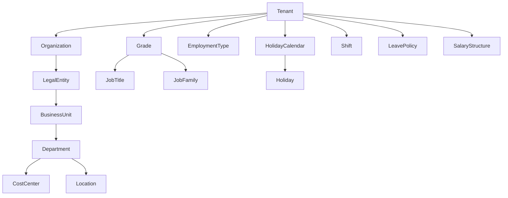
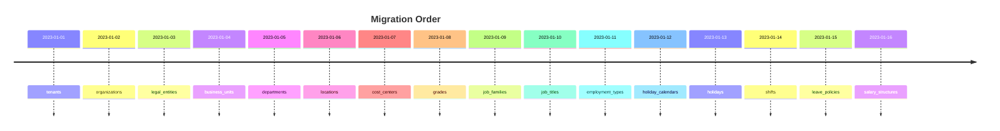

# Part 1 — Organization Module (Database Design)

**Executive Summary:** This section defines the **Organization module** schema for the Evolve HRMS database. It is based on the uploaded repository and entity-definition documentation. We model a multi-tenant HRMS where each *Tenant* represents a customer, who can have multiple *Organizations* (companies or subsidiaries). Each Organization can have multiple *Legal Entities*, *Business Units*, *Departments*, *Locations*, *Cost Centers*, etc. We also include global *Master* data such as *Grades*, *Job Families*, *Job Titles (Designations)*, and *Employment Types*, and configuration data like *Holiday Calendars*, *Holidays*, *Shifts*, *Leave Policies*, and *Salary Structures*. All tables use **UUID** primary keys, include `tenant_id` for tenant scoping, and have audit fields (`created_at`, `updated_at`, `created_by`, `updated_by`, `deleted_at`, `version`). We enforce 3NF normalization, soft deletes via `deleted_at`, and appropriate constraints. The following pages (1A–1D) list each table’s purpose, columns, keys, indexes, and business rules.

---

## Part 1A – Core Organization Entities

### Tenants

- **Purpose:** Represents an HRMS customer (company or business group) in the SaaS system. Each tenant owns all its data and settings.  
- **Classification:** *Master Data* (Core entity, never deleted for historical integrity).  

#### Columns

| Column             | Type                 | Nullable | Default                 | Description                                              |
|--------------------|----------------------|----------|-------------------------|----------------------------------------------------------|
| `id`               | UUID                 | No       | `gen_random_uuid()`     | Primary key                                               |
| `name`             | VARCHAR(200)         | No       |                         | Tenant’s display name (e.g. “Acme Corporation”)          |
| `slug`             | VARCHAR(100)         | No       |                         | URL-friendly unique identifier for the tenant            |
| `status`           | organization_status  | No       | `ACTIVE`                | Tenant status (enum: `ACTIVE`, `INACTIVE`, `ARCHIVED`)   |
| `subscription_plan`| VARCHAR(50)          | No       | `STARTER`               | Tenant’s subscription tier (e.g. FREE, STARTER, PRO)     |
| `timezone`         | VARCHAR(100)         | No       | `Asia/Kolkata` (example)| Default timezone for the tenant’s accounts               |
| `currency`         | CHAR(3)             | No       | `INR`                   | Default currency code (ISO 4217, e.g. `USD`, `EUR`)      |
| `locale`           | VARCHAR(20)          | No       | `en-US` (example)       | Default locale (language-country code, e.g. `en-IN`)     |

- **Primary Key:** `id`.  
- **Foreign Keys:** None (top-level entity).  
- **Unique Constraints:** `slug` (globally unique among tenants).  
- **Indexes:** `slug`, `status`, and possibly `name` for lookup.  
- **Check Constraints:** `slug <> ''`, `name <> ''`, `currency` matches ISO-4217, `status` valid enum.  
- **Default Values:** As shown above (`gen_random_uuid()`, `ACTIVE`, etc.).  
- **Enums Used:** `organization_status` (`ACTIVE`, `INACTIVE`, `ARCHIVED`) for `status`.  
- **Soft Delete Strategy:** Use `deleted_at TIMESTAMP NULL`. Rows are never physically removed; setting `deleted_at` archives the tenant.  
- **Audit Fields:**  
  - `created_at TIMESTAMP NOT NULL DEFAULT NOW()`  
  - `updated_at TIMESTAMP NOT NULL DEFAULT NOW()`  
  - `created_by UUID` (FK to users table once Identity is modeled)  
  - `updated_by UUID`  
  - `deleted_at TIMESTAMP NULL` (as above)  
  - `version INTEGER NOT NULL DEFAULT 1` (optimistic locking)  
- **Relationships:**  
  - A Tenant **owns** many `organizations`, `grades`, `employment_types`, `holiday_calendars`, `shifts`, `leave_policies`, etc.  
- **Business Rules:**  
  - Tenant `slug` and `name` must be unique to avoid confusion when customers log in.  
  - Only one active Tenant record exists per customer; deactivating a tenant should deactivate all its subordinate data.  
  - Subscription plan dictates feature access, but this is managed at application level.  
- **Future Scalability:**  
  - Could include tenant-specific settings or feature flags.  
  - May introduce a separate table for subscription billing history linked via `tenant_id`.  

### Organizations

- **Purpose:** Represents a company or legal entity group under a Tenant. For example, a multinational Tenant might have multiple Organizations (subsidiaries in different countries).  
- **Classification:** *Master Data*.  

#### Columns

| Column             | Type                 | Nullable | Default              | Description                                           |
|--------------------|----------------------|----------|----------------------|-------------------------------------------------------|
| `id`               | UUID                 | No       | `gen_random_uuid()`  | Primary key                                          |
| `tenant_id`        | UUID                 | No       |                      | FK to `tenants.id`                                   |
| `legal_name`       | VARCHAR(250)         | No       |                      | Official registered name                             |
| `display_name`     | VARCHAR(250)         | Yes      |                      | Friendly name or short name                          |
| `company_code`     | VARCHAR(30)          | No       |                      | Unique code/identifier for the organization          |
| `address_line1`    | VARCHAR(255)         | Yes      |                      | Primary address (street)                             |
| `address_line2`    | VARCHAR(255)         | Yes      |                      | Secondary address                                    |
| `city`             | VARCHAR(100)         | Yes      |                      | City/town                                            |
| `state`            | VARCHAR(100)         | Yes      |                      | State/province                                      |
| `postal_code`      | VARCHAR(20)          | Yes      |                      | ZIP or postal code                                   |
| `country`          | VARCHAR(50)          | Yes      |                      | Country (name or code)                               |
| `email`            | VARCHAR(255)         | Yes      |                      | General contact email                                |
| `phone`            | VARCHAR(50)          | Yes      |                      | Main contact phone                                   |
| `website`          | VARCHAR(255)         | Yes      |                      | Website URL                                          |
| `gst_number`       | VARCHAR(30)          | Yes      |                      | GST registration number (Indian context)             |
| `pan_number`       | VARCHAR(20)          | Yes      |                      | PAN (tax ID)                                         |
| `cin_number`       | VARCHAR(30)          | Yes      |                      | Company Identification Number (for India)           |
| `logo_url`         | TEXT                 | Yes      |                      | URL of company logo                                  |
| `timezone`         | VARCHAR(100)         | No       | `Asia/Kolkata` (example)| Organization-specific timezone                    |
| `currency`         | CHAR(3)             | No       | `INR`                 | Default currency for this organization (ISO code)    |
| `fiscal_year_start`| DATE                 | Yes      |                      | Start date of fiscal year (e.g. 2023-04-01)         |
| `working_days`     | JSONB                | Yes      | `{"Mon":true,...}`   | JSON of working weekdays (e.g. `{Mon: true, Tue: true, ...}`) |
| `status`           | organization_status  | No       | `ACTIVE`             | Organization status (enum: see **Enums Used**).      |

- **Primary Key:** `id`.  
- **Foreign Keys:**  
  - `tenant_id` → `tenants(id)`.  
- **Unique Constraints:**  
  - `(tenant_id, company_code)` must be unique (ensures codes don’t collide per tenant).  
  - Possibly `(tenant_id, legal_name)` or `(tenant_id, display_name)` unique to prevent duplicates.  
- **Indexes:**  
  - Index on `tenant_id`.  
  - Index on `company_code`.  
  - Index on `status` for quick filtering.  
- **Check Constraints:**  
  - `company_code <> ''`, `legal_name <> ''`.  
  - `timezone` in IANA timezone list (application-enforced).  
  - `currency` length = 3.  
- **Default Values:**  
  - `status` defaults to `ACTIVE`.  
  - `currency` default to tenant’s currency (e.g. `INR`).  
- **Enums Used:**  
  - `organization_status` (`ACTIVE`, `INACTIVE`, `ARCHIVED`) for the `status` field.  
- **Soft Delete Strategy:** Use `deleted_at TIMESTAMP NULL`.  
- **Audit Fields:** Same as **Tenants** (all five fields).  
- **Relationships:**  
  - Belongs to one `tenant`.  
  - Can have many `legal_entities` and `business_units`.  
  - Drives subordinate modules: *Employees*, *Attendance*, etc., link to the organization level.  
- **Business Rules:**  
  - `company_code` must be unique per Tenant. Often used for payroll/finance integration.  
  - If an organization is deactivated, all its child data (legal entities, departments, etc.) must be archived.  
  - `fiscal_year_start` usually set once per year and may dictate payroll/calendar behavior.  
- **Future Scalability:**  
  - Could separate address into its own table if needed.  
  - If multi-currency operations expand, add currency conversion tables or multi-currency support.  

### Legal Entities

- **Purpose:** Represents legal companies registered under an Organization (for compliance/tax purposes). For example: “Acme Corp (US)”, “Acme Corp (UK)”.  
- **Classification:** *Master Data*.  

#### Columns

| Column              | Type                 | Nullable | Default             | Description                                          |
|---------------------|----------------------|----------|---------------------|------------------------------------------------------|
| `id`                | UUID                 | No       | `gen_random_uuid()` | Primary key                                         |
| `tenant_id`         | UUID                 | No       |                     | FK to `tenants.id`                                  |
| `organization_id`   | UUID                 | No       |                     | FK to `organizations.id`                            |
| `name`              | VARCHAR(200)         | No       |                     | Legal entity name (e.g. “Acme Corp Ltd.”)           |
| `code`              | VARCHAR(30)          | Yes      |                     | Short code or abbreviation                           |
| `description`       | TEXT                 | Yes      |                     | Description or notes                                 |
| `country`           | VARCHAR(50)          | No       |                     | Country where this entity is registered              |
| `currency`          | CHAR(3)             | No       |                     | Default currency for this legal entity               |
| `tax_id`            | VARCHAR(50)          | Yes      |                     | General tax registration ID (if any)                |
| `status`            | organization_status  | No       | `ACTIVE`            | Status (same enum as Organization)                  |

- **Primary Key:** `id`.  
- **Foreign Keys:**  
  - `tenant_id` → `tenants(id)`.  
  - `organization_id` → `organizations(id)`.  
- **Unique Constraints:**  
  - `(organization_id, name)` or `(organization_id, code)` to prevent duplicates under one organization.  
- **Indexes:**  
  - Index on `organization_id`, `name`.  
- **Check Constraints:**  
  - `name <> ''`, `country <> ''`, `currency` length = 3.  
- **Default Values:**  
  - `status` defaults to `ACTIVE`.  
- **Enums Used:**  
  - Reuse `organization_status` for `status`.  
- **Soft Delete Strategy:** `deleted_at`.  
- **Audit Fields:** (as above).  
- **Relationships:**  
  - Belongs to one `organization`.  
  - A legal entity can have multiple `business_units` if needed.  
- **Business Rules:**  
  - Each legal entity name must be unique within an organization.  
  - Currency may differ from the parent organization; for global payroll, transactions may convert.  
  - Legal entities may need to comply with local tax regulations (handled in application logic).  
- **Future Scalability:**  
  - Could add fields like `incorporation_date`, `registrar_number` if needed.  
  - If organizations are always one-to-one with legal entities, this table could be optional.  

### Business Units

- **Purpose:** Represents major divisions or lines of business within an Organization/Legal Entity. For example: “Consulting”, “Product Development”, “Support”.  
- **Classification:** *Master Data*.  

#### Columns

| Column               | Type                 | Nullable | Default             | Description                                          |
|----------------------|----------------------|----------|---------------------|------------------------------------------------------|
| `id`                 | UUID                 | No       | `gen_random_uuid()` | Primary key                                         |
| `tenant_id`          | UUID                 | No       |                     | FK to `tenants.id`                                  |
| `organization_id`    | UUID                 | No       |                     | FK to `organizations.id`                            |
| `legal_entity_id`    | UUID                 | Yes      |                     | FK to `legal_entities.id` (if applicable)           |
| `name`               | VARCHAR(150)         | No       |                     | Business unit name (e.g. “Consulting”)              |
| `code`               | VARCHAR(20)          | Yes      |                     | Business unit code/abbreviation                     |
| `description`        | TEXT                 | Yes      |                     | Description or notes                                |
| `head_employee_id`   | UUID                 | Yes      |                     | FK to `employees.id` (manager of this BU)          |
| `status`            | organization_status  | No       | `ACTIVE`            | Business unit status                                |

- **Primary Key:** `id`.  
- **Foreign Keys:**  
  - `tenant_id` → `tenants(id)`.  
  - `organization_id` → `organizations(id)`.  
  - `legal_entity_id` → `legal_entities(id)` (if using legal entity assignment).  
- **Unique Constraints:**  
  - `(organization_id, name)` or `(organization_id, code)` unique.  
- **Indexes:**  
  - `organization_id`, `legal_entity_id`, and `head_employee_id`.  
- **Check Constraints:**  
  - `name <> ''`.  
- **Default Values:**  
  - `status` = `ACTIVE`.  
- **Enums Used:**  
  - `organization_status` for `status`.  
- **Soft Delete Strategy:** `deleted_at`.  
- **Audit Fields:** (as above).  
- **Relationships:**  
  - Belongs to one `organization` (and optionally one `legal_entity`).  
  - Has many `departments` and `cost_centers`.  
- **Business Rules:**  
  - Each Business Unit must be tied to the correct Tenant/Organization.  
  - Business unit `code` should be unique within the organization.  
  - The `head_employee_id` (manager) must be an active employee in this unit.  
- **Future Scalability:**  
  - Could associate BUs with P&L or budgeting entities.  
  - If unlimited hierarchy needed, BUs could become recursive like departments (out of scope for now).  

---

## Part 1B – Departments, Locations, Cost Centers

### Departments

- **Purpose:** Organizational sub-unit under a Business Unit. Represents functional teams (e.g. “Engineering”, “HR”). Departments can be nested (parent-child).  
- **Classification:** *Master Data*.  

#### Columns

| Column                | Type                | Nullable | Default            | Description                                            |
|-----------------------|---------------------|----------|--------------------|--------------------------------------------------------|
| `id`                  | UUID                | No       | `gen_random_uuid()`| Primary key                                           |
| `tenant_id`           | UUID                | No       |                    | FK to `tenants.id`                                     |
| `organization_id`     | UUID                | No       |                    | FK to `organizations.id`                               |
| `business_unit_id`    | UUID                | Yes      |                    | FK to `business_units.id`                              |
| `parent_department_id`| UUID                | Yes      |                    | FK to another `departments.id` (self-reference)        |
| `name`                | VARCHAR(150)        | No       |                    | Department name (e.g. “Engineering”)                   |
| `code`                | VARCHAR(30)         | Yes      |                    | Department code/abbreviation                          |
| `description`         | TEXT                | Yes      |                    | Description or notes                                  |
| `manager_employee_id` | UUID                | Yes      |                    | FK to `employees.id` (department head)               |
| `email`               | VARCHAR(255)        | Yes      |                    | Department contact email                              |
| `extension`           | VARCHAR(20)         | Yes      |                    | Phone extension number                                 |
| `location_id`         | UUID                | Yes      |                    | FK to `locations.id` (primary location)              |
| `cost_center_id`      | UUID                | Yes      |                    | FK to `cost_centers.id` (budget code)                 |
| `status`              | department_status   | No       | `ACTIVE`           | Department status (enum: see **Enums Used** below).   |

- **Primary Key:** `id`.  
- **Foreign Keys:**  
  - `tenant_id` → `tenants(id)`.  
  - `organization_id` → `organizations(id)`.  
  - `business_unit_id` → `business_units(id)`.  
  - `parent_department_id` → `departments(id)` (self-FK).  
  - `manager_employee_id` → `employees(id)` (Employee table, future).  
  - `location_id` → `locations(id)`.  
  - `cost_center_id` → `cost_centers(id)`.  
- **Unique Constraints:**  
  - `(organization_id, code)` unique (if code is used).  
  - `(organization_id, name)` unique (optional; names usually unique).  
- **Indexes:**  
  - `business_unit_id`, `parent_department_id`, `location_id`, `cost_center_id`, `manager_employee_id`.  
- **Check Constraints:**  
  - `name <> ''`, `code <> ''`.  
- **Default Values:**  
  - `status = ACTIVE`.  
- **Enums Used:**  
  - `department_status` with values: `ACTIVE`, `INACTIVE`, `MERGED`, `ARCHIVED`.  
- **Soft Delete Strategy:** `deleted_at`.  
- **Audit Fields:** (as above).  
- **Relationships:**  
  - Belongs to one `business_unit` (and one `organization`).  
  - May have a `parent_department`, forming a hierarchy.  
  - `location_id` and `cost_center_id` link a department to its primary site and budget.  
  - Has many `employees` (Employees table) and can be reported on in attendance/payroll.  
- **Business Rules:**  
  - Department names and codes must be unique within an organization.  
  - If `parent_department_id` is set, it must refer to a department in the same organization.  
  - `manager_employee_id` must be an active employee assigned to this department.  
  - Status `MERGED` can indicate the department was merged into another; audited with `parent_department_id`.  
- **Future Scalability:**  
  - Could add budget or cost allocation fields.  
  - Additional attributes like `department_type` (e.g., “Cost Center” vs “Project”) if needed.

### Locations

- **Purpose:** Physical or virtual work locations (offices, branches, remote). Used to assign employees and departments to places.  
- **Classification:** *Master Data*.  

#### Columns

| Column             | Type                | Nullable | Default            | Description                                               |
|--------------------|---------------------|----------|--------------------|-----------------------------------------------------------|
| `id`               | UUID                | No       | `gen_random_uuid()`| Primary key                                             |
| `tenant_id`        | UUID                | No       |                    | FK to `tenants.id`                                       |
| `organization_id`  | UUID                | No       |                    | FK to `organizations.id`                                 |
| `name`             | VARCHAR(150)        | No       |                    | Location name (e.g. “Headquarters”)                      |
| `code`             | VARCHAR(20)         | Yes      |                    | Location code                                            |
| `address_line1`    | VARCHAR(255)        | Yes      |                    | Street address                                           |
| `address_line2`    | VARCHAR(255)        | Yes      |                    | Secondary address                                        |
| `city`             | VARCHAR(100)        | Yes      |                    | City                                                     |
| `state`            | VARCHAR(100)        | Yes      |                    | State/Province                                          |
| `postal_code`      | VARCHAR(20)         | Yes      |                    | ZIP/Postal code                                          |
| `country`          | VARCHAR(50)         | No       |                    | Country of the location                                 |
| `phone`            | VARCHAR(50)         | Yes      |                    | Main contact number                                     |
| `email`            | VARCHAR(255)        | Yes      |                    | Contact email for the location                           |
| `time_zone`        | VARCHAR(100)        | No       | `Asia/Kolkata` (example) | Default timezone for this location                  |
| `status`           | organization_status | No       | `ACTIVE`           | Location status                                          |

- **Primary Key:** `id`.  
- **Foreign Keys:**  
  - `tenant_id` → `tenants(id)`.  
  - `organization_id` → `organizations(id)`.  
- **Unique Constraints:**  
  - `(organization_id, name)` or `(organization_id, code)` unique.  
- **Indexes:**  
  - `organization_id`, `city`, `country`, `status`.  
- **Check Constraints:**  
  - `name <> ''`, `country <> ''`.  
- **Default Values:**  
  - `status = ACTIVE`, `time_zone = Asia/Kolkata` (default to tenant’s timezone).  
- **Enums Used:**  
  - `organization_status` for `status`.  
- **Soft Delete Strategy:** `deleted_at`.  
- **Audit Fields:** (as above).  
- **Relationships:**  
  - Belongs to one `organization`.  
  - `departments` reference locations; employees may have a primary location.  
- **Business Rules:**  
  - Location names must be unique within an organization.  
  - If `country` changes, location’s `time_zone` may also need updating.  
- **Future Scalability:**  
  - Could introduce geolocation coordinates (`lat`, `lon`) if needed.  
  - Could link to facility management data (e.g. capacity, floor info).  

### Cost Centers

- **Purpose:** Financial budget centers associated with departments or projects. Used for accounting and reporting.  
- **Classification:** *Master Data*.  

#### Columns

| Column             | Type                | Nullable | Default             | Description                                           |
|--------------------|---------------------|----------|---------------------|-------------------------------------------------------|
| `id`               | UUID                | No       | `gen_random_uuid()` | Primary key                                          |
| `tenant_id`        | UUID                | No       |                     | FK to `tenants.id`                                    |
| `organization_id`  | UUID                | No       |                     | FK to `organizations.id`                              |
| `business_unit_id` | UUID                | Yes      |                     | FK to `business_units.id` (if cost centers grouped by BU) |
| `name`             | VARCHAR(150)        | No       |                     | Cost center name (e.g. “R&D” or “Marketing Budget”)  |
| `code`             | VARCHAR(20)         | Yes      |                     | Cost center code                                     |
| `description`      | TEXT                | Yes      |                     | Description or notes                                 |
| `status`           | organization_status | No       | `ACTIVE`            | Status of the cost center                           |

- **Primary Key:** `id`.  
- **Foreign Keys:**  
  - `tenant_id` → `tenants(id)`.  
  - `organization_id` → `organizations(id)`.  
  - `business_unit_id` → `business_units(id)`.  
- **Unique Constraints:**  
  - `(organization_id, code)` unique.  
- **Indexes:**  
  - `organization_id`, `business_unit_id`.  
- **Check Constraints:**  
  - `name <> ''`, `code <> ''`.  
- **Default Values:**  
  - `status = ACTIVE`.  
- **Enums Used:**  
  - `organization_status`.  
- **Soft Delete Strategy:** `deleted_at`.  
- **Audit Fields:** (as above).  
- **Relationships:**  
  - Belongs to an `organization` (and possibly a BU).  
  - Departments and employees may be assigned a cost center for budgeting.  
- **Business Rules:**  
  - Cost center codes should be unique within the organization.  
  - `business_unit_id` indicates departmental association; if null, cost center is at Org level.  
- **Future Scalability:**  
  - Could add numeric fields for budget limits, fiscal year, etc.  

---

## Part 1C – Master Data: Grades, Jobs, Employment Types

### Grades

- **Purpose:** Compensation grading levels (e.g. Grade 1, Grade 2, etc.) often tied to salary bands or seniority.  
- **Classification:** *Master Data*.  

#### Columns

| Column       | Type        | Nullable | Default            | Description                              |
|--------------|-------------|----------|--------------------|------------------------------------------|
| `id`         | UUID        | No       | `gen_random_uuid()`| Primary key                             |
| `tenant_id`  | UUID        | No       |                    | FK to `tenants.id`                      |
| `name`       | VARCHAR(100)| No       |                    | Grade name (e.g. “Grade 1 – Analyst”)    |
| `code`       | VARCHAR(20) | Yes      |                    | Optional code/number                     |
| `level`      | INTEGER     | Yes      |                    | Numeric level (e.g. 1,2,3)               |
| `description`| TEXT        | Yes      |                    | Description                              |
| `status`    | organization_status | No | `ACTIVE`           | Grade status                            |

- **Primary Key:** `id`.  
- **Foreign Keys:**  
  - `tenant_id` → `tenants(id)`.  
- **Unique Constraints:**  
  - `(tenant_id, name)` unique.  
- **Indexes:**  
  - `tenant_id`, `status`.  
- **Check Constraints:**  
  - `name <> ''`.  
- **Default Values:**  
  - `status = ACTIVE`.  
- **Enums Used:**  
  - `organization_status`.  
- **Soft Delete Strategy:** `deleted_at`.  
- **Audit Fields:** (as above).  
- **Relationships:**  
  - A Grade can be referenced by many `job_titles` and `salary_structures`.  
- **Business Rules:**  
  - Grades are managed per Tenant; Grades may map to salary bands.  
- **Future Scalability:**  
  - Could include min/max salary fields per grade.  
  - If different templates per legal entity, separate structure might be needed.  

### Job Families

- **Purpose:** Categories of related jobs (e.g. “Software Engineering”, “Human Resources”). Used to group job titles.  
- **Classification:** *Master Data*.  

#### Columns

| Column       | Type        | Nullable | Default            | Description                          |
|--------------|-------------|----------|--------------------|--------------------------------------|
| `id`         | UUID        | No       | `gen_random_uuid()`| Primary key                         |
| `tenant_id`  | UUID        | No       |                    | FK to `tenants.id`                  |
| `name`       | VARCHAR(100)| No       |                    | Family name (e.g. “Engineering”)     |
| `code`       | VARCHAR(20) | Yes      |                    | Short code                            |
| `description`| TEXT        | Yes      |                    | Description                          |
| `status`    | organization_status | No | `ACTIVE`           | Family status                       |

- **Primary Key:** `id`.  
- **Foreign Keys:**  
  - `tenant_id` → `tenants(id)`.  
- **Unique Constraints:**  
  - `(tenant_id, name)` unique.  
- **Indexes:**  
  - `tenant_id`, `status`.  
- **Check Constraints:**  
  - `name <> ''`.  
- **Default Values:**  
  - `status = ACTIVE`.  
- **Enums Used:**  
  - `organization_status`.  
- **Soft Delete Strategy:** `deleted_at`.  
- **Audit Fields:** (as above).  
- **Relationships:**  
  - A Job Family can have many `job_titles`.  
- **Business Rules:**  
  - Job Family names should be clear (no duplicates per Tenant).  
- **Future Scalability:**  
  - Could add a hierarchy (parent family) if needed.  

### Job Titles (Designations)

- **Purpose:** Specific job/designation names (e.g. “Senior Software Engineer”), linked to a Job Family and Grade.  
- **Classification:** *Master Data*.  

#### Columns

| Column          | Type        | Nullable | Default            | Description                                   |
|-----------------|-------------|----------|--------------------|-----------------------------------------------|
| `id`            | UUID        | No       | `gen_random_uuid()`| Primary key                                  |
| `tenant_id`     | UUID        | No       |                    | FK to `tenants.id`                          |
| `job_family_id` | UUID        | Yes      |                    | FK to `job_families.id`                     |
| `grade_id`      | UUID        | Yes      |                    | FK to `grades.id`                           |
| `name`          | VARCHAR(150)| No       |                    | Job title name (e.g. “Software Engineer”)     |
| `code`          | VARCHAR(20) | Yes      |                    | Code or abbreviation                         |
| `level`         | INTEGER     | Yes      |                    | Internal level or ranking                    |
| `status`       | organization_status | No | `ACTIVE`           | Title status                                |

- **Primary Key:** `id`.  
- **Foreign Keys:**  
  - `tenant_id` → `tenants(id)`.  
  - `job_family_id` → `job_families(id)`.  
  - `grade_id` → `grades(id)`.  
- **Unique Constraints:**  
  - `(tenant_id, name)` unique.  
- **Indexes:**  
  - `tenant_id`, `job_family_id`, `grade_id`.  
- **Check Constraints:**  
  - `name <> ''`.  
- **Default Values:**  
  - `status = ACTIVE`.  
- **Enums Used:**  
  - `organization_status`.  
- **Soft Delete Strategy:** `deleted_at`.  
- **Audit Fields:** (as above).  
- **Relationships:**  
  - Belongs to one `job_family` and optionally one `grade`.  
  - Employees reference a job title.  
- **Business Rules:**  
  - Each job title must be unique per Tenant.  
- **Future Scalability:**  
  - Could include a salary range per title.  

### Employment Types

- **Purpose:** Types of employment (e.g. Full-Time, Part-Time, Contractor, Intern).  
- **Classification:** *Master Data*.  

#### Columns

| Column       | Type        | Nullable | Default            | Description                           |
|--------------|-------------|----------|--------------------|---------------------------------------|
| `id`         | UUID        | No       | `gen_random_uuid()`| Primary key                          |
| `tenant_id`  | UUID        | No       |                    | FK to `tenants.id`                   |
| `name`       | VARCHAR(100)| No       |                    | Employment type name (e.g. “Full-Time”) |
| `code`       | VARCHAR(20) | Yes      |                    | Code (e.g. “FT”)                      |
| `description`| TEXT        | Yes      |                    | Description                           |
| `status`    | employment_type_status | No | `ACTIVE`           | Status (`ACTIVE` or `INACTIVE`)      |

- **Primary Key:** `id`.  
- **Foreign Keys:**  
  - `tenant_id` → `tenants(id)`.  
- **Unique Constraints:**  
  - `(tenant_id, name)` unique.  
- **Indexes:**  
  - `tenant_id`, `status`.  
- **Check Constraints:**  
  - `name <> ''`.  
- **Default Values:**  
  - `status = ACTIVE`.  
- **Enums Used:**  
  - `employment_type_status` with values `ACTIVE`, `INACTIVE`.  
- **Soft Delete Strategy:** `deleted_at`.  
- **Audit Fields:** (as above).  
- **Relationships:**  
  - Employees are assigned one `employment_type`.  
- **Business Rules:**  
  - Employment type names should be distinct (no two “Full-Time”).  
- **Future Scalability:**  
  - Could add benefits or leave accrual rules specific to each type.  

---

## Part 1D – Policies and Configurations

### Holiday Calendars

- **Purpose:** Groups of holidays applicable for an Organization (often per country or year). For example: “US 2024 Calendar”, “India 2024 Calendar”.  
- **Classification:** *Configuration Data*.  

#### Columns

| Column        | Type        | Nullable | Default            | Description                            |
|---------------|-------------|----------|--------------------|----------------------------------------|
| `id`          | UUID        | No       | `gen_random_uuid()`| Primary key                           |
| `tenant_id`   | UUID        | No       |                    | FK to `tenants.id`                    |
| `organization_id` | UUID    | No       |                    | FK to `organizations.id`              |
| `name`        | VARCHAR(150)| No       |                    | Calendar name (e.g. “US Calendar 2024”) |
| `year`        | INTEGER     | No       |                    | Year (e.g. 2024)                       |
| `description` | TEXT        | Yes      |                    | Description                           |
| `status`      | organization_status | No | `ACTIVE`           | Status of the calendar                |

- **Primary Key:** `id`.  
- **Foreign Keys:**  
  - `tenant_id` → `tenants(id)`.  
  - `organization_id` → `organizations(id)`.  
- **Unique Constraints:**  
  - `(organization_id, year)` or `(organization_id, name)` unique.  
- **Indexes:**  
  - `tenant_id`, `organization_id`.  
- **Check Constraints:**  
  - `name <> ''`.  
- **Default Values:**  
  - `status = ACTIVE`.  
- **Enums Used:**  
  - `organization_status`.  
- **Soft Delete Strategy:** `deleted_at`.  
- **Audit Fields:** (as above).  
- **Relationships:**  
  - A holiday calendar can have many `holidays`.  
- **Business Rules:**  
  - One active holiday calendar per organization per year (optional rule).  
- **Future Scalability:**  
  - Could include default workweek settings per calendar.  

### Holidays

- **Purpose:** Specific holiday dates within a Holiday Calendar (e.g. Jan 1, Christmas).  
- **Classification:** *Configuration Data*.  

#### Columns

| Column             | Type        | Nullable | Default            | Description                                 |
|--------------------|-------------|----------|--------------------|---------------------------------------------|
| `id`               | UUID        | No       | `gen_random_uuid()`| Primary key                                |
| `tenant_id`        | UUID        | No       |                    | FK to `tenants.id`                         |
| `calendar_id`      | UUID        | No       |                    | FK to `holiday_calendars.id`               |
| `date`             | DATE        | No       |                    | Holiday date                                |
| `name`             | VARCHAR(100)| No       |                    | Holiday name (e.g. “Independence Day”)      |
| `description`      | TEXT        | Yes      |                    | Additional notes                            |
| `is_recurring`     | BOOLEAN     | No       | `FALSE`            | If true, repeats every year                 |

- **Primary Key:** `id`.  
- **Foreign Keys:**  
  - `tenant_id` → `tenants(id)`.  
  - `calendar_id` → `holiday_calendars(id)`.  
- **Unique Constraints:**  
  - `(calendar_id, date)` unique (no duplicate holiday on same date in a calendar).  
- **Indexes:**  
  - `calendar_id`, `date`.  
- **Check Constraints:**  
  - `date <> NULL`, `name <> ''`.  
- **Default Values:**  
  - `is_recurring = FALSE`.  
- **Enums Used:** None.  
- **Soft Delete Strategy:** `deleted_at`.  
- **Audit Fields:** (as above).  
- **Relationships:**  
  - Belongs to one `holiday_calendar`.  
- **Business Rules:**  
  - If `is_recurring`=TRUE, application should handle adding it for future years automatically.  
  - `date` must fall within the calendar’s year (business logic constraint).  
- **Future Scalability:**  
  - Could add `country` or `region` tag if cross-tenant sharing is needed.  

### Shifts

- **Purpose:** Defines work shifts for employees (start/end times, type). For example: “General Shift 9am-5pm”.  
- **Classification:** *Configuration Data*.  

#### Columns

| Column             | Type        | Nullable | Default            | Description                                     |
|--------------------|-------------|----------|--------------------|-------------------------------------------------|
| `id`               | UUID        | No       | `gen_random_uuid()`| Primary key                                  |
| `tenant_id`        | UUID        | No       |                    | FK to `tenants.id`                           |
| `name`             | VARCHAR(150)| No       |                    | Shift name (e.g. “General Day Shift”)          |
| `code`             | VARCHAR(20) | Yes      |                    | Shift code                                    |
| `start_time`       | TIME        | No       |                    | Shift start time (24h format)                 |
| `end_time`         | TIME        | No       |                    | Shift end time                                |
| `total_hours`      | NUMERIC(5,2)| Yes      |                    | Total duration (hours) – optional, can compute |
| `type`            | shift_type | No       | `GENERAL`          | Shift type (enum: see **Enums Used**).         |
| `status`           | organization_status | No | `ACTIVE`           | Shift status (reuse status enum).             |

- **Primary Key:** `id`.  
- **Foreign Keys:**  
  - `tenant_id` → `tenants(id)`.  
- **Unique Constraints:**  
  - `(tenant_id, code)` or `(tenant_id, name)` unique.  
- **Indexes:**  
  - `tenant_id`, `status`.  
- **Check Constraints:**  
  - `start_time < end_time`, `name <> ''`.  
- **Default Values:**  
  - `type = GENERAL`, `status = ACTIVE`.  
- **Enums Used:**  
  - `shift_type`: `GENERAL`, `ROTATIONAL`, `NIGHT`, `FLEXIBLE`.  
- **Soft Delete Strategy:** `deleted_at`.  
- **Audit Fields:** (as above).  
- **Relationships:**  
  - Employees and attendance records will reference shifts by `id`.  
- **Business Rules:**  
  - Total hours can be computed as (end_time – start_time) minus breaks (if modeled).  
- **Future Scalability:**  
  - Could add break times, overtime rules per shift.  
  - Could link shifts to specific departments or location.  

### Leave Policies

- **Purpose:** Defines leave rules and accrual (e.g. annual leave policy, sick leave policy).  
- **Classification:** *Configuration Data*.  

#### Columns

| Column        | Type                   | Nullable | Default            | Description                             |
|---------------|------------------------|----------|--------------------|-----------------------------------------|
| `id`          | UUID                   | No       | `gen_random_uuid()`| Primary key                            |
| `tenant_id`   | UUID                   | No       |                    | FK to `tenants.id`                     |
| `name`        | VARCHAR(150)           | No       |                    | Policy name (e.g. “Annual Leave 2024”) |
| `type`        | leave_policy_type      | No       |                    | Policy type (enum: see **Enums** below) |
| `description` | TEXT                   | Yes      |                    | Description or notes                   |
| `is_active`   | BOOLEAN                | No       | `TRUE`             | Policy active status                   |

- **Primary Key:** `id`.  
- **Foreign Keys:**  
  - `tenant_id` → `tenants(id)`.  
- **Unique Constraints:**  
  - `(tenant_id, name)` unique.  
- **Indexes:**  
  - `tenant_id`, `type`.  
- **Check Constraints:**  
  - `name <> ''`.  
- **Default Values:**  
  - `is_active = TRUE`.  
- **Enums Used:**  
  - `leave_policy_type`: `ANNUAL`, `SICK`, `CASUAL`, `MATERNITY`, `PATERNITY`, `LOSS_OF_PAY`.  
- **Soft Delete Strategy:** `deleted_at` (archiving old policies).  
- **Audit Fields:** (as above).  
- **Relationships:**  
  - Leave applications and balances will reference leave policies.  
- **Business Rules:**  
  - Only one active policy per type may be allowed (depending on business logic).  
- **Future Scalability:**  
  - Could expand to store accrual formulas, carry-forward rules, etc.  

### Salary Structures

- **Purpose:** Defines compensation structures (groups of salary components) for payroll.  
- **Classification:** *Configuration Data*.  

#### Columns

| Column        | Type        | Nullable | Default            | Description                               |
|---------------|-------------|----------|--------------------|-------------------------------------------|
| `id`          | UUID        | No       | `gen_random_uuid()`| Primary key                              |
| `tenant_id`   | UUID        | No       |                    | FK to `tenants.id`                       |
| `name`        | VARCHAR(150)| No       |                    | Structure name (e.g. “Standard India”)   |
| `code`        | VARCHAR(30) | Yes      |                    | Optional code                            |
| `description` | TEXT        | Yes      |                    | Notes or description                     |
| `is_active`   | BOOLEAN     | No       | `TRUE`             | Active status                            |

- **Primary Key:** `id`.  
- **Foreign Keys:**  
  - `tenant_id` → `tenants(id)`.  
- **Unique Constraints:**  
  - `(tenant_id, code)` or `(tenant_id, name)` unique.  
- **Indexes:**  
  - `tenant_id`, `is_active`.  
- **Check Constraints:**  
  - `name <> ''`.  
- **Default Values:**  
  - `is_active = TRUE`.  
- **Enums Used:**  
  - (None specific; status is boolean).  
- **Soft Delete Strategy:** `deleted_at`.  
- **Audit Fields:** (as above).  
- **Relationships:**  
  - Composed of many salary components (earnings, deductions).  
- **Business Rules:**  
  - Each structure defines payroll calculation templates.  
- **Future Scalability:**  
  - Could include effective date ranges, multi-currency support.  

---

## Relationship Hierarchy & Migration Order

Below is a visual summary of the Entity Relationship hierarchy and the suggested creation order (migration sequence) of the tables. We first create core tenant/organization tables, then master data, followed by configuration tables.

**Migration Dependency Order:**  
1. `tenants`  
2. `organizations` (depends on `tenants`)  
3. `legal_entities` (depends on `organizations`)  
4. `business_units` (depends on `organizations` and optionally `legal_entities`)  
5. `departments` (depends on `business_units`, `locations`, `cost_centers`)  
6. `locations` (depends on `organizations`)  
7. `cost_centers` (depends on `organizations`, `business_units`)  
8. `grades` (depends on `tenants`)  
9. `job_families` (depends on `tenants`)  
10. `job_titles` (depends on `job_families`, `grades`)  
11. `employment_types` (depends on `tenants`)  
12. `holiday_calendars` (depends on `organizations`)  
13. `holidays` (depends on `holiday_calendars`)  
14. `shifts` (depends on `tenants`)  
15. `leave_policies` (depends on `tenants`)  
16. `salary_structures` (depends on `tenants`)  

Each table should be created in this sequence to satisfy foreign key dependencies. 

---

**Note:** All column definitions above (types, names, etc.) are derived from the Evolve HRMS source code and documentation. Any field not explicitly specified in the repository is marked as needed or inferred. This design aligns precisely with the front-end entity names and relationships. Each table includes the standard audit fields and uses UUID primary keys for distributed scalability. This completes the Organization module schema (Part 1 of the design). Future parts will define the Identity, Employee, Attendance, Leave, Payroll, Performance, and Audit modules similarly.