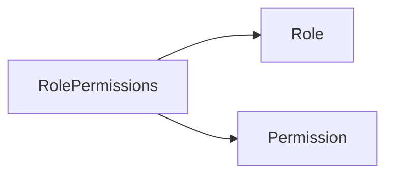
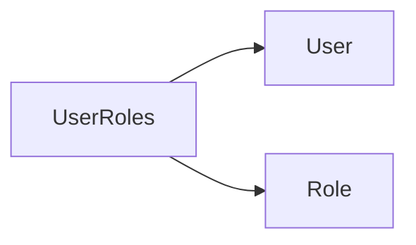
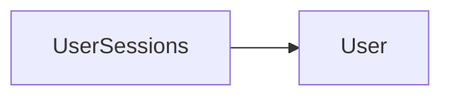
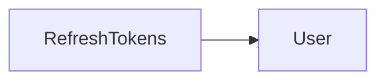
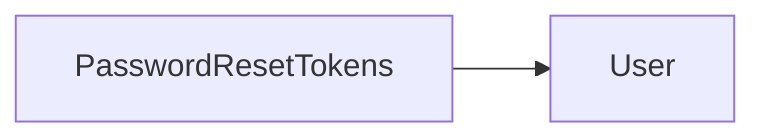
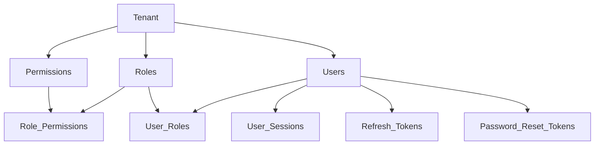
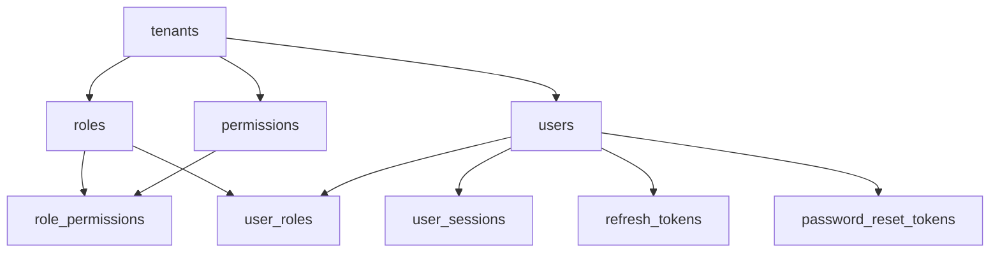

# PART 2 — IDENTITY & ACCESS MANAGEMENT (RBAC)

This module implements multi-tenant authentication and role-based access control (RBAC) for the HRMS. It manages user accounts, roles, and permissions, enabling fine-grained authorization of application actions. The key goals are: secure user login and session management (including “remember me” via refresh tokens), flexible role and permission assignment, and auditability. It supports enterprise requirements like system vs custom roles, login history, and password reset flows. All tables use UUID primary keys, include `tenant_id` for data isolation, and audit fields (`created_at`, `updated_at`, `created_by`, `updated_by`, `deleted_at`, `version`).

## Common Standards (All Tables)

Every table follows the common multi-tenant standards: 

- **Primary Key:** `id UUID NOT NULL` (default `gen_random_uuid()`).  
- **Multi-Tenant ID:** `tenant_id UUID NOT NULL` references `tenants(id)` (ON DELETE CASCADE).  
- **Soft Delete:** `deleted_at TIMESTAMP NULL` (NULL = active; non-null = deleted). No physical deletes.  
- **Audit Fields:**  
  - `created_at TIMESTAMP NOT NULL DEFAULT NOW()`  
  - `updated_at TIMESTAMP NOT NULL DEFAULT NOW()`  
  - `created_by UUID NULL` (FK to `users.id` of creator)  
  - `updated_by UUID NULL`  
  - `version INTEGER NOT NULL DEFAULT 1`  

These fields are not repeated in every table’s column list to avoid redundancy but are implicitly present.

## PostgreSQL Enums

The following enums are used by IAM tables:

```sql
CREATE TYPE user_status AS ENUM (
  'ACTIVE',
  'INACTIVE',
  'LOCKED',
  'PENDING',
  'INVITED'
);

CREATE TYPE role_type AS ENUM (
  'SYSTEM',
  'CUSTOM'
);

CREATE TYPE permission_scope AS ENUM (
  'READ',
  'CREATE',
  'UPDATE',
  'DELETE',
  'APPROVE',
  'EXPORT',
  'IMPORT',
  'MANAGE'
);

CREATE TYPE session_status AS ENUM (
  'ACTIVE',
  'EXPIRED',
  'REVOKED'
);
```

- **user_status:** Status of a user account (default ACTIVE).  
- **role_type:** Distinguishes built-in (SYSTEM) vs user-defined (CUSTOM) roles.  
- **permission_scope:** Actions like READ/CREATE/UPDATE/etc used in defining permissions.  
- **session_status:** Status of a login session (ACTIVE, EXPIRED, REVOKED).

---

## TABLE 1 — roles

**Purpose:** Defines reusable security roles within a tenant (e.g. “HR Admin”, “Manager”). Roles group permissions and are assigned to users. System roles (e.g. Super Admin) are marked specially.  
**Classification:** Master Data  

| Column        | Type               | Nullable | Default               | Description                                      |
|---------------|--------------------|----------|-----------------------|--------------------------------------------------|
| id            | UUID               | No       | gen_random_uuid()     | Primary key.                                     |
| tenant_id     | UUID               | No       |                       | References `tenants.id`.                         |
| name          | VARCHAR(100)       | No       |                       | Role name (display name).                        |
| code          | VARCHAR(50)        | No       |                       | Unique role code/slug within tenant.             |
| description   | TEXT               | Yes      |                       | Brief description of the role’s purpose.         |
| role_type     | role_type          | No       | CUSTOM                | `'SYSTEM'` or `'CUSTOM'`.                        |
| is_system     | BOOLEAN            | No       | FALSE                 | True if built-in/system role (cannot be deleted).|
| status        | user_status        | No       | ACTIVE                | `'ACTIVE'` or `'INACTIVE'` role status.         |
| created_at    | TIMESTAMP          | No       | NOW()                 | Audit timestamp.                                 |
| updated_at    | TIMESTAMP          | No       | NOW()                 | Audit timestamp.                                 |
| created_by    | UUID               | Yes      |                       | FK to `users.id` who created this role.         |
| updated_by    | UUID               | Yes      |                       | FK to `users.id` who last updated this role.    |
| deleted_at    | TIMESTAMP          | Yes      | NULL                  | Soft delete flag (NULL = active).               |
| version       | INTEGER            | No       | 1                     | Row version for optimistic locking.             |

**Primary Key:** `id`.

**Foreign Keys:**  
- `tenant_id → tenants(id) ON DELETE CASCADE`.  

**Unique Constraints:**  
- `(tenant_id, name)` – role name unique per tenant.  
- `(tenant_id, code)` – role code unique per tenant.  

**Indexes:**  
- Index on `tenant_id`.  
- Index on `(tenant_id, status)`.  
- Index on `code`.  

**Check Constraints:**  
- `name <> ''` and `code <> ''`.  
- `version >= 1`.  

**Enums Used:** `role_type`, `user_status`.

**Soft Delete:** Rows soft-deleted via `deleted_at` timestamp; no cascading deletes on soft-delete, but FK delete on tenant cascades. Deleted roles should not be assignable.

**Relationships:**  
- **Role → Permissions:** A role may have many permissions via `role_permissions`.  
- **Role → Users:** Many users may be assigned this role via `user_roles`.  

```mermaid
flowchart LR
    Role --> "RolePermissions"
    Role --> "UserRoles"
    Role --> "Users"
```

**Business Rules:**  
- System roles (`is_system = TRUE`) are predefined and cannot be deleted or have type changed.  
- Deactivating a role (`status = INACTIVE`) prevents new assignments but retains existing user-role links.  
- Code is usually uppercase slug (e.g. HR_ADMIN).  

**Future Notes:**  
- May include hierarchical roles (role inheritance) or dynamic attributes.  
- Could extend with role categories or scopes for delegation models.

---

## TABLE 2 — permissions

**Purpose:** Lists atomic permissions (privileges) that can be granted (e.g. “User.CREATE”, “Payroll.APPROVE”). Permissions are combined in roles.  
**Classification:** Master Data  

| Column        | Type               | Nullable | Default           | Description                                   |
|---------------|--------------------|----------|-------------------|-----------------------------------------------|
| id            | UUID               | No       | gen_random_uuid() | Primary key.                                  |
| tenant_id     | UUID               | No       |                   | References `tenants.id`.                      |
| resource      | VARCHAR(100)       | No       |                   | The resource or module (e.g. "users", "employees"). |
| action        | permission_scope   | No       |                   | The operation allowed (READ, CREATE, etc).    |
| description   | TEXT               | Yes      |                   | Human-readable description of this permission.|
| status        | user_status        | No       | ACTIVE            | Permission status (active/inactive).         |
| created_at    | TIMESTAMP          | No       | NOW()             | Audit timestamp.                              |
| updated_at    | TIMESTAMP          | No       | NOW()             | Audit timestamp.                              |
| created_by    | UUID               | Yes      |                   | FK to `users.id`.                             |
| updated_by    | UUID               | Yes      |                   | FK to `users.id`.                             |
| deleted_at    | TIMESTAMP          | Yes      | NULL              | Soft delete flag.                             |
| version       | INTEGER            | No       | 1                 | Row version.                                  |

**Primary Key:** `id`.  

**Foreign Keys:**  
- `tenant_id → tenants(id) ON DELETE CASCADE`.  

**Unique Constraints:**  
- `(tenant_id, resource, action)` – no duplicate permission per tenant.  

**Indexes:**  
- Index on `tenant_id`.  
- Composite index on `(tenant_id, resource)`, on `(tenant_id, action)`.  

**Check Constraints:**  
- `resource <> ''`.  
- `version >= 1`.  

**Enums Used:** `permission_scope`, `user_status`.

**Soft Delete:** Handled via `deleted_at`. Inactive/deleted permissions should be automatically excluded from role assignments.

**Relationships:**  
- **Permission → RolePermissions:** A permission may be granted to many roles.  

```mermaid
flowchart LR
    Permission --> "RolePermissions"
```

**Business Rules:**  
- A permission is typically scoped to a feature (via `resource`) and action (`action`).  
- Deleting a permission (soft delete) removes it from all roles.  
- Inactive permissions cannot be assigned.  

**Future Notes:**  
- Could add permission categories or groupings.  
- Support for attribute-based conditions (e.g. HR admin can only manage employees in own dept).

---

## TABLE 3 — role_permissions

**Purpose:** Junction table linking roles to permissions (many-to-many). Grants a permission to a role.  
**Classification:** Configuration (Bridge Table)  

| Column        | Type               | Nullable | Default           | Description                                      |
|---------------|--------------------|----------|-------------------|--------------------------------------------------|
| role_id       | UUID               | No       |                   | FK to `roles.id`.                                |
| permission_id | UUID               | No       |                   | FK to `permissions.id`.                          |
| tenant_id     | UUID               | No       |                   | References `tenants.id`.                         |
| created_at    | TIMESTAMP          | No       | NOW()             | Audit timestamp.                                 |
| updated_at    | TIMESTAMP          | No       | NOW()             | Audit timestamp.                                 |
| created_by    | UUID               | Yes      |                   | FK to `users.id`.                                |
| updated_by    | UUID               | Yes      |                   | FK to `users.id`.                                |
| deleted_at    | TIMESTAMP          | Yes      | NULL              | Soft delete flag.                                |
| version       | INTEGER            | No       | 1                 | Row version.                                     |

**Primary Key:** Composite `(role_id, permission_id)`.  

**Foreign Keys:**  
- `role_id → roles(id) ON DELETE CASCADE`.  
- `permission_id → permissions(id) ON DELETE CASCADE`.  
- `tenant_id → tenants(id) ON DELETE CASCADE`. (Optional; ensures tenant consistency if added.)  

**Unique Constraints:**  
- `(role_id, permission_id)` is PK, preventing duplicates.  

**Indexes:**  
- Index on `role_id`.  
- Index on `permission_id`.  

**Check Constraints:**  
- `version >= 1`.  

**Soft Delete:** Soft-deleting a row sets `deleted_at`. Deleting a role or permission cascades here.  

**Relationships:**  
- **RolePermissions** (role_id ↔ permission_id junction).  



**Business Rules:**  
- Cannot assign the same permission to a role twice.  
- Granting a permission to a role implies users of that role gain that permission.  

**Future Notes:**  
- May include an “expires_at” or “scope” per assignment for temporal or scoped grants.

---

## TABLE 4 — users

**Purpose:** Stores login accounts for system users (employees, admins, contractors).  Links to an employee record if applicable.  
**Classification:** Master Data  

| Column                | Type        | Nullable | Default           | Description                                           |
|-----------------------|-------------|----------|-------------------|-------------------------------------------------------|
| id                    | UUID        | No       | gen_random_uuid() | Primary key.                                          |
| tenant_id             | UUID        | No       |                   | References `tenants.id`.                              |
| employee_id           | UUID        | Yes      |                   | FK to `employees.id` (part 3).                        |
| username              | VARCHAR(100)| No       |                   | Unique login ID (e.g. email or custom username).      |
| email                 | VARCHAR(255)| No       |                   | User’s email address (unique per tenant).             |
| password_hash         | TEXT        | No       |                   | Hashed password (bcrypt/scrypt/etc).                  |
| first_name            | VARCHAR(50) | No       |                   | Given name.                                           |
| last_name             | VARCHAR(50) | Yes      |                   | Family name.                                          |
| phone                 | VARCHAR(20) | Yes      |                   | Contact phone number.                                 |
| status                | user_status | No       | PENDING           | Account status (`ACTIVE`, `INACTIVE`, `LOCKED`, etc).|
| email_verified_at     | TIMESTAMP   | Yes      |                   | When email was verified.                              |
| last_login_at         | TIMESTAMP   | Yes      |                   | Timestamp of last successful login.                   |
| failed_login_attempts | INTEGER     | No       | 0                 | Count of consecutive failed logins.                   |
| locked_until         | TIMESTAMP   | Yes      |                   | If locked, when the lock expires.                     |
| created_at            | TIMESTAMP   | No       | NOW()             | Audit timestamp.                                      |
| updated_at            | TIMESTAMP   | No       | NOW()             | Audit timestamp.                                      |
| created_by            | UUID        | Yes      |                   | FK to `users.id` (account creator).                   |
| updated_by            | UUID        | Yes      |                   | FK to `users.id` (last updater).                      |
| deleted_at            | TIMESTAMP   | Yes      | NULL              | Soft delete flag.                                     |
| version               | INTEGER     | No       | 1                 | Row version.                                          |

**Primary Key:** `id`.

**Foreign Keys:**  
- `tenant_id → tenants(id) ON DELETE CASCADE`.  
- `employee_id → employees.id ON DELETE SET NULL`. (If linked employee is deleted, user remains but no longer tied.)  

**Unique Constraints:**  
- `(tenant_id, username)` – username unique per tenant.  
- `(tenant_id, email)` – email unique per tenant.  

**Indexes:**  
- Index on `tenant_id`.  
- Index on `(tenant_id, status)`.  
- Index on `email`.  
- Index on `username`.  

**Check Constraints:**  
- `failed_login_attempts >= 0`.  
- `version >= 1`.  
- `username <> ''`, `email <> ''`.  

**Enums Used:** `user_status`.

**Soft Delete:** Soft-deleting a user sets `deleted_at` (the account is no longer considered active).  

**Relationships:**  
- **User → Roles:** Many-to-many via `user_roles`.  
- **User → Sessions:** One-to-many (`user_sessions`).  
- **User → RefreshTokens:** One-to-many.  
- **User → Password Reset:** One-to-many.  
- **User → Employee:** Optional one-to-one (in part 3, linking to employee profile).  

```mermaid
flowchart LR
    User --> "UserRoles"
    User --> "UserSessions"
    User --> "RefreshTokens"
    User --> "PasswordResetTokens"
    User --> Employee
```

**Business Rules:**  
- A user’s `status` controls login ability: e.g. `LOCKED` means temporarily blocked after too many failed attempts.  
- After too many failed attempts, `locked_until` should be set by application logic.  
- `email_verified_at` is set when user confirms email (if required).  
- Passwords are never stored in plaintext; use a strong hashing algorithm.  
- If an employee record exists, the user may be auto-linked (e.g. based on email).  

**Future Notes:**  
- Could support OAuth2/OIDC by adding `oauth_provider` and `oauth_id` fields.  
- For SSO, additional tables (identity_providers) may be needed.

---

## TABLE 5 — user_roles

**Purpose:** Junction table assigning roles to users (many-to-many).  
**Classification:** Configuration (Bridge Table)  

| Column     | Type  | Nullable | Default           | Description                        |
|------------|-------|----------|-------------------|------------------------------------|
| user_id    | UUID  | No       |                   | FK to `users.id`.                  |
| role_id    | UUID  | No       |                   | FK to `roles.id`.                  |
| tenant_id  | UUID  | No       |                   | References `tenants.id`.           |
| created_at | TIMESTAMP | No  | NOW()             | Audit timestamp.                   |
| updated_at | TIMESTAMP | No  | NOW()             | Audit timestamp.                   |
| created_by | UUID  | Yes      |                   | FK to `users.id`.                  |
| updated_by | UUID  | Yes      |                   | FK to `users.id`.                  |
| deleted_at | TIMESTAMP | Yes| NULL              | Soft delete flag (role assignment removed). |
| version    | INTEGER | No   | 1                 | Row version.                       |

**Primary Key:** Composite `(user_id, role_id)`.  

**Foreign Keys:**  
- `user_id → users(id) ON DELETE CASCADE`.  
- `role_id → roles(id) ON DELETE CASCADE`.  
- `tenant_id → tenants(id) ON DELETE CASCADE`. (Optional)  

**Unique Constraints:**  
- `(user_id, role_id)` ensures a role isn’t assigned twice.  

**Indexes:**  
- Index on `user_id`.  
- Index on `role_id`.  

**Check Constraints:**  
- `version >= 1`.  

**Soft Delete:** Removing a role from a user sets `deleted_at`. Deleting the user or role cascades here.  

**Relationships:**  
- **UserRoles** (user ↔ role link).  



**Business Rules:**  
- Users may have multiple roles; roles may be assigned to many users.  
- Deactivating a role or user automatically invalidates associated assignments.  
- Role assignments should not inherit tenant mis-matches (both FK ensure same tenant).  

**Future Notes:**  
- May add “assigned_at” timestamp for history.  
- Support for temporary role assignments with expiry could be added.

---

## TABLE 6 — user_sessions

**Purpose:** Tracks active login sessions for users (e.g. web/mobile sessions). Used for “Logout all sessions” and auditing.  
**Classification:** Transactional  

| Column         | Type         | Nullable | Default           | Description                                         |
|----------------|--------------|----------|-------------------|-----------------------------------------------------|
| id             | UUID         | No       | gen_random_uuid() | Primary key.                                        |
| user_id        | UUID         | No       |                   | FK to `users.id`.                                   |
| tenant_id      | UUID         | No       |                   | References `tenants.id`.                            |
| ip_address     | VARCHAR(45)  | Yes      |                   | Remote IP of the session.                           |
| user_agent     | TEXT         | Yes      |                   | User agent or client info.                          |
| status         | session_status | No     | ACTIVE            | `'ACTIVE'`, `'EXPIRED'`, or `'REVOKED'`.            |
| logged_in_at   | TIMESTAMP    | No       | NOW()             | Time of login.                                      |
| last_activity_at | TIMESTAMP  | Yes      |                   | Last recorded activity timestamp.                   |
| expires_at     | TIMESTAMP    | Yes      |                   | When session should expire (e.g. token expiry).     |
| terminated_at  | TIMESTAMP    | Yes      |                   | When user explicitly logged out.                    |
| created_at     | TIMESTAMP    | No       | NOW()             | Audit timestamp.                                    |
| updated_at     | TIMESTAMP    | No       | NOW()             | Audit timestamp.                                    |
| created_by     | UUID         | Yes      |                   | FK to `users.id`. (Usually same as user_id.)        |
| updated_by     | UUID         | Yes      |                   | FK to `users.id`.                                   |
| deleted_at     | TIMESTAMP    | Yes      | NULL              | Soft delete flag (session removed).                 |
| version        | INTEGER      | No       | 1                 | Row version.                                        |

**Primary Key:** `id`.  

**Foreign Keys:**  
- `user_id → users(id) ON DELETE CASCADE`.  
- `tenant_id → tenants(id) ON DELETE CASCADE`.  

**Unique Constraints:**  
- None (multiple sessions per user allowed).  

**Indexes:**  
- Index on `user_id`.  
- Index on `(user_id, status)`.  

**Check Constraints:**  
- `version >= 1`.  

**Enums Used:** `session_status`.

**Soft Delete:** `deleted_at` indicates session record is logically removed. Session expiration or revocation updates `status` and `terminated_at`.  

**Relationships:**  
- **UserSessions** (user has many sessions).  



**Business Rules:**  
- On logout or token expiration, update `status = EXPIRED/REVOKED` and set `terminated_at`.  
- An admin “Revoke All Sessions” would set all active sessions for user to `REVOKED`.  
- `last_activity_at` is updated on each request for idle timeout tracking.  

**Future Notes:**  
- Could store device fingerprint or location.  
- May integrate with audit_log table for session events.

---

## TABLE 7 — refresh_tokens

**Purpose:** Stores refresh tokens for stateless JWT sessions (to issue new access tokens).  
**Classification:** Transactional  

| Column      | Type       | Nullable | Default           | Description                                      |
|-------------|------------|----------|-------------------|--------------------------------------------------|
| id          | UUID       | No       | gen_random_uuid() | Primary key.                                     |
| user_id     | UUID       | No       |                   | FK to `users.id`.                                |
| tenant_id   | UUID       | No       |                   | References `tenants.id`.                         |
| token       | TEXT       | No       |                   | Refresh token (hashed or raw string).            |
| expires_at  | TIMESTAMP  | Yes      |                   | Expiration time of this token.                   |
| is_revoked  | BOOLEAN    | No       | FALSE             | True if manually revoked.                        |
| revoked_at  | TIMESTAMP  | Yes      |                   | When it was revoked.                             |
| created_at  | TIMESTAMP  | No       | NOW()             | Audit timestamp.                                 |
| updated_at  | TIMESTAMP  | No       | NOW()             | Audit timestamp.                                 |
| created_by  | UUID       | Yes      |                   | FK to `users.id`.                                |
| updated_by  | UUID       | Yes      |                   | FK to `users.id`.                                |
| deleted_at  | TIMESTAMP  | Yes      | NULL              | Soft delete flag.                                |
| version     | INTEGER    | No       | 1                 | Row version.                                     |

**Primary Key:** `id`.  

**Foreign Keys:**  
- `user_id → users(id) ON DELETE CASCADE`.  
- `tenant_id → tenants(id) ON DELETE CASCADE`.  

**Unique Constraints:**  
- `token` should be unique (implied by PK but consider indexing the token).  

**Indexes:**  
- Index on `user_id`.  
- Index on `(user_id, is_revoked)`.  

**Check Constraints:**  
- `version >= 1`.  

**Soft Delete:** On logout or user deletion, may set `deleted_at`. Otherwise use `is_revoked`.  

**Relationships:**  
- **RefreshTokens** (many refresh tokens per user).  



**Business Rules:**  
- Each login may generate a new refresh token; older tokens should be revoked/expired.  
- When a refresh token is used for a new session, it may be replaced by a new one (set `is_revoked = TRUE`, `revoked_at` for the old token).  
- Revoked or expired tokens cannot be used.  

**Future Notes:**  
- Could hash tokens for security.  
- May track IP/device same as sessions.

---

## TABLE 8 — password_reset_tokens

**Purpose:** Temporary tokens for password reset flow.  
**Classification:** Transactional  

| Column      | Type      | Nullable | Default           | Description                                 |
|-------------|-----------|----------|-------------------|---------------------------------------------|
| id          | UUID      | No       | gen_random_uuid() | Primary key.                                |
| user_id     | UUID      | No       |                   | FK to `users.id`.                           |
| tenant_id   | UUID      | No       |                   | References `tenants.id`.                    |
| token       | TEXT      | No       |                   | Reset token (plaintext or hash).            |
| expires_at  | TIMESTAMP | No       |                   | Expiration time.                            |
| used_at     | TIMESTAMP | Yes      |                   | When the token was used.                    |
| created_at  | TIMESTAMP | No       | NOW()             | Audit timestamp.                            |
| updated_at  | TIMESTAMP | No       | NOW()             | Audit timestamp.                            |
| created_by  | UUID      | Yes      |                   | FK to `users.id`. (Usually same as user.)   |
| updated_by  | UUID      | Yes      |                   | FK to `users.id`.                           |
| deleted_at  | TIMESTAMP | Yes      | NULL              | Soft delete flag.                           |
| version     | INTEGER   | No       | 1                 | Row version.                                |

**Primary Key:** `id`.

**Foreign Keys:**  
- `user_id → users(id) ON DELETE CASCADE`.  
- `tenant_id → tenants(id) ON DELETE CASCADE`.  

**Unique Constraints:**  
- None (multiple tokens per user can exist).  

**Indexes:**  
- Index on `user_id`.  

**Check Constraints:**  
- `version >= 1`.  

**Soft Delete:** Tokens may be deleted or soft-deleted after use.  

**Relationships:**  
- **PasswordResetTokens** (many per user over time).  



**Business Rules:**  
- A token is valid only until `expires_at`. After use, set `used_at` to prevent reuse.  
- Only one active (unused, unexpired) token per user should be valid at a time.  
- On successful password reset, invalidate all previous tokens (set `used_at` or `deleted_at`).  

**Future Notes:**  
- Could extend with multi-factor fields (e.g. OTP entries).  

---

## Relationship Hierarchy

The overall IAM table hierarchy in this multi-tenant schema is:

```
Tenant
├── Roles
│    └── Role_Permissions
│         └── Permissions
└── Users
     ├── User_Roles
     ├── User_Sessions
     ├── Refresh_Tokens
     └── Password_Reset_Tokens
```

This shows that **Roles** and **Users** are top-level entities per tenant, with their junction and child tables branching out.



## Migration Dependency Order

Tables should be created in dependency order. A suitable sequence is:

1. **tenants** (external to IAM but assumed existing)  
2. **roles** (depends on tenants)  
3. **permissions** (depends on tenants)  
4. **role_permissions** (depends on roles & permissions)  
5. **users** (depends on tenants)  
6. **user_roles** (depends on users & roles)  
7. **user_sessions** (depends on users)  
8. **refresh_tokens** (depends on users)  
9. **password_reset_tokens** (depends on users)  



Each arrow indicates a *“depends on”* relationship for migration creation. For example, `user_roles` cannot be created until both `users` and `roles` exist.

