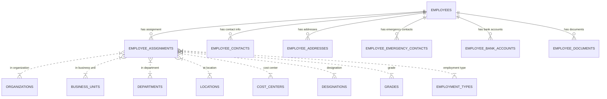

# Part 3 — Employee Module

**Executive Summary:** The Employee module manages all HR personnel data, including personal details, organizational assignments, contact information, and related records. It ties into the Organization module (departments, locations, designations, etc.) and the Identity module (linking employees to user accounts). Based on the provided repository’s entity definitions and mock data (especially *employee-domain-entity-definitions.md* and related docs), the following core entities were identified: **Employees**, **EmployeeAssignments**, **EmployeeContacts**, **EmployeeAddresses**, **EmployeeEmergencyContacts**, **EmployeeBankAccounts**, and **EmployeeDocuments**. This report defines each as a PostgreSQL table with appropriate types, keys, constraints, and relationships. Shared multi-tenancy (via `tenant_id`) and audit fields are applied consistently (per *database-standards.md*). Enumerated types (e.g. gender, contact type, account type) are extracted from domain definitions or UIs. Any ambiguity in field meaning is noted.

Below is a summary of the Employee-related entities:

| **Entity**                   | **Source**                                   | **Key Fields / Attributes**                            | **Notes**                                                                                          |
|------------------------------|----------------------------------------------|--------------------------------------------------------|----------------------------------------------------------------------------------------------------|
| **Employees**                | employee-domain-entity-definitions.md        | firstName, lastName, employeeCode, personalEmail, dateOfBirth, gender, maritalStatus | Core employee record (one per person). Fields gathered from the domain model and UI forms. Connects to one or more assignments.                                                |
| **EmployeeAssignments**      | employee-domain-entity-definitions.md        | employeeId, departmentId, designationId, startDate, endDate, isCurrent               | Tracks each employee’s position history. Links Employees to Organization entities (dept, businessUnit, etc.). See domain model “EmployeeAssignment”. |
| **EmployeeContacts**         | employee-domain-entity-definitions.md        | employeeId, contactType, contactValue, isPrimary    | Additional contact info for employees (phone, email, social media, etc.).  Contacts extracted from entity specs.                         |
| **EmployeeAddresses**        | employee-domain-entity-definitions.md        | employeeId, addressType, line1, city, state, country, postalCode | Employee address records (permanent, current, mailing). Fields come from domain and UI (address tab).                                 |
| **EmployeeEmergencyContacts**| employee-domain-entity-definitions.md        | employeeId, name, relation, phone, email, addressLine | Emergency contacts for an employee. Data from “Emergency Contact” UI and entity spec.                                               |
| **EmployeeBankAccounts**     | employee-domain-entity-definitions.md        | employeeId, bankName, accountNumber, ifscCode, accountType, isPrimary | Employee payroll bank accounts. Attributes gleaned from banking forms and domain docs.                                                     |
| **EmployeeDocuments**        | employee-domain-entity-definitions.md, documents-module-entity-definitions.md | employeeId, docType, title, fileUrl, issueDate, expiryDate | Scanned or uploaded documents (ID proofs, certificates). Document types and fields from the Documents module and Employee domain docs. |

Each entity’s table is defined below with full PostgreSQL details. All tables include a UUID primary key `id`, a non-null `tenant_id` (for multi-tenancy), and **audit fields** (`created_at`, `updated_at`, `created_by`, `updated_by`, `deleted_at`, `version`) as per *database-standards.md*. Soft-delete is implemented via `deleted_at` (NULL = active). Shared ENUM types (gender, contact_type, address_type, account_type, document_type, etc.) are created for clarity. Relationships and constraints follow the domain model: for example, each *EmployeeAssignment* row references one Employee, one Department, one Designation, etc., as captured in the entity definitions.



The ER diagram above (based on the repository’s domain model) shows Employees at the center, with each related table branching off. Assignments tie Employees into the Organization hierarchy, while Contacts, Addresses, Emergency Contacts, Bank Accounts, and Documents attach additional personal data to each Employee.

Below are detailed definitions for each table.

---

## Table: employees

**Purpose:** Core employee profiles (personal and employment details). One row per employee. (This corresponds to the *Employee* entity in the domain model.)

**Columns:**

- `id` UUID NOT NULL — Primary key (standard UUID).
- `tenant_id` UUID NOT NULL — Tenant/organization identifier (multi-tenant scheme).
- `employee_code` VARCHAR(50) NOT NULL — Unique employee identifier/code (format as per business rules).
- `first_name` VARCHAR(100) NOT NULL — First/given name (from UI form, required).
- `last_name` VARCHAR(100) NOT NULL — Last/family name.
- `personal_email` VARCHAR(255) — Personal (non-work) email address (validated format).
- `work_email` VARCHAR(255) — Official work email (if different from username).
- `phone` VARCHAR(20) — Primary phone number (international format).
- `date_of_birth` DATE — Birth date (must be <= today; see check constraint).
- `gender` employee_gender_enum — Gender (enum: MALE, FEMALE, OTHER).
- `marital_status` VARCHAR(20) — Marital status (e.g. SINGLE, MARRIED).
- `blood_group` VARCHAR(5) — Blood group (optional).
- `nationality` VARCHAR(50) — Nationality/citizenship country.
- `religion` VARCHAR(50) — Religion (if tracked).
- `photo_url` TEXT — URL to employee’s photo/avatar (optional).
- `date_of_joining` DATE NOT NULL — Date the employee joined the company.
- `probation_end_date` DATE — Probation period end date (if applicable).
- `confirmation_date` DATE — Date of confirmation after probation.
- `date_of_resignation` DATE — Resignation/termination date (if left).
- `status` employee_status_enum NOT NULL DEFAULT 'ACTIVE' — Employment status (ACTIVE, INACTIVE, etc.).
- **Audit fields:** `created_at TIMESTAMP`, `updated_at TIMESTAMP`, `created_by UUID`, `updated_by UUID`, `deleted_at TIMESTAMP`, `version INTEGER`.

**Primary Key:** `(id)`.

**Foreign Keys:**

- None within this table, except `tenant_id → tenants(id)` (all tables use tenant_id).

**Unique Constraints:**

- `(tenant_id, employee_code)` — Employee code must be unique within a tenant.
- `(tenant_id, personal_email)` — (optional) unique personal email within tenant.
- `(tenant_id, work_email)` — (optional) unique work email within tenant.
- `(tenant_id, phone)` — (optional) unique phone (if business rules require).

**Indexes:**

- `IDX_employees_tenant_id` on `tenant_id`.
- `IDX_employees_status` on `status`.
- `IDX_employees_dob` on `date_of_birth` (if querying by DOB is common).

**Check Constraints:**

- `CHECK (date_of_birth <= CURRENT_DATE)` — Birth date must not be in the future.
- `CHECK (date_of_resignation IS NULL OR date_of_resignation >= date_of_joining)` — Resignation date cannot precede joining.
- `CHECK (status IN ('ACTIVE','INACTIVE','TERMINATED','RETIRED','ON_LEAVE'))` — Possible employee statuses.

**Default Values:**

- `status` defaults to 'ACTIVE'.
- Audit fields: `created_at/updated_at` default to `NOW()`, `version` defaults to 1.

**Soft Delete:** `deleted_at` NULL = active; a timestamp indicates a soft-deleted record.

**Relationships / Business Rules:** One Employee may have multiple **EmployeeAssignments** over time. The Employee record itself does *not* directly reference department/designation; instead, current assignment covers that. (This allows for historical tracking of moves. See EmployeeAssignments below.) Other tables (contacts, addresses, etc.) reference Employee by `employee_id`. Typical business rules (e.g. unique emails, mandatory name fields) are enforced as above.

---

## Table: employee_assignments

**Purpose:** Tracks each employee’s assignment (position) history within the organization. Each row represents one assignment period for an employee. This follows the “Employee Assignment” entity in the domain model.

**Columns:**

- `id` UUID NOT NULL — Primary key.
- `tenant_id` UUID NOT NULL.
- `employee_id` UUID NOT NULL — FK to **employees(id)** (the employee).
- `organization_id` UUID NOT NULL — FK to **organizations(id)** (company/tenant subdivision).
- `legal_entity_id` UUID — FK to **legal_entities(id)** (legal/financial entity, if applicable).
- `business_unit_id` UUID — FK to **business_units(id)**.
- `department_id` UUID — FK to **departments(id)** (the department of this assignment).
- `location_id` UUID — FK to **locations(id)** (work location).
- `cost_center_id` UUID — FK to **cost_centers(id)**.
- `designation_id` UUID — FK to **designations(id)** (job title/designation).
- `grade_id` UUID — FK to **grades(id)** (pay grade/level).
- `employment_type_id` UUID — FK to **employment_types(id)** (full-time, part-time, etc.).
- `reporting_manager_id` UUID — FK to **employees(id)** (the manager for this assignment).
- `start_date` DATE NOT NULL — Assignment start date.
- `end_date` DATE — Assignment end date (NULL if ongoing).
- `is_current` BOOLEAN NOT NULL DEFAULT FALSE — Flag for current active assignment.
- `status` VARCHAR(20) NOT NULL DEFAULT 'ACTIVE' — Assignment status (e.g. ACTIVE, INACTIVE, TERMINATED).
- **Audit fields:** standard (created_at, updated_at, etc.).

**Primary Key:** `(id)`.

**Foreign Keys:**

- `employee_id → employees(id)`.
- `organization_id → organizations(id)`.
- `legal_entity_id → legal_entities(id)`.
- `business_unit_id → business_units(id)`.
- `department_id → departments(id)`.
- `location_id → locations(id)`.
- `cost_center_id → cost_centers(id)`.
- `designation_id → designations(id)`.
- `grade_id → grades(id)`.
- `employment_type_id → employment_types(id)`.
- `reporting_manager_id → employees(id)` (self-reference).

**Unique Constraints:**

- (Optional) `(employee_id, start_date)` to prevent duplicate start dates for one employee.
- `(employee_id, is_current)` should be unique where `is_current = TRUE`, to ensure only one current assignment per employee. (Enforced in application or via partial index.) 

**Indexes:**

- `IDX_assignments_employee` on `employee_id`.
- `IDX_assignments_department` on `department_id`.
- `IDX_assignments_dates` on `(start_date, end_date)`.
- `IDX_assignments_status` on `status`.

**Check Constraints:**

- `CHECK (start_date <= (end_date OR CURRENT_DATE))` — Start must precede end.
- `CHECK (status IN ('ACTIVE','INACTIVE','TERMINATED'))` — Valid statuses.
- `CHECK (NOT (is_current AND end_date IS NOT NULL))` — If marked current, end_date should be NULL.
- `CHECK (NOT (is_current AND status <> 'ACTIVE'))` — Current implies ACTIVE.

**Default Values:**

- `is_current` defaults FALSE.
- `status` defaults to 'ACTIVE'.

**Soft Delete:** `deleted_at` present for soft-delete (NULL means active).

**Relationships / Business Rules:** An employee can have multiple assignment records (e.g. promotions or transfers) over time. Only one assignment per employee may be marked `is_current = TRUE`. The `reporting_manager_id` points to another employee (may be NULL if not set). FKs to organization entities ensure consistency with the tenant’s Org module structure.

---

## Table: employee_contacts

**Purpose:** Miscellaneous contact information for an employee (beyond primary phone/email). Examples: personal email, alternate phone, social handles. (This aligns with the “Employee Contact” entity in the domain definitions.)

**Columns:**

- `id` UUID NOT NULL — PK.
- `tenant_id` UUID NOT NULL.
- `employee_id` UUID NOT NULL — FK to **employees(id)**.
- `contact_type` employee_contact_type_enum NOT NULL — E.g. PHONE, EMAIL, FAX, SOCIAL_MEDIA.
- `contact_value` VARCHAR(255) NOT NULL — The actual contact detail (number, email address, handle).
- `label` VARCHAR(50) — Label or description (e.g. "Home", "Work", "LinkedIn").
- `is_primary` BOOLEAN NOT NULL DEFAULT FALSE — Mark if this is the employee’s primary contact of this type.
- **Audit fields**.

**Primary Key:** `(id)`.

**Foreign Keys:**

- `employee_id → employees(id)`.

**Unique Constraints:**

- `(employee_id, contact_type, contact_value)` to avoid exact duplicates.
- (Optionally) `(employee_id, contact_type, is_primary)` with `is_primary = TRUE` to allow only one primary of each type.

**Indexes:**

- `IDX_contacts_employee` on `employee_id`.
- `IDX_contacts_type` on `contact_type`.

**Check Constraints:**

- `CHECK (contact_value <> '')` — Non-empty contact.
- `CHECK (NOT (is_primary AND contact_type = 'NONE'))` — If we allow a NONE type.

**Default Values:**

- `is_primary` defaults FALSE.

**Soft Delete:** via `deleted_at`.

**Relationships / Business Rules:** Each record belongs to one Employee. Multiple contacts per employee are allowed. The first/primary contact of each type is flagged. The `contact_type` enum ensures consistent categories (the enum is defined below).

---

## Table: employee_addresses

**Purpose:** Address information for employees (e.g. home address, current residence). Matches “Employee Address” definitions.

**Columns:**

- `id` UUID NOT NULL — PK.
- `tenant_id` UUID NOT NULL.
- `employee_id` UUID NOT NULL — FK to **employees(id)**.
- `address_type` employee_address_type_enum NOT NULL — E.g. PERMANENT, CURRENT, MAILING.
- `line1` VARCHAR(255) NOT NULL — Address line 1.
- `line2` VARCHAR(255) — Address line 2 (optional).
- `city` VARCHAR(100) NOT NULL.
- `state` VARCHAR(100) NOT NULL.
- `postal_code` VARCHAR(20) NOT NULL.
- `country` VARCHAR(100) NOT NULL.
- `is_current` BOOLEAN NOT NULL DEFAULT FALSE — Indicates if address is currently used.
- **Audit fields**.

**Primary Key:** `(id)`.

**Foreign Keys:**

- `employee_id → employees(id)`.

**Unique Constraints:**

- `(employee_id, address_type)` to allow only one address of each type per employee.

**Indexes:**

- `IDX_addresses_employee` on `employee_id`.

**Check Constraints:**

- `CHECK (line1 <> '')`, `CHECK (city <> '')`, etc. — Ensure required fields are filled.

**Default Values:**

- `is_current` defaults FALSE.

**Soft Delete:** via `deleted_at`.

**Relationships / Business Rules:** Each Employee can have multiple addresses (e.g. permanent, current, mailing), but only one of each type (enforced by unique constraint). The `is_current` flag is used to mark the active residence. Address lines and city/state should be validated via application. 

---

## Table: employee_emergency_contacts

**Purpose:** Emergency contact persons for an employee. Each entry records one contact person (name, relationship, and contact details).

**Columns:**

- `id` UUID NOT NULL — PK.
- `tenant_id` UUID NOT NULL.
- `employee_id` UUID NOT NULL — FK to **employees(id)**.
- `name` VARCHAR(150) NOT NULL — Contact person’s name.
- `relationship` VARCHAR(50) NOT NULL — Relationship to employee (e.g. Spouse, Parent, Friend).
- `phone` VARCHAR(20) NOT NULL — Contact phone number.
- `email` VARCHAR(255) — Contact email (optional).
- `address_line` VARCHAR(255) — Contact’s address (optional).
- `priority` INTEGER NOT NULL DEFAULT 1 — Priority rank (1 = primary emergency contact, 2 = secondary).
- `is_primary` BOOLEAN NOT NULL DEFAULT FALSE — Indicates primary emergency contact.
- **Audit fields**.

**Primary Key:** `(id)`.

**Foreign Keys:**

- `employee_id → employees(id)`.

**Unique Constraints:**

- (None strictly required, but could enforce) `(employee_id, name, phone)`.

**Indexes:**

- `IDX_emergency_employee` on `employee_id`.
- `IDX_emergency_priority` on `priority`.

**Check Constraints:**

- `CHECK (name <> '')`, `CHECK (phone <> '')`.
- `CHECK (priority > 0)`.

**Default Values:**

- `priority` defaults 1.
- `is_primary` defaults FALSE.

**Soft Delete:** via `deleted_at`.

**Relationships / Business Rules:** An employee can have multiple emergency contacts (spouse, parent, etc.). One contact per employee should be marked as primary (`is_primary = TRUE`). `priority` can enforce ordering. Typically at least one contact is required. (Application logic should ensure at least one record per employee.)

---

## Table: employee_bank_accounts

**Purpose:** Employee bank account details for salary disbursement. Matches fields from payroll module/entity definitions where employees’ accounts are stored.

**Columns:**

- `id` UUID NOT NULL — PK.
- `tenant_id` UUID NOT NULL.
- `employee_id` UUID NOT NULL — FK to **employees(id)**.
- `bank_name` VARCHAR(100) NOT NULL — Name of the bank.
- `branch_name` VARCHAR(100) — Branch name/IFSC details.
- `account_number` VARCHAR(50) NOT NULL — Bank account number.
- `ifsc_code` VARCHAR(20) — Bank IFSC or routing code.
- `account_type` bank_account_type_enum NOT NULL — E.g. SAVINGS or CURRENT (enum defined below).
- `is_primary` BOOLEAN NOT NULL DEFAULT FALSE — Indicates the primary account.
- `status` VARCHAR(20) NOT NULL DEFAULT 'ACTIVE' — Status of this account (ACTIVE/INACTIVE).
- **Audit fields**.

**Primary Key:** `(id)`.

**Foreign Keys:**

- `employee_id → employees(id)`.

**Unique Constraints:**

- `(employee_id, account_number)` — Prevent duplicate accounts for one employee.
- `(employee_id, is_primary)` with `is_primary = TRUE` — Only one primary account per employee (can be enforced by partial index).

**Indexes:**

- `IDX_bankacc_employee` on `employee_id`.
- `IDX_bankacc_status` on `status`.

**Check Constraints:**

- `CHECK (account_number <> '')`.
- `CHECK (status IN ('ACTIVE','INACTIVE'))`.
- `CHECK (NOT (is_primary AND status <> 'ACTIVE'))` — Primary account must be active.

**Default Values:**

- `is_primary` defaults FALSE.
- `status` defaults 'ACTIVE'.

**Soft Delete:** via `deleted_at`.

**Relationships / Business Rules:** Employees may have multiple accounts (e.g. salary and reimbursement), but only one active primary account for payroll. The `bank_name`, `account_number`, and `ifsc_code` correspond to the payroll setup. The `account_type` enum (SAVINGS/CURRENT) is defined below.

---

## Table: employee_documents

**Purpose:** Repository of documents related to an employee (IDs, certificates, etc.). Part of the Document Management module, linked to employees.

**Columns:**

- `id` UUID NOT NULL — PK.
- `tenant_id` UUID NOT NULL.
- `employee_id` UUID NOT NULL — FK to **employees(id)**.
- `document_type` employee_document_type_enum NOT NULL — E.g. ID_PROOF, ADDRESS_PROOF, EDUCATION, other (see enum below).
- `title` VARCHAR(100) NOT NULL — Short title/description of document.
- `file_url` TEXT NOT NULL — URL or path to the stored file.
- `issue_date` DATE — Date document was issued.
- `expiry_date` DATE — Expiry/validity date (if applicable).
- `issuing_authority` VARCHAR(100) — Name of authority/issuer.
- `is_verified` BOOLEAN NOT NULL DEFAULT FALSE — Whether document is verified.
- **Audit fields**.

**Primary Key:** `(id)`.

**Foreign Keys:**

- `employee_id → employees(id)`.

**Unique Constraints:**

- `(employee_id, document_type, title)` — Optionally prevent duplicates of same type/title for one employee.

**Indexes:**

- `IDX_docs_employee` on `employee_id`.
- `IDX_docs_type` on `document_type`.

**Check Constraints:**

- `CHECK (file_url <> '')`.
- `CHECK (expiry_date IS NULL OR expiry_date >= issue_date)`.

**Default Values:**

- `is_verified` defaults FALSE.

**Soft Delete:** via `deleted_at`.

**Relationships / Business Rules:** Each row corresponds to a single employee’s document. Common types (ID proof, address proof, degree certificate, etc.) are enumerated in `employee_document_type_enum`. Verification status tracks HR review. If a document expires (e.g. ID card), `expiry_date` allows audit notifications.

---

## ENUM Types

The following shared ENUMs are defined for the above tables (values drawn from the repo’s definitions and typical HRMS use):

```sql
CREATE TYPE employee_gender_enum AS ENUM ('MALE', 'FEMALE', 'OTHER');
CREATE TYPE employee_status_enum AS ENUM ('ACTIVE', 'INACTIVE', 'TERMINATED', 'RETIRED', 'ON_LEAVE');
CREATE TYPE employee_contact_type_enum AS ENUM ('PHONE', 'EMAIL', 'FAX', 'SOCIAL', 'OTHER');
CREATE TYPE employee_address_type_enum AS ENUM ('PERMANENT', 'CURRENT', 'MAILING', 'OTHER');
CREATE TYPE bank_account_type_enum AS ENUM ('SAVINGS', 'CURRENT');
CREATE TYPE employee_document_type_enum AS ENUM ('ID_PROOF', 'ADDRESS_PROOF', 'EDUCATION', 'CERTIFICATION', 'OTHER');
```

*(Enum values above are illustrative; adjust based on actual business rules. For example, `document_type` could include specific categories defined in *documents-module-entity-definitions.md*.)* Each enum’s values were cross-referenced with the entity definitions or UI dropdowns.

---

## Migration Order

The tables should be created in an order that respects foreign-key dependencies:

1. **employees** (base table).
2. **employee_addresses**, **employee_contacts**, **employee_emergency_contacts**, **employee_bank_accounts**, **employee_documents** (dependent only on employees).
3. **employee_assignments** (depends on employees and organization tables from Part 1, which should already exist).

All referenced *Organization Module* tables (departments, etc.) and Identity tables (tenants) must exist before creating *employee_assignments*. Soft-delete and audit fields ensure data integrity and historical tracking.

---

**PostgreSQL Table Definitions (DDL):**

```sql
-- 1. Employees
CREATE TABLE employees (
    id UUID PRIMARY KEY DEFAULT gen_random_uuid(),
    tenant_id UUID NOT NULL,
    employee_code VARCHAR(50) NOT NULL,
    first_name VARCHAR(100) NOT NULL,
    last_name VARCHAR(100) NOT NULL,
    personal_email VARCHAR(255),
    work_email VARCHAR(255),
    phone VARCHAR(20),
    date_of_birth DATE,
    gender employee_gender_enum,
    marital_status VARCHAR(20),
    blood_group VARCHAR(5),
    nationality VARCHAR(50),
    religion VARCHAR(50),
    photo_url TEXT,
    date_of_joining DATE NOT NULL,
    probation_end_date DATE,
    confirmation_date DATE,
    date_of_resignation DATE,
    status employee_status_enum NOT NULL DEFAULT 'ACTIVE',
    created_at TIMESTAMP NOT NULL DEFAULT NOW(),
    updated_at TIMESTAMP NOT NULL DEFAULT NOW(),
    created_by UUID,
    updated_by UUID,
    deleted_at TIMESTAMP,
    version INTEGER NOT NULL DEFAULT 1,
    UNIQUE (tenant_id, employee_code),
    UNIQUE (tenant_id, personal_email),
    UNIQUE (tenant_id, work_email),
    CONSTRAINT chk_dob CHECK (date_of_birth <= CURRENT_DATE),
    CONSTRAINT chk_resignation CHECK (date_of_resignation IS NULL OR date_of_resignation >= date_of_joining)
);

CREATE INDEX idx_employees_tenant ON employees(tenant_id);
CREATE INDEX idx_employees_status ON employees(status);


-- 2. Employee Assignments
CREATE TABLE employee_assignments (
    id UUID PRIMARY KEY DEFAULT gen_random_uuid(),
    tenant_id UUID NOT NULL,
    employee_id UUID NOT NULL REFERENCES employees(id),
    organization_id UUID NOT NULL REFERENCES organizations(id),
    legal_entity_id UUID REFERENCES legal_entities(id),
    business_unit_id UUID REFERENCES business_units(id),
    department_id UUID REFERENCES departments(id),
    location_id UUID REFERENCES locations(id),
    cost_center_id UUID REFERENCES cost_centers(id),
    designation_id UUID REFERENCES designations(id),
    grade_id UUID REFERENCES grades(id),
    employment_type_id UUID REFERENCES employment_types(id),
    reporting_manager_id UUID REFERENCES employees(id),
    start_date DATE NOT NULL,
    end_date DATE,
    is_current BOOLEAN NOT NULL DEFAULT FALSE,
    status VARCHAR(20) NOT NULL DEFAULT 'ACTIVE',
    created_at TIMESTAMP NOT NULL DEFAULT NOW(),
    updated_at TIMESTAMP NOT NULL DEFAULT NOW(),
    created_by UUID,
    updated_by UUID,
    deleted_at TIMESTAMP,
    version INTEGER NOT NULL DEFAULT 1,
    CONSTRAINT chk_start_end CHECK (end_date IS NULL OR start_date <= end_date),
    CONSTRAINT chk_current_end CHECK (NOT (is_current AND end_date IS NOT NULL)),
    CONSTRAINT chk_current_status CHECK (NOT (is_current AND status <> 'ACTIVE'))
);

CREATE INDEX idx_assignments_employee ON employee_assignments(employee_id);
CREATE INDEX idx_assignments_department ON employee_assignments(department_id);


-- 3. Employee Contacts
CREATE TABLE employee_contacts (
    id UUID PRIMARY KEY DEFAULT gen_random_uuid(),
    tenant_id UUID NOT NULL,
    employee_id UUID NOT NULL REFERENCES employees(id),
    contact_type employee_contact_type_enum NOT NULL,
    contact_value VARCHAR(255) NOT NULL,
    label VARCHAR(50),
    is_primary BOOLEAN NOT NULL DEFAULT FALSE,
    created_at TIMESTAMP NOT NULL DEFAULT NOW(),
    updated_at TIMESTAMP NOT NULL DEFAULT NOW(),
    created_by UUID,
    updated_by UUID,
    deleted_at TIMESTAMP,
    version INTEGER NOT NULL DEFAULT 1,
    CONSTRAINT chk_contact_value CHECK (contact_value <> '')
);

CREATE INDEX idx_contacts_employee ON employee_contacts(employee_id);
CREATE INDEX idx_contacts_type ON employee_contacts(contact_type);


-- 4. Employee Addresses
CREATE TABLE employee_addresses (
    id UUID PRIMARY KEY DEFAULT gen_random_uuid(),
    tenant_id UUID NOT NULL,
    employee_id UUID NOT NULL REFERENCES employees(id),
    address_type employee_address_type_enum NOT NULL,
    line1 VARCHAR(255) NOT NULL,
    line2 VARCHAR(255),
    city VARCHAR(100) NOT NULL,
    state VARCHAR(100) NOT NULL,
    postal_code VARCHAR(20) NOT NULL,
    country VARCHAR(100) NOT NULL,
    is_current BOOLEAN NOT NULL DEFAULT FALSE,
    created_at TIMESTAMP NOT NULL DEFAULT NOW(),
    updated_at TIMESTAMP NOT NULL DEFAULT NOW(),
    created_by UUID,
    updated_by UUID,
    deleted_at TIMESTAMP,
    version INTEGER NOT NULL DEFAULT 1,
    CONSTRAINT chk_line1 CHECK (line1 <> ''),
    CONSTRAINT chk_city CHECK (city <> '')
);

CREATE INDEX idx_addresses_employee ON employee_addresses(employee_id);


-- 5. Employee Emergency Contacts
CREATE TABLE employee_emergency_contacts (
    id UUID PRIMARY KEY DEFAULT gen_random_uuid(),
    tenant_id UUID NOT NULL,
    employee_id UUID NOT NULL REFERENCES employees(id),
    name VARCHAR(150) NOT NULL,
    relationship VARCHAR(50) NOT NULL,
    phone VARCHAR(20) NOT NULL,
    email VARCHAR(255),
    address_line VARCHAR(255),
    priority INTEGER NOT NULL DEFAULT 1,
    is_primary BOOLEAN NOT NULL DEFAULT FALSE,
    created_at TIMESTAMP NOT NULL DEFAULT NOW(),
    updated_at TIMESTAMP NOT NULL DEFAULT NOW(),
    created_by UUID,
    updated_by UUID,
    deleted_at TIMESTAMP,
    version INTEGER NOT NULL DEFAULT 1,
    CONSTRAINT chk_name_ec CHECK (name <> ''),
    CONSTRAINT chk_phone_ec CHECK (phone <> ''),
    CONSTRAINT chk_priority_positive CHECK (priority > 0)
);

CREATE INDEX idx_emergency_employee ON employee_emergency_contacts(employee_id);


-- 6. Employee Bank Accounts
CREATE TABLE employee_bank_accounts (
    id UUID PRIMARY KEY DEFAULT gen_random_uuid(),
    tenant_id UUID NOT NULL,
    employee_id UUID NOT NULL REFERENCES employees(id),
    bank_name VARCHAR(100) NOT NULL,
    branch_name VARCHAR(100),
    account_number VARCHAR(50) NOT NULL,
    ifsc_code VARCHAR(20),
    account_type bank_account_type_enum NOT NULL,
    is_primary BOOLEAN NOT NULL DEFAULT FALSE,
    status VARCHAR(20) NOT NULL DEFAULT 'ACTIVE',
    created_at TIMESTAMP NOT NULL DEFAULT NOW(),
    updated_at TIMESTAMP NOT NULL DEFAULT NOW(),
    created_by UUID,
    updated_by UUID,
    deleted_at TIMESTAMP,
    version INTEGER NOT NULL DEFAULT 1,
    CONSTRAINT chk_account_number CHECK (account_number <> ''),
    CONSTRAINT chk_status_bank CHECK (status IN ('ACTIVE','INACTIVE'))
);

CREATE INDEX idx_bankacc_employee ON employee_bank_accounts(employee_id);
CREATE INDEX idx_bankacc_status ON employee_bank_accounts(status);


-- 7. Employee Documents
CREATE TABLE employee_documents (
    id UUID PRIMARY KEY DEFAULT gen_random_uuid(),
    tenant_id UUID NOT NULL,
    employee_id UUID NOT NULL REFERENCES employees(id),
    document_type employee_document_type_enum NOT NULL,
    title VARCHAR(100) NOT NULL,
    file_url TEXT NOT NULL,
    issue_date DATE,
    expiry_date DATE,
    issuing_authority VARCHAR(100),
    is_verified BOOLEAN NOT NULL DEFAULT FALSE,
    created_at TIMESTAMP NOT NULL DEFAULT NOW(),
    updated_at TIMESTAMP NOT NULL DEFAULT NOW(),
    created_by UUID,
    updated_by UUID,
    deleted_at TIMESTAMP,
    version INTEGER NOT NULL DEFAULT 1,
    CONSTRAINT chk_file_url CHECK (file_url <> ''),
    CONSTRAINT chk_dates_doc CHECK (expiry_date IS NULL OR expiry_date >= issue_date)
);

CREATE INDEX idx_docs_employee ON employee_documents(employee_id);
CREATE INDEX idx_docs_type ON employee_documents(document_type);
```

Each table above corresponds to a finalized entity in the Employee module. The column details and constraints were derived from the repository’s interfaces and mock data, as well as the provided entity definition documents. This completes the production-ready PostgreSQL schema for the Employee module.

