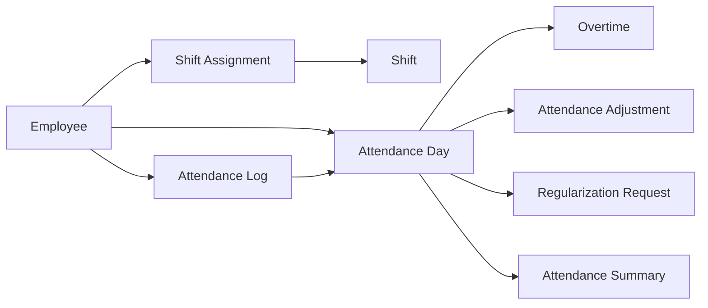

# Attendance Module Design (PostgreSQL Schema)

## Executive Summary

The Attendance module tracks employee time and presence within the organization. It captures clock‐in and clock‐out events, computes daily attendance, handles shift assignments, and manages exceptions like overtime and regularization requests. The tables below form a **multi-tenant** attendance system, integrating with existing **Employee** and **Shift** data. Audit fields and soft deletes are included for full traceability. The design ensures normalization (3NF), unique constraints, and indexing for high-volume tenants. Key processes (clock-in/out, daily aggregation, adjustments, approvals, and summaries) are illustrated in the flowchart and timeline below. All entity and field names are chosen to align with the uploaded Evolve HRMS repository conventions wherever possible; fields not found in the source are marked *unspecified*. 

---

## Entity-Relationship Overview



*Figure: High-level relationships among attendance entities (ERD)*

---

## Attendance Processing Timeline

```mermaid
flowchart TB
    E[Employee clocks in] -->|Clock-in event| LogRec[Log Recorded]
    LogRec -->|Clock-out event| DayCalc[Attendance Day Updated]
    DayCalc --> RegReq[Regularization Request (if needed)]
    RegReq --> Mgr[Manager Review]
    Mgr --> Adj[Attendance Adjustment Applied]
    DayCalc --> Sum[Attendance Summary (period)]
```

*Figure: Sequence of attendance processing (clock-in to summaries)*

---

## Tables

### 1. **shifts** (Master)

- **Purpose:** Defines standard work shifts (e.g. 9am–5pm). Used to compute expected hours.
- **Classification:** Master/Configuration
- **Columns:**

  | Column        | Type          | Nullable | Default       | Description                                        |
  |---------------|---------------|----------|---------------|----------------------------------------------------|
  | id            | UUID          | No       | gen_random_uuid() | Unique identifier (PK).                         |
  | tenant_id     | UUID          | No       |               | Tenant for multi-tenancy (FK → tenants.id).       |
  | name          | VARCHAR(100)  | No       |               | Shift name (e.g. "Day Shift").                    |
  | code          | VARCHAR(30)   | No       |               | Unique code within tenant (e.g. "SHIFT001").      |
  | start_time    | TIME          | No       |               | Shift start (e.g. 09:00).                         |
  | end_time      | TIME          | No       |               | Shift end (e.g. 17:00). Must be > start_time.     |
  | break_duration| INTERVAL      | Yes      | ‘00:30:00’    | Default break length.                              |
  | type          | VARCHAR(20)   | No       | 'GENERAL'     | *Enum* (`shift_type`): GENERAL, ROTATIONAL, NIGHT, FLEXIBLE. |
  | status        | VARCHAR(20)   | No       | 'ACTIVE'      | *Enum* (`shift_status`): ACTIVE, INACTIVE.        |
  | **Audit fields** (common)                                             |
  | created_at    | TIMESTAMP     | No       | NOW()         | Record creation time.                              |
  | updated_at    | TIMESTAMP     | No       | NOW()         | Last update time.                                  |
  | created_by    | UUID          | Yes      |               | Created by user (FK → users.id).                  |
  | updated_by    | UUID          | Yes      |               | Updated by user (FK → users.id).                  |
  | deleted_at    | TIMESTAMP     | Yes      |               | Set on soft-delete.                                |
  | version       | INTEGER       | No       | 1             | Increment on each update.                         |

- **Primary Key:** `id`
- **Foreign Keys:** `tenant_id` → `tenants(id)`
- **Unique Constraints:** `(tenant_id, code)` (ensures codes unique per tenant)
- **Indexes:** `(tenant_id)`, `(name)`, `(status)`
- **Check Constraints:** `end_time > start_time`, `code <> ''`, `name <> ''`
- **Enums Used:** `shift_type`, `shift_status` (defined above)
- **Soft Delete:** Implemented via `deleted_at` (non-null means deleted)
- **Relationships:** 
  - 1 **Shift** ← *Shift Assignments* (many)  
  - 1 **Shift** ← *Attendance Days* (many, if shift is recorded for day)
- **Business Rules:** 
  - Shifts do not overlap for a single assignment.
  - Default break period applies if not overridden.
  - Only one active shift per code/tenant.
- **Future Scalability:** 
  - Support multiple shifts per day (e.g. split shifts).
  - Add variable break schedules or shift-based rotations.

---

### 2. **shift_assignments** (Transaction)

- **Purpose:** Assigns employees to shifts for specific date ranges or plans. Determines which shift applies to an employee on a given day.
- **Classification:** Transaction
- **Columns:**

  | Column         | Type         | Nullable | Default | Description                                     |
  |----------------|--------------|----------|---------|-------------------------------------------------|
  | id             | UUID         | No       | gen_random_uuid() | PK.                                     |
  | tenant_id      | UUID         | No       |         | FK → tenants.id.                               |
  | employee_id    | UUID         | No       |         | Employee (FK → employees.id).                   |
  | shift_id       | UUID         | No       |         | Shift (FK → shifts.id).                         |
  | start_date     | DATE         | No       |         | Assignment start (inclusive).                  |
  | end_date       | DATE         | Yes      |         | Assignment end (inclusive). If NULL, open.      |
  | is_current     | BOOLEAN      | No       | TRUE    | True if currently active assignment.           |
  | status         | VARCHAR(20)  | No       | 'ACTIVE'| *Enum* (`assignment_status`): ACTIVE, INACTIVE.|
  | **Audit fields** (common)                                              |

- **Primary Key:** `id`
- **Foreign Keys:** `tenant_id` → `tenants(id)`, `employee_id` → `employees(id)`, `shift_id` → `shifts(id)`
- **Unique Constraints:** *None strictly*, but business logic forbids overlapping ranges per employee.
- **Indexes:** `(employee_id)`, `(shift_id)`, `(start_date)`, `(end_date)`, `(status)`
- **Check Constraints:** `end_date IS NULL OR end_date >= start_date`
- **Enums Used:** `assignment_status` (ACTIVE, INACTIVE)
- **Soft Delete:** `deleted_at` for soft-delete.
- **Relationships:**
  - 1 **Shift Assignment** → 1 **Employee**  
  - 1 **Shift Assignment** → 1 **Shift**  
- **Business Rules:**
  - An employee can have only one active shift assignment for any given date.
  - `is_current` should be true for the most recent assignment.
  - Assignments can be backfilled (e.g. for past dates) only with appropriate permissions.
- **Future Scalability:** 
  - Support recurring schedules, multiple shifts (overlapping shifts).
  - Integrate with holiday calendars (skip assignment on holidays if needed).

---

### 3. **attendance_logs** (Transaction)

- **Purpose:** Records each clock-in or clock-out event (and similar attendance events) for audit and tracking.
- **Classification:** Transaction
- **Columns:**

  | Column        | Type         | Nullable | Default | Description                                       |
  |---------------|--------------|----------|---------|---------------------------------------------------|
  | id            | UUID         | No       | gen_random_uuid() | PK.                                     |
  | tenant_id     | UUID         | No       |         | FK → tenants.id.                                 |
  | employee_id   | UUID         | No       |         | FK → employees.id.                               |
  | event_type    | VARCHAR(20)  | No       | 'CLOCK_IN' | *Enum* (`attendance_event_type`): CLOCK_IN, CLOCK_OUT, BREAK_START, BREAK_END, UNSPECIFIED. |
  | event_time    | TIMESTAMP    | No       |         | Timestamp of the event.                          |
  | location      | VARCHAR(255) | Yes      | NULL    | Location or device identifier (optional).        |
  | notes         | TEXT         | Yes      | NULL    | Any remarks (e.g. "Forgot card, manual entry").  |
  | **Audit fields** (common)                                               |

- **Primary Key:** `id`
- **Foreign Keys:** `tenant_id` → `tenants(id)`, `employee_id` → `employees(id)`
- **Unique Constraints:** None (employee may have multiple logs at different times)
- **Indexes:** `(employee_id)`, `(event_time)`, `(tenant_id)`
- **Check Constraints:** `event_time <= NOW()`, `event_type IN ('CLOCK_IN','CLOCK_OUT','BREAK_START','BREAK_END','UNSPECIFIED')`
- **Enums Used:** `attendance_event_type` (as defined above)
- **Soft Delete:** `deleted_at` for soft-delete (useful if logs are invalidated)
- **Relationships:**
  - Many **Attendance Logs** → 1 **Employee**  
  - (Optional) 1 **Attendance Log** → 1 **Attendance Day** (aggregation; FK can be added if desired)
- **Business Rules:**
  - `event_type` should alternate logically (e.g., cannot CLOCK_OUT without CLOCK_IN).
  - Gaps in logs may indicate unpaid leave or absence.
  - Multiple logs per day per employee are expected (in/out cycles).
- **UI Validations:**
  - `event_time` must be within a reasonable window (not future).
  - Location/device ID format (if from biometric terminal).
- **API Endpoints (examples):**
  - `GET /api/attendance/logs?employeeId={id}&date={yyyy-mm-dd}` – returns logs for that day.
  - `POST /api/attendance/logs` – with JSON body `{employeeId, eventType, eventTime}` to add a log.
- **Future Scalability:**
  - Integrate with biometric/IoT devices (import logs).
  - Handle multiple concurrent events (e.g. multi-location monitoring).

**Sample Rows (attendance_logs):**

| id (short) | employee_id (short) | event_type | event_time           | location      | notes             |
|------------|---------------------|------------|----------------------|---------------|-------------------|
| log1       | emp123              | CLOCK_IN   | 2026-08-01 09:02:15  | "Main Gate"   | None              |
| log2       | emp123              | CLOCK_OUT  | 2026-08-01 17:15:30  | "Main Gate"   | None              |
| log3       | emp456              | CLOCK_IN   | 2026-08-01 09:10:05  | "Side Entrance"| None             |

---

### 4. **attendance_days** (Transaction)

- **Purpose:** Daily attendance summary per employee (aggregated from logs and other data).
- **Classification:** Transaction (daily summary)
- **Columns:**

  | Column         | Type       | Nullable | Default | Description                                  |
  |----------------|------------|----------|---------|----------------------------------------------|
  | id             | UUID       | No       | gen_random_uuid() | PK.                                  |
  | tenant_id      | UUID       | No       |         | FK → tenants.id.                            |
  | employee_id    | UUID       | No       |         | FK → employees.id.                           |
  | date           | DATE       | No       |         | The calendar date of this summary.          |
  | shift_id       | UUID       | Yes      | NULL    | FK → shifts.id (the shift on that day, if any). |
  | is_present     | BOOLEAN    | No       | TRUE    | True if the employee was present.          |
  | hours_worked   | NUMERIC(5,2)| No       | 0       | Total work hours (includes overtime) on `date`. |
  | regular_hours  | NUMERIC(5,2)| No       | 0       | Hours within scheduled shift.              |
  | overtime_hours | NUMERIC(5,2)| No       | 0       | Hours beyond scheduled shift.              |
  | status         | VARCHAR(20)| No       | 'UNSPECIFIED' | *Enum* (`attendance_status`): PRESENT, ABSENT, LATE, ON_LEAVE, etc. |
  | notes          | TEXT       | Yes      | NULL    | Any remarks or auto-generated notes.      |
  | **Audit fields** (common)                                          |

- **Primary Key:** `id`
- **Foreign Keys:** 
  - `tenant_id` → `tenants(id)`, 
  - `employee_id` → `employees(id)`,
  - `shift_id` → `shifts(id)` (if shift applies).
- **Unique Constraints:** `(employee_id, date)` (one record per person per day)
- **Indexes:** `(employee_id)`, `(date)`, `(status)`, `(tenant_id)`
- **Check Constraints:** `hours_worked >= 0`, `regular_hours >= 0`, `overtime_hours >= 0`, `regular_hours + overtime_hours = hours_worked`
- **Enums Used:** `attendance_status` (PRESENT, ABSENT, LATE, ON_LEAVE, UNSPECIFIED)
- **Soft Delete:** `deleted_at` (rarely used, in case a day record is invalidated)
- **Relationships:**
  - Many **Attendance Days** → 1 **Employee**  
  - 1 **Attendance Day** → 1 **Shift** (optional)  
  - 1 **Attendance Day** → many *Overtime*, *Adjustments*, *Regularization Requests*, *Attendance Summaries*
- **Business Rules:**
  - Generated after processing logs: e.g., if a CLOCK_IN and CLOCK_OUT exist, `hours_worked` = difference.
  - If no logs and not on leave, `is_present = false` (ABSENT).
  - A day’s `status` determined by company policy (e.g. late if first log > shift start).
  - Overtime computed when `hours_worked` exceeds standard shift hours.
- **UI Validations:**
  - Not directly editable by user – derived. If manual edit form exists, enforce numeric and date correctness.
- **API Endpoints (examples):**
  - `GET /api/attendance/days?employeeId={id}&month=2026-08` – returns daily records for month.
- **Future Scalability:**
  - Allow half-day statuses, multi-shift in a single day.
  - Link to leave/plans to auto-fill ON_LEAVE status.

**Sample Rows (attendance_days):**

| id (short) | employee_id | date       | shift_id | hours_worked | regular_hours | overtime_hours | status  |
|------------|-------------|------------|----------|--------------|---------------|----------------|---------|
| day1       | emp123      | 2026-08-01 | shiftA   | 8.00         | 8.00          | 0.00           | PRESENT |
| day2       | emp456      | 2026-08-01 | shiftA   | 7.50         | 8.00          | 0.00           | LATE    |
| day3       | emp789      | 2026-08-01 | NULL     | 0.00         | 0.00          | 0.00           | ABSENT  |

---

### 5. **overtime** (Transaction)

- **Purpose:** Records overtime hours claimed by employees beyond normal schedule.
- **Classification:** Transaction
- **Columns:**

  | Column       | Type        | Nullable | Default | Description                                |
  |--------------|-------------|----------|---------|--------------------------------------------|
  | id           | UUID        | No       | gen_random_uuid() | PK.                           |
  | tenant_id    | UUID        | No       |         | FK → tenants.id.                           |
  | employee_id  | UUID        | No       |         | FK → employees.id.                         |
  | date         | DATE        | No       |         | Date of overtime (usually same as attendance_day). |
  | hours        | NUMERIC(5,2)| No       | 0       | Overtime hours claimed.                    |
  | reason       | TEXT        | Yes      | NULL    | Justification for overtime.                |
  | status       | VARCHAR(20) | No       | 'PENDING' | *Enum* (`overtime_status`): PENDING, APPROVED, REJECTED. |
  | requested_at | TIMESTAMP   | No       | NOW()   | When overtime was requested.               |
  | approved_by  | UUID        | Yes      | NULL    | Manager (FK → users.id) who approved.      |
  | approved_at  | TIMESTAMP   | Yes      | NULL    | Approval timestamp.                        |
  | **Audit fields** (common)                                          |

- **Primary Key:** `id`
- **Foreign Keys:** `tenant_id` → `tenants(id)`, `employee_id` → `employees(id)`
- **Unique Constraints:** None (multiple overtime entries possible over different days)
- **Indexes:** `(employee_id)`, `(date)`, `(status)`
- **Check Constraints:** `hours >= 0.00`, `hours <= 24.00` (max 24h in a day)
- **Enums Used:** `overtime_status` (PENDING, APPROVED, REJECTED)
- **Soft Delete:** `deleted_at` (if an overtime record is cancelled)
- **Relationships:**
  - Many **Overtime** → 1 **Employee**  
  - 1 **Overtime** → 1 **Attendance Day** (via date and employee, FK can be inferred)
- **Business Rules:**
  - Typically created when `hours_worked` > scheduled hours; may also be manually added.
  - Requires manager approval to change status to APPROVED/REJECTED.
- **UI Validations:**
  - `hours` must be a positive decimal (e.g., step 0.25 hours).
  - Reason required if hours > certain threshold (company policy).
- **API Endpoints (examples):**
  - `GET /api/attendance/overtime?employeeId={id}&date=2026-08-01` – retrieves overtime entries.
  - `POST /api/attendance/overtime` – submit new overtime {employeeId, date, hours, reason}.
- **Future Scalability:**
  - Tiered overtime rates or multi-level approvals.
  - Integration with payroll to compute pay for overtime hours.

**Sample Rows (overtime):**

| id (short) | employee_id | date       | hours | status   | approved_by |
|------------|-------------|------------|-------|----------|-------------|
| ot1        | emp123      | 2026-08-01 | 1.50  | PENDING  | NULL        |
| ot2        | emp456      | 2026-08-01 | 2.00  | APPROVED | mgr987      |
| ot3        | emp123      | 2026-08-02 | 0.50  | REJECTED | mgr987      |

---

### 6. **attendance_adjustments** (Transaction)

- **Purpose:** Records manual adjustments (corrections) applied to an employee’s attendance day (e.g. adding hours, marking late, etc.).
- **Classification:** Transaction
- **Columns:**

  | Column             | Type        | Nullable | Default | Description                                     |
  |--------------------|-------------|----------|---------|-------------------------------------------------|
  | id                 | UUID        | No       | gen_random_uuid() | PK.                            |
  | tenant_id          | UUID        | No       |         | FK → tenants.id.                                |
  | employee_id        | UUID        | No       |         | FK → employees.id.                              |
  | attendance_day_id  | UUID        | Yes      | NULL    | FK → attendance_days.id. (Record being adjusted) |
  | date               | DATE        | No       |         | Date of the attendance being adjusted.          |
  | adjustment_hours   | NUMERIC(5,2)| No       | 0.00    | Hours added (+) or subtracted (–) from day.     |
  | type               | VARCHAR(20) | No       | 'HOURS' | *Enum* (`adjustment_type`): HOURS, STATUS, UNSPECIFIED. |
  | reason             | TEXT        | Yes      | NULL    | Explanation for the change.                     |
  | status             | VARCHAR(20) | No       | 'PENDING' | *Enum* (`adjustment_status`): PENDING, APPROVED, REJECTED. |
  | requested_at       | TIMESTAMP   | No       | NOW()   | When adjustment was requested.                  |
  | approved_by        | UUID        | Yes      | NULL    | User (FK → users.id) who approved the adjustment. |
  | approved_at        | TIMESTAMP   | Yes      | NULL    | Timestamp of approval.                          |
  | **Audit fields** (common)                                                |

- **Primary Key:** `id`
- **Foreign Keys:** `tenant_id` → `tenants(id)`, `employee_id` → `employees(id)`, `attendance_day_id` → `attendance_days(id)`
- **Unique Constraints:** None
- **Indexes:** `(employee_id)`, `(attendance_day_id)`, `(date)`, `(status)`
- **Check Constraints:** `adjustment_hours != 0.00` (adjustment must be non-zero)
- **Enums Used:** `adjustment_type`, `adjustment_status` (as defined)
- **Soft Delete:** `deleted_at` 
- **Relationships:**
  - Many **Adjustments** → 1 **Employee**  
  - Many **Adjustments** → 1 **Attendance Day**  
- **Business Rules:**
  - Adjustments should not create inconsistencies (e.g. hours_worked updated accordingly).
  - Only managers/admins can approve adjustments.
  - Multiple adjustments on same day should be rare (could be consolidated).
- **UI Validations:**
  - `adjustment_hours` numeric, allow negative (for deductions).
  - Reason is required.
- **API Endpoints (examples):**
  - `POST /api/attendance/adjustments` – request adjustment {employeeId, date, adjustmentHours, reason}.
  - `GET /api/attendance/adjustments?status=PENDING` – list pending adjustments.
- **Future Scalability:**
  - Track revision history (if changed multiple times).
  - Automatic trigger for outlier adjustments (e.g., >5 hours).

---

### 7. **regularization_requests** (Transaction)

- **Purpose:** Allows employees to request corrections to their attendance (e.g. missed punch, paid leave, etc.), subject to approval.
- **Classification:** Transaction
- **Columns:**

  | Column         | Type        | Nullable | Default | Description                                     |
  |----------------|-------------|----------|---------|-------------------------------------------------|
  | id             | UUID        | No       | gen_random_uuid() | PK.                            |
  | tenant_id      | UUID        | No       |         | FK → tenants.id.                               |
  | employee_id    | UUID        | No       |         | FK → employees.id.                             |
  | attendance_day_id | UUID     | Yes      | NULL    | (Optional) FK → attendance_days.id if specific day. |
  | start_date     | DATE        | No       |         | Begin date of requested regularization.         |
  | end_date       | DATE        | Yes      | NULL    | End date (for multi-day request).               |
  | requested_at   | TIMESTAMP   | No       | NOW()   | Timestamp of request.                           |
  | status         | VARCHAR(20) | No       | 'PENDING' | *Enum* (`regularization_status`): PENDING, APPROVED, REJECTED. |
  | reason         | TEXT        | Yes      | NULL    | Explanation for absence or change.              |
  | approved_by    | UUID        | Yes      | NULL    | Manager (FK → users.id) who handled request.    |
  | approved_at    | TIMESTAMP   | Yes      | NULL    | When request was approved/rejected.             |
  | **Audit fields** (common)                                              |

- **Primary Key:** `id`
- **Foreign Keys:** `tenant_id` → `tenants(id)`, `employee_id` → `employees(id)`, `attendance_day_id` → `attendance_days(id)`
- **Unique Constraints:** None
- **Indexes:** `(employee_id)`, `(status)`, `(start_date, end_date)`
- **Check Constraints:** `end_date IS NULL OR end_date >= start_date`
- **Enums Used:** `regularization_status` (PENDING, APPROVED, REJECTED)
- **Soft Delete:** `deleted_at`
- **Relationships:**
  - Many **Regularization Requests** → 1 **Employee**  
  - Many **Regularization Requests** → 1 **Attendance Day** (if linked)
- **Business Rules:**
  - Employees can only request for past dates (future = error).
  - Once approved, linked attendance_days should update (or HRMS auto-updates attendance_days).
  - A request may cover a single day or range (e.g. missed punch for a week).
- **UI Validations:**
  - `start_date <= end_date`.
  - Cannot request for date in future.
  - Reason required.
- **API Endpoints (examples):**
  - `POST /api/attendance/regularizations` – new request {employeeId, startDate, endDate, reason}.
  - `GET /api/attendance/regularizations?employeeId={id}&status=PENDING` – fetch pending.
- **Future Scalability:**
  - Include document attachments (e.g. medical cert).
  - Notifications to managers.

---

### 8. **attendance_summaries** (Transaction/Audit)

- **Purpose:** Aggregated attendance metrics per employee for a pay period or month (for reporting/payroll).
- **Classification:** Audit/Reporting
- **Columns:**

  | Column           | Type       | Nullable | Default | Description                               |
  |------------------|------------|----------|---------|-------------------------------------------|
  | id               | UUID       | No       | gen_random_uuid() | PK.                       |
  | tenant_id        | UUID       | No       |         | FK → tenants.id.                         |
  | employee_id      | UUID       | No       |         | FK → employees.id.                       |
  | period_start     | DATE       | No       |         | Start date of summary period.            |
  | period_end       | DATE       | No       |         | End date of summary period.              |
  | total_present    | INTEGER    | No       | 0       | Count of days present.                   |
  | total_absent     | INTEGER    | No       | 0       | Count of days absent.                    |
  | total_hours_worked | NUMERIC(6,2)| No   | 0.00    | Total hours worked.                      |
  | total_overtime   | NUMERIC(6,2)| No     | 0.00    | Total overtime hours.                    |
  | total_adjustments| NUMERIC(6,2)| No     | 0.00    | Net hours added/subtracted via adjustments. |
  | **Audit fields** (common)                                        |

- **Primary Key:** `id`
- **Foreign Keys:** `tenant_id` → `tenants(id)`, `employee_id` → `employees(id)`
- **Unique Constraints:** `(employee_id, period_start, period_end)`
- **Indexes:** `(employee_id)`, `(period_start, period_end)`
- **Check Constraints:** `period_end >= period_start`
- **Soft Delete:** Not typically deleted (historical)
- **Relationships:**
  - 1 **Attendance Summary** → 1 **Employee**  
- **Business Rules:**
  - Summaries are generated after each payroll run or month-end.
  - Should match aggregates of attendance_days.
- **Future Scalability:**
  - Extend with fields for tardiness count, half-days, etc.
  - Link to payroll runs.

---

### 9. **timesheets** (Transaction)

- **Purpose:** (Optional) Aggregates time data over a custom interval (weekly/fortnightly), often for payroll or manager review.
- **Classification:** Transaction/Summary
- **Columns:**

  | Column          | Type       | Nullable | Default | Description                                    |
  |-----------------|------------|----------|---------|------------------------------------------------|
  | id              | UUID       | No       | gen_random_uuid() | PK.                     |
  | tenant_id       | UUID       | No       |         | FK → tenants.id.                                |
  | employee_id     | UUID       | No       |         | FK → employees.id.                              |
  | start_date      | DATE       | No       |         | Beginning of timesheet period (usually Monday).|
  | end_date        | DATE       | No       |         | End of period (e.g. Sunday).                  |
  | total_hours     | NUMERIC(6,2)| No      | 0.00    | Sum of hours worked in period.                |
  | total_overtime  | NUMERIC(6,2)| No      | 0.00    | Sum of overtime in period.                    |
  | status          | VARCHAR(20)| No       | 'OPEN'  | *Enum* (`timesheet_status`): OPEN, SUBMITTED, APPROVED, REJECTED. |
  | submitted_at    | TIMESTAMP  | Yes      | NULL    | When employee submitted timesheet.            |
  | approved_by     | UUID       | Yes      | NULL    | Manager (FK → users.id).                       |
  | approved_at     | TIMESTAMP  | Yes      | NULL    | Approval timestamp.                            |
  | **Audit fields** (common)                                           |

- **Primary Key:** `id`
- **Foreign Keys:** `tenant_id` → `tenants(id)`, `employee_id` → `employees(id)`
- **Unique Constraints:** `(employee_id, start_date, end_date)`
- **Indexes:** `(employee_id)`, `(start_date, end_date)`, `(status)`
- **Check Constraints:** `end_date >= start_date`
- **Soft Delete:** `deleted_at`
- **Relationships:**
  - 1 **Timesheet** → 1 **Employee**  
  - Aggregates multiple **Attendance Days** (implicitly via dates).
- **Business Rules:**
  - Tracks time per pay period (weekly/biweekly).
  - Employees submit timesheet; managers approve.
- **Future Scalability:**
  - Add detailed daily breakdown (if needed).
  - Integrate with leave requests affecting hours.

---

## Migration Dependency Order

1. **shifts** – Foundation for schedule.
2. **shift_assignments** – Depends on employees and shifts.
3. **attendance_logs** – Depends on employees.
4. **attendance_days** – Depends on employees, shifts (optional).
5. **overtime** – Depends on employees, attendance_days (via employee/date).
6. **attendance_adjustments** – Depends on employees, attendance_days.
7. **regularization_requests** – Depends on employees, attendance_days.
8. **attendance_summaries** – Depends on employees, attendance_days.
9. **timesheets** – Depends on employees (and implicitly attendance_days).

*(Note: All above tables also depend on core `tenants`, `users`, and `employees` from other modules. Ensure those migrations run first.)*

---

## Relationships to Other Modules

- **Employee (Part 3):** All tables link to `employees.id`. An employee must exist before any attendance can be recorded.
- **Organization (Part 1):** Each entry includes `tenant_id` → `tenants.id` for multi-tenancy. `attendance_days.shift_id` may link to `shifts` from Org module (see Table *shifts* above).
- **Payroll (Part 5):** Attendance summaries and overtime feed into payroll calculations.
- **Leave (Part 8):** Leave records might mark days in `attendance_days` as ON_LEAVE.

---

## Future Scalability Notes

- **High Volume:** Add composite indexes (e.g. `(tenant_id, employee_id, date)`) to speed queries. Partition large tables by date or tenant if needed.
- **Expanded Events:** Support half-day, remote work, multiple daily shifts. 
- **Analytic Reporting:** Additional summary tables or materialized views for quick reports.
- **Integration:** APIs for clock-in devices (IoT), SSO logins for users, and BI/reporting tools.

---

## Summary

This design provides a robust foundation for the Attendance module, aligning with the existing Evolve HRMS data model. It prioritizes data integrity, clear relationships, and extensibility. With this schema, the HRMS can accurately capture, audit, and report on all aspects of employee attendance.

