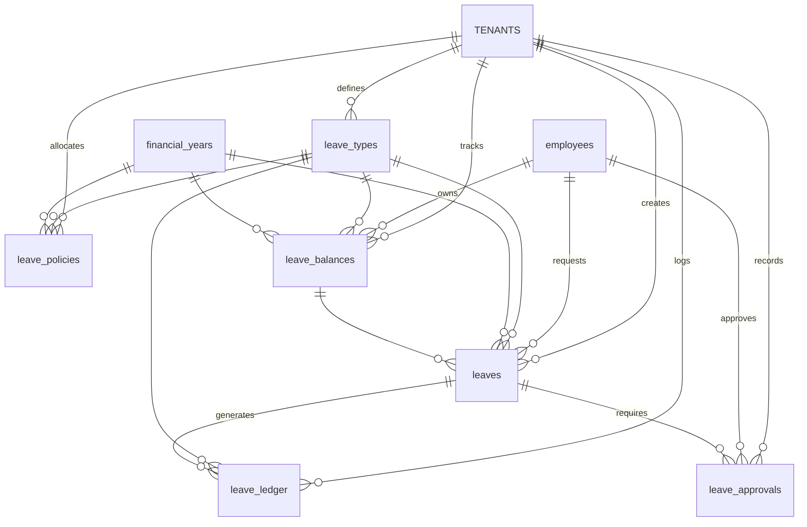
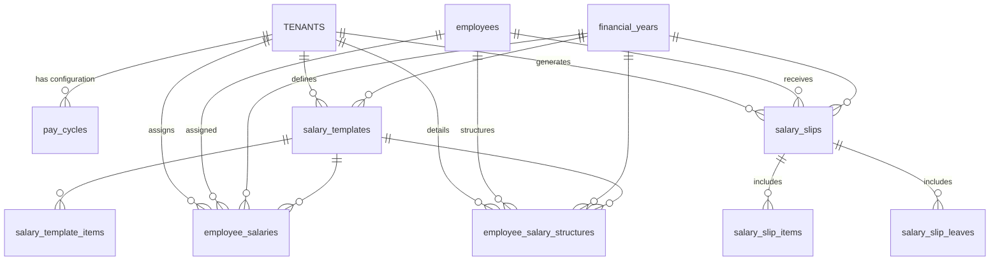

# Parts 5 & 6: Leave and Payroll Modules (Database Design)

## Executive Summary

**Leave Module (Part 5):** The Leave module manages employee leave policies, leave requests, balances and approvals.  It defines **leave types** (e.g. Sick Leave, Casual Leave), **leave policies** (allocations per financial year), tracks each employee’s **leave balance** and **leave ledger** (debits/credits), and handles **leave requests** with multi-step approval. Key entities include `leave_types`, `leave_policies`, `leave_balances`, `leaves`, `leave_approvals` and `leave_ledger`. These tables are linked through foreign keys to **tenants**, **employees**, **financial years**, and each other to enforce business rules (e.g. no overlapping approved leave, balance updates on approval, etc.).

**Payroll Module (Part 6):** The Payroll module handles salary configuration and payslip generation. It includes **payroll cycles**, **salary templates**, **employee salary assignments**, and the generation of **salary slips** with line items (earnings/deductions) and included leaves. Key entities are `pay_cycles`, `salary_templates`, `salary_template_items`, `employee_salaries`, `employee_salary_structures`, `salary_slips`, `salary_slip_items`, and `salary_slip_leaves`. These tables connect **tenants**, **financial years**, **employees**, and each other to ensure accurate payroll computation (e.g. one active salary template per year, one payslip per employee per month, etc.).

All tables use a **tenant_id** column for multi-tenancy (with RLS) and include standard **audit fields** (`created_at`, `created_by`, `updated_at`, `updated_by`, `version`) and a soft-delete flag **`inactive BOOLEAN DEFAULT FALSE`**. Enumerated fields (e.g. leave status, day type, transaction type, item type) are defined as `VARCHAR` columns with documented valid values. Primary keys are `id UUID`, typically defaulting to `gen_random_uuid()`. Foreign keys reference well-known tables (e.g. `financial_years`, `employees`). Unique constraints and indexes enforce data integrity (e.g. one active payslip per employee per month) and optimize queries. Where repository details are unspecified, fields or rules are marked **unspecified**.

### Entity Summary Tables

#### Leave Module Entities

| Entity            | Description                                      | Key Relationships                                      |
|-------------------|--------------------------------------------------|--------------------------------------------------------|
| **leave_types**        | Defines each kind of leave (name, shortcode, paid/unpaid, carry rules, etc.) | ▶ Referenced by `leave_policies`, `leaves`, `leave_balances`, `leave_ledger`, `salary_slip_leaves` |
| **leave_policies**     | Annual allocation of days per leave type & year (fixed or monthly accrual) | ▶ FK to `leave_types`, `financial_years`               |
| **leave_balances**     | Current balance, used and pending days per employee/type/FY | ▶ FK to `employees` (or `users`), `leave_types`, `financial_years` |
| **leaves**            | Employee leave requests/records (dates, status, etc.)     | ▶ FK to `employees`, `leave_types`, `financial_years`  |
| **leave_approvals**   | Approval step records for leave requests (approver, status) | ▶ FK to `leaves` and to `employees` (as approver)       |
| **leave_ledger**      | Audit trail of leave debit/credit transactions (with references) | ▶ FK to `employees`, `leave_types`, `financial_years`, and optionally `leaves` |

#### Payroll Module Entities

| Entity                      | Description                                                | Key Relationships                                            |
|-----------------------------|------------------------------------------------------------|--------------------------------------------------------------|
| **pay_cycles**                 | Payroll cycle configuration (e.g. monthly pay day, period)  | – (tenant-specific; no external FK except `tenant_id`)       |
| **salary_templates**          | Salary component templates per financial year              | ▶ FK to `financial_years`                                    |
| **salary_template_items**     | Individual earning/deduction items in a salary template    | ▶ FK to `salary_templates`                                   |
| **employee_salaries**         | Employee’s base salary & chosen template for a FY         | ▶ FK to `employees`, `salary_templates`, `financial_years`    |
| **employee_salary_structures**| Custom breakdown of salary components per employee & FY   | ▶ FK to `employees`, `salary_templates`, `financial_years`    |
| **salary_slips**              | Payslip records (monthly) with totals (gross, deductions) | ▶ FK to `employees`, `salary_templates`, `financial_years`    |
| **salary_slip_items**         | Line items (earnings/deductions) on a payslip             | ▶ FK to `salary_slips`                                       |
| **salary_slip_leaves**        | Leaves accounted in a payslip (for LWP calculation)       | ▶ FK to `salary_slips`, `leave_types`                        |

---

## Part 5: Leave Module

### TABLE: leave_types  
**Purpose:** Defines each type of leave that can be taken (e.g. Casual, Sick, Earned Leave), including rules like paid/unpaid, carry-forward, and daily limits.  

**Columns:**

| Column                 | PostgreSQL Type         | Nullable | Default        | Description |
|------------------------|-------------------------|----------|----------------|-------------|
| **id**                 | UUID                    | No       | `gen_random_uuid()` | Primary key identifier |
| **tenant_id**          | UUID                    | No       | –              | FK to `tenants.id` (tenant/company) |
| **name**               | VARCHAR(100)            | No       | –              | Leave type name (e.g. "Casual Leave") |
| **shortcode**          | VARCHAR(20)             | Yes      | –              | Abbreviated code (e.g. "CL", "SL") |
| **description**        | TEXT                    | Yes      | –              | Detailed description |
| **is_paid**            | BOOLEAN                 | No       | `TRUE`         | Whether leave is paid or unpaid |
| **is_carry_forward**   | BOOLEAN                 | No       | `FALSE`        | If unused days can be carried to next year |
| **max_carry_forward**  | INTEGER                | No       | `0`            | Max days allowed to carry forward |
| **is_consecutive_limit** | BOOLEAN               | No       | `FALSE`        | If a consecutive-day limit applies |
| **consecutive_days_limit** | INTEGER             | No       | `0`            | Maximum consecutive days allowed if limit applies |
| **inactive**           | BOOLEAN                 | No       | `FALSE`        | Soft-delete flag (inactive if true) |
| **created_at**         | TIMESTAMP WITH TIME ZONE| No       | `NOW()`        | Record creation timestamp |
| **created_by**         | UUID                    | Yes      | –              | FK to `users.id` who created record |
| **updated_at**         | TIMESTAMP WITH TIME ZONE| Yes      | –              | Last update timestamp |
| **updated_by**         | UUID                    | Yes      | –              | FK to `users.id` who last updated |
| **version**            | INTEGER                 | No       | `1`            | Row version for optimistic locking |

**Primary Key:** `id`

**Foreign Keys:**
- `tenant_id → tenants.id`
- (Audit FKs: `created_by`, `updated_by` → `users.id`)

**Unique Constraints:**
- `(tenant_id, name)` – each tenant’s leave types must have unique names (WHERE `NOT inactive`).
- `(tenant_id, shortcode)` – unique shortcode per tenant (if shortcodes are used).

**Indexes:**
- `idx_leave_types_tenant ON leave_types(tenant_id);`

**Check Constraints:** None beyond type constraints.

**Default Values:** As above.

**Enums Used:** None; boolean flags instead.

**Soft Delete:** `inactive BOOLEAN NOT NULL DEFAULT FALSE` indicates a soft-deleted record (active records have `inactive = FALSE`).

**Audit Fields:** `created_at`, `created_by`, `updated_at`, `updated_by`, `version` as above.

**Relationships:**  
- One-to-many to **leave_policies** (via `leave_type_id`).  
- One-to-many to **leaves** (`leave_type_id`).  
- One-to-many to **leave_balances** (`leave_type_id`).  
- One-to-many to **leave_ledger** (`leave_type_id`).  
- One-to-many to **salary_slip_leaves** (`leave_type_id`).

**Business Rules:**  
- Leave type name and shortcode must be unique per tenant.  
- If `is_carry_forward` is true, carried days ≤ `max_carry_forward`.  
- If `is_consecutive_limit` is true, days requested ≤ `consecutive_days_limit` per request or FY (enforced in approval logic).  

---

### TABLE: leave_policies  
**Purpose:** Specifies how many days of each leave type are allocated per financial year (FY) for the tenant. Supports fixed annual days or monthly accrual.  

**Columns:**

| Column                | PostgreSQL Type         | Nullable | Default         | Description |
|-----------------------|-------------------------|----------|-----------------|-------------|
| **id**                | UUID                    | No       | `gen_random_uuid()` | PK |
| **tenant_id**         | UUID                    | No       | –               | FK to `tenants.id` |
| **leave_type_id**     | UUID                    | No       | –               | FK to `leave_types.id` |
| **fy_id**             | UUID                    | No       | –               | FK to `financial_years.id` |
| **total_days**        | NUMERIC(5,1)            | No       | `0`             | Total days allocated in FY |
| **allocation_type**   | VARCHAR(20)             | No       | `'fixed'`       | `'fixed'` or `'monthly'` |
| **jan**               | INTEGER                 | No       | `0`             | (If monthly) Jan allocation |
| **feb**               | INTEGER                 | No       | `0`             | Feb allocation |
| **mar**               | INTEGER                 | No       | `0`             | Mar allocation |
| **apr**               | INTEGER                 | No       | `0`             | Apr allocation |
| **may**               | INTEGER                 | No       | `0`             | May allocation |
| **jun**               | INTEGER                 | No       | `0`             | Jun allocation |
| **jul**               | INTEGER                 | No       | `0`             | Jul allocation |
| **aug**               | INTEGER                 | No       | `0`             | Aug allocation |
| **sep**               | INTEGER                 | No       | `0`             | Sep allocation |
| **oct**               | INTEGER                 | No       | `0`             | Oct allocation |
| **nov**               | INTEGER                 | No       | `0`             | Nov allocation |
| **dec**               | INTEGER                 | No       | `0`             | Dec allocation |
| **is_sandwich_applicable** | BOOLEAN            | No       | `FALSE`         | If sandwich rule applies (default off) |
| **inactive**          | BOOLEAN                 | No       | `FALSE`         | Soft-delete flag |
| **created_at**        | TIMESTAMP WITH TIME ZONE| No       | `NOW()`         | Creation time |
| **created_by**        | UUID                    | Yes      | –               | Creator user ID |
| **updated_at**        | TIMESTAMP WITH TIME ZONE| Yes      | –               | Last update time |
| **updated_by**        | UUID                    | Yes      | –               | Last updater ID |
| **version**           | INTEGER                 | No       | `1`             | Version |

**Primary Key:** `id`

**Foreign Keys:**
- `tenant_id → tenants.id`
- `leave_type_id → leave_types.id`
- `fy_id → financial_years.id`
- (Audit: `created_by`, `updated_by` → `users.id`)

**Unique Constraints:**
- `(tenant_id, leave_type_id, fy_id)` UNIQUE (when `inactive = FALSE`), ensuring one policy per type per year.

**Indexes:**
- `idx_leave_policies_unique ON leave_policies(tenant_id, leave_type_id, fy_id) WHERE NOT inactive;`

**Check Constraints:**
- `allocation_type IN ('fixed','monthly')`.
- (Optional) Each monthly column ≥ 0. (Defaults cover it.)

**Default Values:** As above.

**Enums Used:**  
- `allocation_type` can be `'fixed'` or `'monthly'`. (You may prefer to define this as an ENUM type.)

**Soft Delete:** `inactive BOOLEAN DEFAULT FALSE`.

**Audit Fields:** Standard fields as above.

**Relationships:**  
- Belongs to **leave_types** and **financial_years**.  
- One-to-many relationship to `leave_balances` indirectly, but balances rely on policies.

**Business Rules:**  
- If `allocation_type = 'fixed'`, total annual days = `total_days`. If `'monthly'`, sum of monthly columns = `total_days`.  
- Only one active leave policy per type per FY.  
- `is_sandwich_applicable` toggles special calculation (see business logic); default is off.

---

### TABLE: leave_balances  
**Purpose:** Tracks running leave balances for each employee by leave type and financial year. Includes totals, used, and pending days.  

**Columns:**

| Column         | PostgreSQL Type         | Nullable | Default        | Description |
|----------------|-------------------------|----------|----------------|-------------|
| **id**         | UUID                    | No       | `gen_random_uuid()` | PK |
| **tenant_id**  | UUID                    | No       | –              | FK to `tenants.id` |
| **employee_id**| UUID                    | No       | –              | FK to `employees.id` (the employee) |
| **leave_type_id** | UUID                 | No       | –              | FK to `leave_types.id` |
| **fy_id**      | UUID                    | No       | –              | FK to `financial_years.id` |
| **total_days** | NUMERIC(5,1)            | No       | `0`            | Total days allocated (from policy) |
| **used_days**  | NUMERIC(5,1)            | No       | `0`            | Days already approved and used |
| **pending_days**| NUMERIC(5,1)           | No       | `0`            | Days requested but pending approval |
| **balance_days**| NUMERIC(5,1)          | Yes/No   | *generated*    | Computed: `total_days - used_days - pending_days` (virtual) |
| **inactive**   | BOOLEAN                 | No       | `FALSE`        | Soft-delete flag |
| **created_at** | TIMESTAMP WITH TIME ZONE| No       | `NOW()`        | Creation time |
| **created_by** | UUID                    | Yes      | –              | Creator user |
| **updated_at** | TIMESTAMP WITH TIME ZONE| Yes      | –              | Last update |
| **updated_by** | UUID                    | Yes      | –              | Last updater |
| **version**    | INTEGER                 | No       | `1`            | Version |

*(If PostgreSQL <12, omit `balance_days` or compute in view.)*

**Primary Key:** `id`

**Foreign Keys:**
- `tenant_id → tenants.id`
- `employee_id → employees.id`
- `leave_type_id → leave_types.id`
- `fy_id → financial_years.id`

**Unique Constraints:**
- `(tenant_id, employee_id, leave_type_id, fy_id)` UNIQUE (active records), ensuring one balance row per employee/type/year.

**Indexes:**
- `idx_leave_balances_user ON leave_balances(tenant_id, employee_id);`
- Unique index: `idx_leave_balance_unique ON leave_balances(tenant_id, employee_id, leave_type_id, fy_id) WHERE NOT inactive;`

**Check Constraints:**
- `used_days >= 0`, `pending_days >= 0`, `total_days >= 0`.

**Default Values:** As above.

**Enums Used:** None.

**Soft Delete:** `inactive BOOLEAN DEFAULT FALSE`.

**Audit Fields:** Standard.

**Relationships:**  
- Belongs to **employees**, **leave_types**, **financial_years**.  
- Used by **business logic** to enforce balance non-negativity.  
- Updated when leave is applied (pending_days↑), approved (used_days↑, pending_days↓), or rejected (pending_days↓).

**Business Rules:**  
- **Balance = Total – Used – Pending.** Balance must never go negative: any leave approval is blocked if `balance_days < requested_days`.  
- On leave application: increment `pending_days`. On approval: move `pending_days→used_days`. On rejection: clear `pending_days`.  
- There should be one balance record for each employee, leave type and FY, even if zeros (initialized at FY start or on first use).  

---

### TABLE: leaves  
**Purpose:** Records employee leave requests and leave records (start/end dates, status, etc.).  When a leave is approved, it reduces balances accordingly.  

**Columns:**

| Column               | PostgreSQL Type         | Nullable | Default        | Description |
|----------------------|-------------------------|----------|----------------|-------------|
| **id**               | UUID                    | No       | `gen_random_uuid()` | PK |
| **tenant_id**        | UUID                    | No       | –              | FK to `tenants.id` |
| **employee_id**      | UUID                    | No       | –              | FK to `employees.id` (the requester) |
| **leave_type_id**    | UUID                    | No       | –              | FK to `leave_types.id` |
| **fy_id**            | UUID                    | No       | –              | FK to `financial_years.id` |
| **start_date**       | DATE                    | No       | –              | Leave start date |
| **end_date**         | DATE                    | No       | –              | Leave end date |
| **start_day_type**   | VARCHAR(20)             | No       | `'fullday'`    | First day type: `'fullday'`, `'firsthalf'`, `'secondhalf'` |
| **end_day_type**     | VARCHAR(20)             | No       | `'fullday'`    | Last day type (same enum) |
| **days**             | NUMERIC(5,1)            | Yes      | –              | Total leave days requested (computed by business logic) |
| **reason**           | TEXT                    | Yes      | –              | Employee’s reason/notes |
| **status**           | VARCHAR(20)             | No       | `'pending'`    | `pending` \| `approved` \| `rejected` \| `canceled` |
| **applied_date**     | TIMESTAMP WITH TIME ZONE| No       | `NOW()`        | Timestamp when leave was applied |
| **from_leave_type**  | UUID                    | Yes      | –              | (Optional) original leave type for auto-conversion (e.g. Earned→EL) |
| **to_leave_type**    | UUID                    | Yes      | –              | (Optional) new leave type after auto-conversion |
| **is_sandwich**      | BOOLEAN                 | No       | `FALSE`        | Whether sandwich rule applied |
| **inactive**         | BOOLEAN                 | No       | `FALSE`        | Soft-delete flag |
| **created_at**       | TIMESTAMP WITH TIME ZONE| No       | `NOW()`        | Creation time |
| **created_by**       | UUID                    | Yes      | –              | Creator user |
| **updated_at**       | TIMESTAMP WITH TIME ZONE| Yes      | –              | Last update |
| **updated_by**       | UUID                    | Yes      | –              | Last updater |
| **version**          | INTEGER                 | No       | `1`            | Version |

**Primary Key:** `id`

**Foreign Keys:**
- `tenant_id → tenants.id`
- `employee_id → employees.id`
- `leave_type_id → leave_types.id`
- `fy_id → financial_years.id`
- `from_leave_type` and `to_leave_type` (if not null) → `leave_types.id`

**Unique Constraints:** None.

**Indexes:**
- `idx_leaves_tenant_user ON leaves(tenant_id, employee_id);`
- `idx_leaves_dates ON leaves(start_date, end_date);`
- `idx_leaves_status ON leaves(status);`

**Check Constraints:**
- `status IN ('pending','approved','rejected','canceled')`.
- `start_date <= end_date`.
- `start_day_type, end_day_type` must be one of `'fullday'`, `'firsthalf'`, `'secondhalf'`.

**Default Values:** As above.

**Enums Used:**  
- `start_day_type`, `end_day_type`: `'fullday' | 'firsthalf' | 'secondhalf'`.  
- `status`: `'pending' | 'approved' | 'rejected' | 'canceled'`.

**Soft Delete:** `inactive BOOLEAN DEFAULT FALSE`.

**Audit Fields:** Standard.

**Relationships:**  
- Belongs to **employees**, **leave_types**, **financial_years**.  
- One-to-many to **leave_approvals**.  
- One-to-many to **leave_ledger** (debits upon approval, credits on conversion).  
- The fields `from_leave_type`/`to_leave_type` reference other leave types during auto-conversion logic.  

**Business Rules:**  
- A leave request’s total `days` is calculated from date range and day-type (e.g. half-days count as 0.5).  
- New leave overlaps with existing approved/pending leaves for the employee are disallowed (enforced in application logic).  
- Applying for leave sets `status='pending'` and inserts a pending **leave_approval**.  
- Upon approval: `status='approved'`, update balances and ledger; rejection sets `status='rejected'`.  
- Only one active leave per month for a given employee is allowed in payroll slip logic (via unique slip index).  

---

### TABLE: leave_approvals  
**Purpose:** Records each approval step for a leave request. Each row logs who approved/rejected a specific leave.  

**Columns:**

| Column         | PostgreSQL Type         | Nullable | Default        | Description |
|----------------|-------------------------|----------|----------------|-------------|
| **id**         | UUID                    | No       | `gen_random_uuid()` | PK |
| **tenant_id**  | UUID                    | No       | –              | FK to `tenants.id` |
| **leave_id**   | UUID                    | No       | –              | FK to `leaves.id` (leave request) |
| **approver_id**| UUID                    | No       | –              | FK to `employees.id` (the approver) |
| **status**     | VARCHAR(20)             | No       | `'pending'`    | `pending` \| `approved` \| `rejected` |
| **remarks**    | TEXT                    | Yes      | –              | Approval comments/remarks |
| **action_date**| TIMESTAMP WITH TIME ZONE| Yes      | –              | When actioned (approved/rejected) |
| **inactive**   | BOOLEAN                 | No       | `FALSE`        | Soft-delete flag |
| **created_at** | TIMESTAMP WITH TIME ZONE| No       | `NOW()`        | Created at |
| **created_by** | UUID                    | Yes      | –              | Creator user |
| **updated_at** | TIMESTAMP WITH TIME ZONE| Yes      | –              | Updated at |
| **updated_by** | UUID                    | Yes      | –              | Updater |
| **version**    | INTEGER                 | No       | `1`            | Version |

**Primary Key:** `id`

**Foreign Keys:**
- `tenant_id → tenants.id`
- `leave_id → leaves.id`
- `approver_id → employees.id`

**Unique Constraints:** None.

**Indexes:**
- `idx_leave_approvals_leave ON leave_approvals(leave_id);`
- `idx_leave_approvals_approver ON leave_approvals(approver_id);`

**Check Constraints:**
- `status IN ('pending','approved','rejected')`.

**Default Values:** As above.

**Enums Used:**  
- `status`: `'pending' | 'approved' | 'rejected'`.

**Soft Delete:** `inactive BOOLEAN DEFAULT FALSE`.

**Audit Fields:** Standard.

**Relationships:**  
- Many-to-one with **leaves**; one leave can have multiple approval steps (manager, HR).  
- `approver_id` points to an **employee** who acted.  

**Business Rules:**  
- Initially a leave yields one row with `status='pending'`.  
- When an approver (e.g. manager) approves/rejects, that row’s status is updated and `action_date` set.  
- Rejecting triggers a rollback of pending balance (balance update in logic) and sets leave’s status to rejected.  
- Approving adds a new approval row with `status='approved'` in flows, then updates balance and leave status.  

---

### TABLE: leave_ledger  
**Purpose:** Keeps a ledger of leave transactions (debits and credits) for auditing. Each record logs when leaves were credited back or deducted.  

**Columns:**

| Column         | PostgreSQL Type         | Nullable | Default        | Description |
|----------------|-------------------------|----------|----------------|-------------|
| **id**         | UUID                    | No       | `gen_random_uuid()` | PK |
| **tenant_id**  | UUID                    | No       | –              | FK to `tenants.id` |
| **employee_id**| UUID                    | No       | –              | FK to `employees.id` |
| **leave_type_id** | UUID                 | No       | –              | FK to `leave_types.id` |
| **fy_id**      | UUID                    | No       | –              | FK to `financial_years.id` |
| **leave_id**   | UUID                    | Yes      | –              | (Optional) FK to `leaves.id` for context |
| **transaction_type** | VARCHAR(10)       | No       | –              | `'debit'` or `'credit'` |
| **days**       | NUMERIC(5,1)            | No       | –              | Number of days debited or credited |
| **remarks**    | TEXT                    | Yes      | –              | Details or reason |
| **inactive**   | BOOLEAN                 | No       | `FALSE`        | Soft-delete flag |
| **created_at** | TIMESTAMP WITH TIME ZONE| No       | `NOW()`        | Timestamp |
| **created_by** | UUID                    | Yes      | –              | Creator user |
| **updated_at** | TIMESTAMP WITH TIME ZONE| Yes      | –              | Update time |
| **updated_by** | UUID                    | Yes      | –              | Updater |
| **version**    | INTEGER                 | No       | `1`            | Version |

**Primary Key:** `id`

**Foreign Keys:**
- `tenant_id → tenants.id`
- `employee_id → employees.id`
- `leave_type_id → leave_types.id`
- `fy_id → financial_years.id`
- `leave_id → leaves.id` (if not null)

**Unique Constraints:** None.

**Indexes:**
- `idx_leave_ledger_user ON leave_ledger(tenant_id, employee_id);`

**Check Constraints:**
- `transaction_type IN ('debit','credit')`.
- `days >= 0`.

**Default Values:** As above.

**Enums Used:**  
- `transaction_type`: `'debit' | 'credit'`.

**Soft Delete:** `inactive BOOLEAN DEFAULT FALSE`.

**Audit Fields:** Standard.

**Relationships:**  
- References **employees**, **leave_types**, **financial_years**, and optionally **leaves**.  
- One-to-many from a leave (if leave_id is set).

**Business Rules:**  
- Upon leave approval: insert a `'debit'` ledger for used days.  
- Upon leave cancellation or conversion: appropriate `'credit'` entries restore days.  
- Ledger rows are append-only for audit (soft-delete if needed).  

---

### Leave Module ER Diagram

---

## Part 6: Payroll Module

### TABLE: pay_cycles  
**Purpose:** Configures the payroll cycle schedule for a tenant (e.g. monthly pay day, cycle boundaries).  

**Columns:**

| Column         | PostgreSQL Type         | Nullable | Default        | Description |
|----------------|-------------------------|----------|----------------|-------------|
| **id**         | UUID                    | No       | `gen_random_uuid()` | PK |
| **tenant_id**  | UUID                    | No       | –              | FK to `tenants.id`; **UNIQUE** (one pay cycle config per tenant) |
| **cycle_type** | VARCHAR(50)             | Yes      | –              | Type (e.g. `'monthly'`, `'bi-weekly'`) or description |
| **pay_day**    | INTEGER                | Yes      | –              | Day of month salary is paid (e.g. `25`) |
| **start_day**  | INTEGER                | Yes      | –              | Attendance period start day (e.g. `26`) |
| **end_day**    | INTEGER                | Yes      | –              | Attendance period end day (e.g. `25`) |
| **inactive**   | BOOLEAN                 | No       | `FALSE`        | Soft-delete flag |
| **created_at** | TIMESTAMP WITH TIME ZONE| No       | `NOW()`        | Creation time |
| **created_by** | UUID                    | Yes      | –              | Creator user |
| **updated_at** | TIMESTAMP WITH TIME ZONE| Yes      | –              | Update time |
| **updated_by** | UUID                    | Yes      | –              | Updater |
| **version**    | INTEGER                 | No       | `1`            | Version |

**Primary Key:** `id`

**Foreign Keys:**
- `tenant_id → tenants.id`

**Unique Constraints:**
- `tenant_id` is UNIQUE (only one cycle config per tenant).

**Indexes:**
- `idx_pay_cycles_tenant ON pay_cycles(tenant_id);`

**Check Constraints:**
- None beyond column types (e.g. 1 ≤ pay_day ≤ 31 if needed).

**Default Values:** As above.

**Enums Used:** None (cycle_type could be enum if desired).

**Soft Delete:** `inactive BOOLEAN DEFAULT FALSE`.

**Audit Fields:** Standard.

**Relationships:**  
- Each tenant optionally has one pay cycle config.  
- Used in payroll processing (determines payroll period and payslip generation cadence).

**Business Rules:**  
- Only one active pay cycle config per tenant.  
- If `cycle_type='monthly'`, pay_day should be valid day (1–28/29/30/31 depending on month).  
- `start_day`/`end_day` usually define period (e.g. start 26th to 25th next month).  

---

### TABLE: salary_templates  
**Purpose:** Defines a reusable salary template (set of components) for a financial year. One template is active per tenant-year.  

**Columns:**

| Column         | PostgreSQL Type         | Nullable | Default        | Description |
|----------------|-------------------------|----------|----------------|-------------|
| **id**         | UUID                    | No       | `gen_random_uuid()` | PK |
| **tenant_id**  | UUID                    | No       | –              | FK to `tenants.id` |
| **fy_id**      | UUID                    | No       | –              | FK to `financial_years.id` |
| **name**       | VARCHAR(255)            | No       | –              | Template name (e.g. "Standard 2024") |
| **description**| TEXT                    | Yes      | –              | Description of template |
| **is_active**  | BOOLEAN                 | No       | `FALSE`        | Only one template may be active per FY |
| **inactive**   | BOOLEAN                 | No       | `FALSE`        | Soft-delete flag |
| **created_at** | TIMESTAMP WITH TIME ZONE| No       | `NOW()`        | Creation time |
| **created_by** | UUID                    | Yes      | –              | Creator |
| **updated_at** | TIMESTAMP WITH TIME ZONE| Yes      | –              | Updated at |
| **updated_by** | UUID                    | Yes      | –              | Updater |
| **version**    | INTEGER                 | No       | `1`            | Version |

**Primary Key:** `id`

**Foreign Keys:**
- `tenant_id → tenants.id`
- `fy_id → financial_years.id`

**Unique Constraints:**
- *(Optional)* Could have `(tenant_id, fy_id, name)` UNIQUE to prevent duplicate names per year.  
- Enforce that only one row has `is_active = TRUE` per `(tenant_id, fy_id)` in application logic or via partial unique index (if needed).

**Indexes:**
- `idx_salary_templates_tenant_fy ON salary_templates(tenant_id, fy_id);`

**Check Constraints:**
- None beyond type.

**Default Values:** As above.

**Enums Used:** None.

**Soft Delete:** `inactive BOOLEAN DEFAULT FALSE`.

**Audit Fields:** Standard.

**Relationships:**  
- Belongs to **financial_years**.  
- One-to-many to **salary_template_items**.  
- Many employees may reference a template in `employee_salaries` and `employee_salary_structures`.

**Business Rules:**  
- Per tenant-year, exactly one template should be marked active (`is_active`).  
- Inactive templates cannot be assigned to new salaries (enforced at application level).  

---

### TABLE: salary_template_items  
**Purpose:** Specifies each salary component (earning or deduction) within a `salary_templates` entry. For example: Basic pay, HRA, Provident Fund, etc.  

**Columns:**

| Column         | PostgreSQL Type         | Nullable | Default        | Description |
|----------------|-------------------------|----------|----------------|-------------|
| **id**         | UUID                    | No       | `gen_random_uuid()` | PK |
| **tenant_id**  | UUID                    | No       | –              | FK to `tenants.id` |
| **template_id**| UUID                    | No       | –              | FK to `salary_templates.id` |
| **item_type**  | VARCHAR(20)             | No       | –              | `'earning'` or `'deduction'` |
| **code**       | VARCHAR(50)             | No       | –              | Code (e.g. `'basic'`, `'hra'`, `'LWP'`) |
| **name**       | VARCHAR(255)            | No       | –              | Component name (e.g. "House Rent Allowance") |
| **percentage** | NUMERIC(7,2)            | Yes      | –              | If non-null, percent of gross salary for this component |
| **amount**     | NUMERIC(12,2)           | Yes      | –              | If non-null, fixed amount override |
| **is_tax_exempt** | BOOLEAN             | No       | `FALSE`        | If true, this component is exempt from tax |
| **sort_order** | INTEGER                | No       | `0`            | Ordering of items on payslip |
| **inactive**   | BOOLEAN                 | No       | `FALSE`        | Soft-delete flag |
| **created_at** | TIMESTAMP WITH TIME ZONE| No       | `NOW()`        | Creation time |
| **created_by** | UUID                    | Yes      | –              | Creator user |
| **updated_at** | TIMESTAMP WITH TIME ZONE| Yes      | –              | Updated at |
| **updated_by** | UUID                    | Yes      | –              | Updater |
| **version**    | INTEGER                 | No       | `1`            | Version |

**Primary Key:** `id`

**Foreign Keys:**
- `tenant_id → tenants.id`
- `template_id → salary_templates.id`

**Unique Constraints:**
- *(Optional)* Unique `(template_id, code)` per template to avoid duplicate codes.

**Indexes:**
- `idx_salary_template_items_template ON salary_template_items(template_id);`

**Check Constraints:**
- `item_type IN ('earning','deduction')`.
- Exactly one of `percentage` or `amount` should be non-null (enforced in app logic).

**Default Values:** As above.

**Enums Used:**  
- `item_type`: `'earning'` or `'deduction'`.

**Soft Delete:** `inactive BOOLEAN DEFAULT FALSE`.

**Audit Fields:** Standard.

**Relationships:**  
- Many-to-one with **salary_templates** (`template_id`).  
- An **employee_salary_structure** can reference the template item fields (or its code).

**Business Rules:**  
- If both `percentage` and `amount` are provided, decide precedence (typically one is used).  
- Common codes `'basic'`, `'hra'`, `'LWP'` may be reserved by the system (as noted in constants).  
- Items marked `is_tax_exempt` may be treated specially during tax calculations.  

---

### TABLE: employee_salaries  
**Purpose:** Assigns an employee to a salary (template) for a given financial year, with a base gross salary. Employees can have multiple historical salaries over time.  

**Columns:**

| Column         | PostgreSQL Type         | Nullable | Default        | Description |
|----------------|-------------------------|----------|----------------|-------------|
| **id**         | UUID                    | No       | `gen_random_uuid()` | PK |
| **tenant_id**  | UUID                    | No       | –              | FK to `tenants.id` |
| **employee_id**| UUID                    | No       | –              | FK to `employees.id` |
| **fy_id**      | UUID                    | No       | –              | FK to `financial_years.id` |
| **template_id**| UUID                    | No       | –              | FK to `salary_templates.id` |
| **gross_salary**| NUMERIC(12,2)          | No       | –              | Gross salary amount |
| **effective_from** | DATE                | Yes      | –              | From this date the salary applies (optional) |
| **inactive**   | BOOLEAN                 | No       | `FALSE`        | Soft-delete (or historical record) |
| **created_at** | TIMESTAMP WITH TIME ZONE| No       | `NOW()`        | |
| **created_by** | UUID                    | Yes      | –              | |
| **updated_at** | TIMESTAMP WITH TIME ZONE| Yes      | –              | |
| **updated_by** | UUID                    | Yes      | –              | |
| **version**    | INTEGER                 | No       | `1`            | |

**Primary Key:** `id`

**Foreign Keys:**
- `tenant_id → tenants.id`
- `employee_id → employees.id`
- `fy_id → financial_years.id`
- `template_id → salary_templates.id`

**Unique Constraints:**
- *(Optional)* Could enforce one active salary per employee per FY.

**Indexes:**
- `idx_employee_salaries_tenant_user ON employee_salaries(tenant_id, employee_id);`

**Check Constraints:**
- `gross_salary >= 0`.

**Default Values:** As above.

**Enums Used:** None.

**Soft Delete:** `inactive BOOLEAN DEFAULT FALSE`.

**Audit Fields:** Standard.

**Relationships:**  
- Belongs to **employees**, **salary_templates**, **financial_years**.  
- Tied to **employee_salary_structures** which further detail breakdown.

**Business Rules:**  
- Only one salary record should be active per employee per financial year (application-enforced).  
- Changes in `gross_salary` or `template_id` create new records (old set inactive).  

---

### TABLE: employee_salary_structures  
**Purpose:** Specifies a detailed breakdown of the assigned salary for an employee. For each component (earning/deduction), it records an amount (overriding template defaults).  

**Columns:**

| Column         | PostgreSQL Type         | Nullable | Default        | Description |
|----------------|-------------------------|----------|----------------|-------------|
| **id**         | UUID                    | No       | `gen_random_uuid()` | PK |
| **tenant_id**  | UUID                    | No       | –              | FK to `tenants.id` |
| **employee_id**| UUID                    | No       | –              | FK to `employees.id` |
| **template_id**| UUID                    | No       | –              | FK to `salary_templates.id` |
| **fy_id**      | UUID                    | No       | –              | FK to `financial_years.id` |
| **item_type**  | VARCHAR(20)             | No       | –              | `'earning'` or `'deduction'` |
| **code**       | VARCHAR(50)             | No       | –              | Code matching `salary_template_items.code` |
| **name**       | VARCHAR(255)            | No       | –              | Component name (override) |
| **amount**     | NUMERIC(12,2)           | No       | `0`            | Amount for this employee’s component |
| **sort_order** | INTEGER                | No       | `0`            | Ordering in breakdown |
| **inactive**   | BOOLEAN                 | No       | `FALSE`        | Soft-delete flag |
| **created_at** | TIMESTAMP WITH TIME ZONE| No       | `NOW()`        | |
| **created_by** | UUID                    | Yes      | –              | |
| **updated_at** | TIMESTAMP WITH TIME ZONE| Yes      | –              | |
| **updated_by** | UUID                    | Yes      | –              | |
| **version**    | INTEGER                 | No       | `1`            | |

**Primary Key:** `id`

**Foreign Keys:**
- `tenant_id → tenants.id`
- `employee_id → employees.id`
- `template_id → salary_templates.id`
- `fy_id → financial_years.id`

**Unique Constraints:**
- *(Optional)* Could enforce `(employee_id, template_id, code, fy_id)` UNIQUE.

**Indexes:**
- `idx_employee_salary_structures_user ON employee_salary_structures(tenant_id, employee_id, fy_id);`

**Check Constraints:**
- `item_type IN ('earning','deduction')`.

**Default Values:** As above.

**Enums Used:**  
- `item_type`: `'earning' | 'deduction'`.

**Soft Delete:** `inactive BOOLEAN DEFAULT FALSE`.

**Audit Fields:** Standard.

**Relationships:**  
- Belongs to **employees** and **salary_templates**.  
- Each row corresponds conceptually to a row in `salary_template_items` (same code).

**Business Rules:**  
- The sum of `amount` fields (earnings minus deductions) should equal the `gross_salary` in `employee_salaries` (application-enforced).  
- Any template item not listed for the employee implicitly uses default from template or zero.  

---

### TABLE: salary_slips  
**Purpose:** Stores generated payslips (monthly payroll results) for each employee, including totals and metadata.  One slip per employee per month-year.  

**Columns:**

| Column         | PostgreSQL Type         | Nullable | Default        | Description |
|----------------|-------------------------|----------|----------------|-------------|
| **id**         | UUID                    | No       | `gen_random_uuid()` | PK |
| **tenant_id**  | UUID                    | No       | –              | FK to `tenants.id` |
| **employee_id**| UUID                    | No       | –              | FK to `employees.id` |
| **fy_id**      | UUID                    | No       | –              | FK to `financial_years.id` |
| **template_id**| UUID                    | No       | –              | FK to `salary_templates.id` |
| **month**      | INTEGER                | No       | –              | Month (1–12) of payroll |
| **year**       | INTEGER                | No       | –              | Year of payroll |
| **gross_salary**| NUMERIC(12,2)          | Yes      | –              | Gross salary for period |
| **total_earnings**| NUMERIC(12,2)        | Yes      | –              | Sum of earning components |
| **total_deductions**| NUMERIC(12,2)      | Yes      | –              | Sum of deduction components |
| **absent_deduction**| NUMERIC(12,2)      | No       | `0`            | Deduction for unpaid leave (LWP) |
| **net_salary** | NUMERIC(12,2)           | Yes      | –              | Final salary after deductions |
| **absent_days**| INTEGER                | No       | `0`            | Number of LWP days in this period |
| **present_days**| INTEGER               | No       | `0`            | Number of present days |
| **total_days** | INTEGER                | No       | `0`            | Total days in payroll period |
| **lwp_days**   | NUMERIC(5,1)           | No       | `0`            | Leave Without Pay days |
| **no_of_ph_weo** | INTEGER              | No       | `0`            | Number of paid holidays/weekoffs |
| **is_special** | BOOLEAN                 | No       | `FALSE`        | Pro-rata slip for new joiner |
| **is_regenerated**| BOOLEAN             | No       | `FALSE`        | Flag if recalculated slip |
| **pdf_path**   | TEXT                    | Yes      | –              | File path or URL to PDF version |
| **inactive**   | BOOLEAN                 | No       | `FALSE`        | Soft-delete flag |
| **created_at** | TIMESTAMP WITH TIME ZONE| No       | `NOW()`        | |
| **created_by** | UUID                    | Yes      | –              | |
| **updated_at** | TIMESTAMP WITH TIME ZONE| Yes      | –              | |
| **updated_by** | UUID                    | Yes      | –              | |
| **version**    | INTEGER                 | No       | `1`            | |

**Primary Key:** `id`

**Foreign Keys:**
- `tenant_id → tenants.id`
- `employee_id → employees.id`
- `fy_id → financial_years.id`
- `template_id → salary_templates.id`

**Unique Constraints:**
- Unique index on `(tenant_id, employee_id, month, year)` WHERE `inactive = FALSE`, ensuring one slip per employee per period.

**Indexes:**
- `idx_salary_slips_unique ON salary_slips(tenant_id, employee_id, month, year) WHERE NOT inactive;`
- `idx_salary_slips_tenant_user ON salary_slips(tenant_id, employee_id);`

**Check Constraints:**
- `month BETWEEN 1 AND 12`.
- `gross_salary >= 0`, `net_salary >= 0`.

**Default Values:** As above.

**Enums Used:** None (booleans as needed).

**Soft Delete:** `inactive BOOLEAN DEFAULT FALSE`.

**Audit Fields:** Standard.

**Relationships:**  
- Belongs to **employees**, **salary_templates**, **financial_years**.  
- One-to-many to **salary_slip_items** and **salary_slip_leaves**.  

**Business Rules:**  
- Exactly one active payslip per employee per month-year.  
- `net_salary = gross_salary + total_earnings - total_deductions - absent_deduction`.  
- If `is_special = TRUE`, slip may be prorated (partial month).  
- `absent_deduction` and `absent_days` correlate: typically `absent_deduction = (gross/total_days) * absent_days`.  
- Payroll generation should ensure `absent_days + present_days = total_days` for regular months.  

---

### TABLE: salary_slip_items  
**Purpose:** Breaks down each salary slip into individual earning or deduction entries (e.g. Basic, HRA, Tax).  

**Columns:**

| Column         | PostgreSQL Type         | Nullable | Default        | Description |
|----------------|-------------------------|----------|----------------|-------------|
| **id**         | UUID                    | No       | `gen_random_uuid()` | PK |
| **tenant_id**  | UUID                    | No       | –              | FK to `tenants.id` |
| **slip_id**    | UUID                    | No       | –              | FK to `salary_slips.id` |
| **item_type**  | VARCHAR(20)             | No       | –              | `'earning'` or `'deduction'` |
| **code**       | VARCHAR(50)             | No       | –              | Code of this line (matching template item code) |
| **name**       | VARCHAR(255)            | No       | –              | Description (e.g. "House Rent Allowance") |
| **amount**     | NUMERIC(12,2)           | No       | `0`            | Amount for this item (can be 0) |
| **sort_order** | INTEGER                | No       | `0`            | Ordering on slip |
| **inactive**   | BOOLEAN                 | No       | `FALSE`        | Soft-delete flag |
| **created_at** | TIMESTAMP WITH TIME ZONE| No       | `NOW()`        | |
| **created_by** | UUID                    | Yes      | –              | |
| **updated_at** | TIMESTAMP WITH TIME ZONE| Yes      | –              | |
| **updated_by** | UUID                    | Yes      | –              | |
| **version**    | INTEGER                 | No       | `1`            | |

**Primary Key:** `id`

**Foreign Keys:**
- `tenant_id → tenants.id`
- `slip_id → salary_slips.id`

**Unique Constraints:** None.

**Indexes:**
- `idx_salary_slip_items_slip ON salary_slip_items(slip_id);`

**Check Constraints:**
- `item_type IN ('earning','deduction')`.
- `amount >= 0`.

**Default Values:** As above.

**Enums Used:**  
- `item_type`: `'earning' | 'deduction'`.

**Soft Delete:** `inactive BOOLEAN DEFAULT FALSE`.

**Audit Fields:** Standard.

**Relationships:**  
- Belongs to **salary_slips**.  

**Business Rules:**  
- Summing all `salary_slip_items` amounts of type `'earning'` should equal `total_earnings` on the slip; similarly deductions sum to `total_deductions`.  
- Line items should mirror the employee’s salary structure (codes from that structure).  

---

### TABLE: salary_slip_leaves  
**Purpose:** Records leave balances (especially unpaid leaves) as part of payroll processing for each payslip. Typically used to apply Leave Without Pay deductions.  

**Columns:**

| Column          | PostgreSQL Type         | Nullable | Default        | Description |
|-----------------|-------------------------|----------|----------------|-------------|
| **id**          | UUID                    | No       | `gen_random_uuid()` | PK |
| **tenant_id**   | UUID                    | No       | –              | FK to `tenants.id` |
| **slip_id**     | UUID                    | No       | –              | FK to `salary_slips.id` |
| **leave_type_id** | UUID                  | No       | –              | FK to `leave_types.id` |
| **leave_type_name** | VARCHAR(100)        | No       | –              | Name of leave type (for reporting) |
| **total_days**  | NUMERIC(5,1)            | No       | `0`            | Total days allotted (from balance) at period start |
| **used_days**   | NUMERIC(5,1)            | No       | `0`            | Days taken/used this period |
| **balance_days**| NUMERIC(5,1)            | No       | `0`            | Remaining days (usually total − used) |
| **inactive**    | BOOLEAN                 | No       | `FALSE`        | Soft-delete flag |
| **created_at**  | TIMESTAMP WITH TIME ZONE| No       | `NOW()`        | |
| **created_by**  | UUID                    | Yes      | –              | |
| **updated_at**  | TIMESTAMP WITH TIME ZONE| Yes      | –              | |
| **updated_by**  | UUID                    | Yes      | –              | |
| **version**     | INTEGER                 | No       | `1`            | |

**Primary Key:** `id`

**Foreign Keys:**
- `tenant_id → tenants.id`
- `slip_id → salary_slips.id`
- `leave_type_id → leave_types.id`

**Unique Constraints:** None.

**Indexes:**
- `idx_salary_slip_leaves_slip ON salary_slip_leaves(slip_id);`

**Check Constraints:**  
- `total_days >= 0`, `used_days >= 0`, `balance_days >= 0`.

**Default Values:** As above.

**Enums Used:** None.

**Soft Delete:** `inactive BOOLEAN DEFAULT FALSE`.

**Audit Fields:** Standard.

**Relationships:**  
- Belongs to **salary_slips** and **leave_types**.  

**Business Rules:**  
- Typically only one type of leave (LWP) contributes to deduction.  
- `used_days` is applied in `absent_deduction` in the slip.  
- The slip’s `absent_days` should equal `used_days` for LWP.  
- These rows serve as a summary of leave adjustments on the payslip.  

---

### Payroll Module ER Diagram

