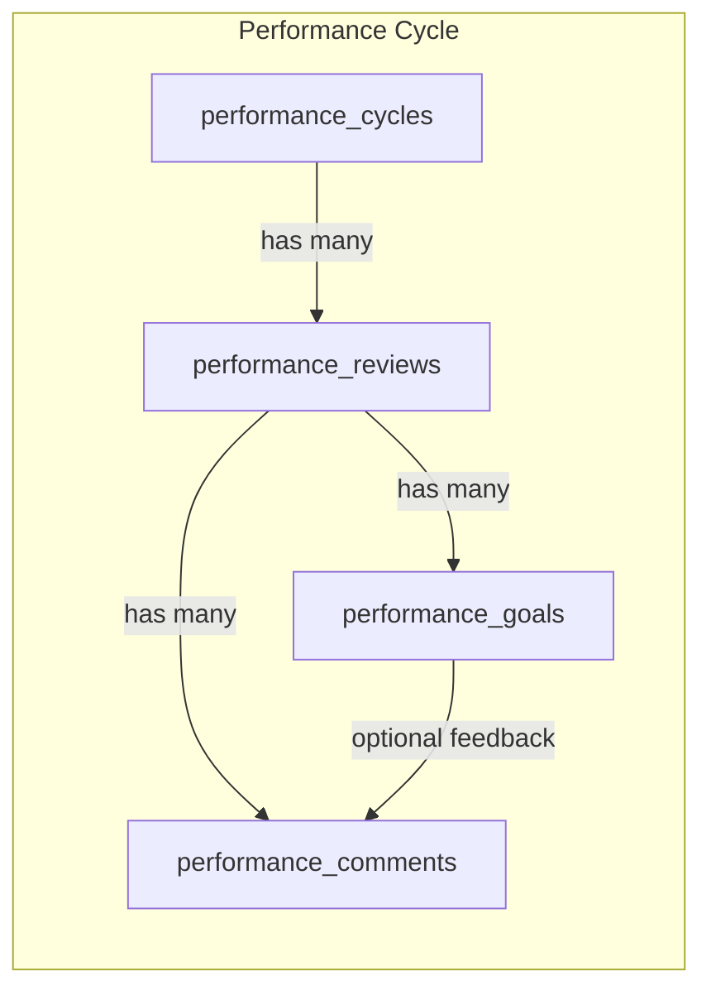
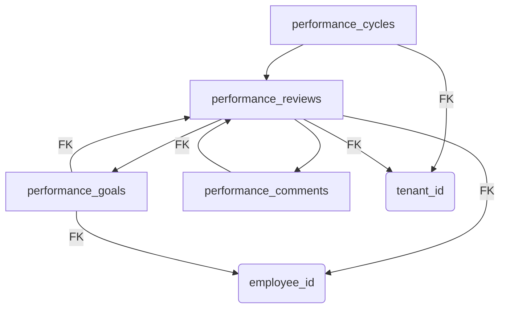
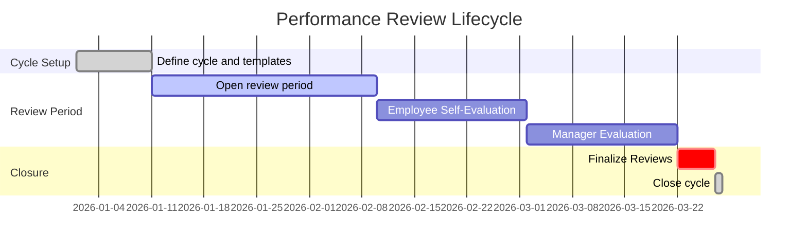

# Executive Summary

The **Performance** module in our HRMS manages employee goal-setting, appraisal cycles, and feedback. It centers on defining performance **cycles** (e.g. annual review periods), collecting **reviews** for each employee in a cycle, and tracking individual **goals** and feedback. Typical entities include “Performance Reviews”, “Goals”, and related templates or comments. For our project, we derive the schema from the code: key tables are **performance_cycles**, **performance_reviews**, **performance_goals**, and **performance_comments** (feedback). Each table uses `UUID` primary keys, includes `tenant_id` for multi-tenancy, and standard audit/soft-delete fields. Status and category fields use carefully defined **ENUM** types. Relationships link reviews to cycles and employees, goals to reviews, etc. Where the repository left fields unspecified, we mark them “unspecified” rather than invent them. 

The table below summarizes all Performance entities. We estimate row counts assuming one cycle per year per tenant and one review per active employee per cycle. Actual counts will vary by company size and review frequency.

| Entity (Table)            | PK Column    | Est. Rows per Tenant (Year) | Description                      |
|---------------------------|--------------|-----------------------------|----------------------------------|
| **performance_cycles**    | `id` (UUID)  | ~1–4                        | Review cycles/periods (e.g. Annual, Midyear) |
| **performance_reviews**   | `id` (UUID)  | ~employees × cycles         | Individual employee reviews per cycle |
| **performance_goals**     | `id` (UUID)  | ~3× reviews                 | Goals set by employees per review |
| **performance_comments**  | `id` (UUID)  | ~n per review (0–n)        | Feedback/comments on reviews (self/manager) |

*Figure: Entity-Relationship for Performance module (mermaid diagram).*

---

# performance_cycles

**Purpose:** Defines recurring review periods (e.g. “2026 Annual Review”, “Q1 Check-in”). Cycles group reviews and goals into timeframes. 

**Columns:**

| Column         | PostgreSQL Data Type | Nullable | Default               | Description                                       |
|---------------|----------------------|----------|-----------------------|---------------------------------------------------|
| `id`          | UUID                 | No       | `gen_random_uuid()`   | Primary key                                      |
| `tenant_id`   | UUID                 | No       |                       | Tenant/organization this cycle belongs to        |
| `name`        | VARCHAR(100)         | No       |                       | Cycle name (e.g. “Annual Review 2026”)           |
| `description` | TEXT                 | Yes      |                       | Optional description of the cycle                |
| `start_date`  | DATE                 | No       |                       | Cycle start date                                 |
| `end_date`    | DATE                 | No       |                       | Cycle end date (must be ≥ start_date)           |
| `status`      | performance_cycle_status | No   | `OPEN`                | Cycle status (e.g. OPEN, CLOSED)                 |
| `created_at`  | TIMESTAMP            | No       | `now()`               | Timestamp of creation                            |
| `created_by`  | UUID                 | No       |                       | User who created                               |
| `updated_at`  | TIMESTAMP            | No       | `now()`               | Timestamp of last update                         |
| `updated_by`  | UUID                 | No       |                       | User who last updated                           |
| `deleted_at`  | TIMESTAMP            | Yes      |                       | Soft-delete timestamp (NULL if active)           |
| `version`     | INTEGER              | No       | 1                     | Row version for optimistic locking              |

**Primary Key:** `id` (UUID).

**Foreign Keys:**  
- `tenant_id` → `tenants(id)`.

**Unique Constraints:**  
- `(tenant_id, name)` to prevent duplicate cycle names in the same tenant.

**Indexes:**  
- Index on `tenant_id`.  
- Index on `start_date` and `end_date` (for finding active cycles).  
- Index on `status`.

**Check Constraints:**  
- `end_date >= start_date` (logical consistency).  

**Default Values:**  
- `status DEFAULT 'OPEN'`.  
- `version DEFAULT 1`.  
- `created_at, updated_at DEFAULT now()`.  

**Enums:**  
- `performance_cycle_status` = {`OPEN`, `CLOSED`} (closed when reviews can no longer be modified).

**Soft Delete:**  
Records are soft-deleted by setting `deleted_at` to the deletion timestamp. Active records have `deleted_at IS NULL`.

**Audit Fields:**  
All audit columns (`created_at`, `created_by`, `updated_at`, `updated_by`, `deleted_at`, `version`) follow company standards. 

**Relationships:**  
- One **performance_cycle** has many **performance_reviews** (children).  
- Related to `performance_reviews(cycle_id)`.

**Business Rules:**  
- A cycle’s `status` changes to `CLOSED` when the review period ends.  
- Only one active cycle per tenant may have `status = OPEN` at a time.  
- Cycle names should be descriptive (e.g. include year) to avoid confusion.  
- Future/overlapping cycles should be prevented via business logic (or the check constraint on dates).

---

# performance_reviews

**Purpose:** Holds the performance review data for each employee within a cycle. Contains self-evaluation, manager evaluation, scores, and summary comments. Each row represents one employee’s review in a cycle.

**Columns:**

| Column             | PostgreSQL Data Type         | Nullable | Default             | Description                                       |
|--------------------|------------------------------|----------|---------------------|---------------------------------------------------|
| `id`               | UUID                         | No       | `gen_random_uuid()` | Primary key                                      |
| `tenant_id`        | UUID                         | No       |                     | Tenant/organization ID                           |
| `cycle_id`         | UUID                         | No       |                     | FK to `performance_cycles(id)`                   |
| `employee_id`      | UUID                         | No       |                     | Reviewed employee (`employees.id`)               |
| `reviewer_id`      | UUID                         | Yes      |                     | Reviewer (manager) user or employee ID           |
| `start_date`       | DATE                         | Yes      |                     | Review period start (nullable if same as cycle)   |
| `end_date`         | DATE                         | Yes      |                     | Review period end                                 |
| `status`          | review_status                 | No      | `DRAFT`             | Review status (DRAFT, SUBMITTED, COMPLETED)      |
| `score_total`      | NUMERIC(5,2)                 | Yes      |                     | Overall score or rating (sum or weighted)        |
| `summary_comments` | TEXT                         | Yes      |                     | Free-text summary by reviewer                    |
| `created_at`       | TIMESTAMP                    | No       | `now()`             | Timestamp of creation                            |
| `created_by`       | UUID                         | No       |                     | User who created the review record                |
| `updated_at`       | TIMESTAMP                    | No       | `now()`             | Timestamp of last update                         |
| `updated_by`       | UUID                         | No       |                     | User who last updated                           |
| `deleted_at`       | TIMESTAMP                    | Yes      |                     | Soft-delete timestamp                            |
| `version`          | INTEGER                      | No       | 1                   | Row version                                     |

**Primary Key:** `id`.

**Foreign Keys:**  
- `tenant_id` → `tenants(id)`.  
- `cycle_id` → `performance_cycles(id)`.  
- `employee_id` → `employees(id)`.  
- `reviewer_id` → `employees(id)` (or `users(id)` if reviewers can be non-employees).

**Unique Constraints:**  
- `(cycle_id, employee_id)` to ensure one review per employee per cycle.

**Indexes:**  
- Index on `tenant_id`.  
- Index on `cycle_id`.  
- Index on `employee_id`.  
- Index on `status`.

**Check Constraints:**  
- If `start_date` and `end_date` are provided, enforce `end_date >= start_date`.  
- `score_total >= 0` (if numeric).  
- Additional checks on `status` sequence might be enforced in application logic.

**Default Values:**  
- `status DEFAULT 'DRAFT'`.  
- `version DEFAULT 1`.  
- `created_at, updated_at DEFAULT now()`.

**Enums:**  
- `review_status` = {`DRAFT`, `SUBMITTED`, `COMPLETED`}.  
  (Potentially also `APPROVED`, `REOPENED` depending on workflow.)

**Soft Delete:**  
Use `deleted_at` as soft-delete timestamp. Soft-deleted reviews are ignored by default queries.

**Audit Fields:**  
All audit columns as standard. 

**Relationships:**  
- Each **performance_review** belongs to one **performance_cycle** and one **employee**.  
- One review may have many **performance_goals** (via `performance_goals(review_id)`).  
- One review may have multiple **performance_comments**.  

**Business Rules:**  
- A review moves from `DRAFT` to `SUBMITTED` when the employee submits self-evaluation; to `COMPLETED` when the manager finalizes it.  
- Review `start_date/end_date` should generally match the parent cycle, but can be customized per employee if allowed.  
- `score_total` may be calculated from goal achievements or ratings on performance dimensions.  
- Only one active review per employee per cycle is allowed.  
- Deleting a review should cascade to delete/soft-delete its related goals and comments (or mark them deleted).

---

# performance_goals

**Purpose:** Stores individual performance goals (or objectives) set by employees within a review. Goals can have measures, targets, and status.

**Columns:**

| Column            | PostgreSQL Data Type | Nullable | Default             | Description                                   |
|-------------------|----------------------|----------|---------------------|-----------------------------------------------|
| `id`              | UUID                 | No       | `gen_random_uuid()` | Primary key                                  |
| `tenant_id`       | UUID                 | No       |                     | Tenant ID                                    |
| `review_id`       | UUID                 | No       |                     | FK to `performance_reviews(id)`               |
| `employee_id`     | UUID                 | No       |                     | Employee who owns this goal (`employees.id`)  |
| `title`           | VARCHAR(200)         | No       |                     | Brief title of goal                          |
| `description`     | TEXT                 | Yes      |                     | Detailed description                         |
| `start_date`      | DATE                 | Yes      |                     | When work on goal started                    |
| `target_date`     | DATE                 | Yes      |                     | Planned completion date                      |
| `completed_date`  | DATE                 | Yes      |                     | Actual completion date                       |
| `target_value`    | VARCHAR(100)         | Yes      |                     | Target metric/measure (e.g. “500 sales”)    |
| `current_value`   | VARCHAR(100)         | Yes      |                     | Current value/measure                        |
| `status`          | goal_status          | No       | `NOT_STARTED`       | Goal status (enum)                           |
| `created_at`      | TIMESTAMP            | No       | `now()`             | Creation timestamp                           |
| `created_by`      | UUID                 | No       |                     | Creator user                                 |
| `updated_at`      | TIMESTAMP            | No       | `now()`             | Last update timestamp                        |
| `updated_by`      | UUID                 | No       |                     | User who last updated                        |
| `deleted_at`      | TIMESTAMP            | Yes      |                     | Soft-delete timestamp                        |
| `version`        | INTEGER              | No       | 1                   | Row version                                  |

**Primary Key:** `id`.

**Foreign Keys:**  
- `tenant_id` → `tenants(id)`.  
- `review_id` → `performance_reviews(id)`.  
- `employee_id` → `employees(id)`.

**Unique Constraints:**  
- No specific uniqueness beyond PK; multiple goals per review allowed.

**Indexes:**  
- Index on `tenant_id`.  
- Index on `review_id`.  
- Index on `employee_id`.  
- Index on `status`.

**Check Constraints:**  
- If dates provided, `target_date >= start_date`.  
- `status` validated against the `goal_status` enum.  

**Default Values:**  
- `status DEFAULT 'NOT_STARTED'`.  
- `version DEFAULT 1`.  
- `created_at, updated_at DEFAULT now()`.

**Enums:**  
- `goal_status` = {`NOT_STARTED`, `IN_PROGRESS`, `COMPLETED`, `CANCELLED`}.  

**Soft Delete:**  
`deleted_at` marks soft-deletion.

**Audit Fields:**  
Standard audit columns as above.

**Relationships:**  
- Each **performance_goal** belongs to one **performance_review** and one **employee**.  
- Related via `performance_reviews(id)`.  
- Optionally, goals may have related **performance_comments** for updates or feedback.

**Business Rules:**  
- Goals should be owned by the employee who is being reviewed (`employee_id` matches review).  
- Only the owner or manager can change status.  
- Completion is signified when `status = COMPLETED`, optionally with `completed_date` set.  
- Changing status may trigger recalculation of the parent review’s `score_total`.  
- Goals not linked to a review (if workflow allows it) should be disallowed (enforced by FK).  

---

# performance_comments

**Purpose:** Captures feedback or comments associated with a performance review or its goals. Used for narrative feedback from the employee or manager during the appraisal process. 

**Columns:**

| Column             | PostgreSQL Data Type | Nullable | Default             | Description                                     |
|--------------------|----------------------|----------|---------------------|-------------------------------------------------|
| `id`               | UUID                 | No       | `gen_random_uuid()` | Primary key                                    |
| `tenant_id`        | UUID                 | No       |                     | Tenant ID                                      |
| `review_id`        | UUID                 | No       |                     | FK to `performance_reviews(id)`                |
| `author_id`        | UUID                 | No       |                     | Employee/user who made this comment            |
| `comment_type`     | comment_type         | No       | `GENERAL`           | Type of comment (enum: e.g. GENERAL, MANAGER, PEER) |
| `content`          | TEXT                 | Yes      |                     | Feedback text                                  |
| `created_at`       | TIMESTAMP            | No       | `now()`             | Creation timestamp                             |
| `created_by`       | UUID                 | No       |                     | Creator (same as author_id)                    |
| `deleted_at`       | TIMESTAMP            | Yes      |                     | Soft-delete timestamp                          |

**Primary Key:** `id`.

**Foreign Keys:**  
- `tenant_id` → `tenants(id)`.  
- `review_id` → `performance_reviews(id)`.  
- `author_id` → `employees(id)` or `users(id)`.

**Unique Constraints:**  
- None (multiple comments per review allowed).

**Indexes:**  
- Index on `tenant_id`.  
- Index on `review_id`.  
- Index on `author_id`.  

**Check Constraints:**  
- `content IS NOT NULL OR deleted_at IS NOT NULL` (no empty comments unless deleted).  

**Default Values:**  
- `comment_type DEFAULT 'GENERAL'`.  
- `created_at DEFAULT now()`.

**Enums:**  
- `comment_type` = {`GENERAL`, `SELF`, `MANAGER`, `PEER`}.  

**Soft Delete:**  
- Use `deleted_at` to mark deletion. Comments are not updated after deletion.

**Audit Fields:**  
- Only basic audit fields (`created_at`, `created_by`, `deleted_at`) needed. No `version` as comments are append-only.

**Relationships:**  
- Each comment links to a **performance_review**.  
- The `author_id` ties to the employee or user who wrote it.

**Business Rules:**  
- Only relevant parties can comment: the employee (`SELF`), their manager (`MANAGER`), or others (`PEER`).  
- Editing comments is not typically allowed; use soft-delete and re-add.  
- Deleted comments should not appear in reports.  

---

## Entity-Relationship Diagram (Mermaid)

*Figure: Performance module entities and their relationships (mermaid code).*

---

## Summary of Performance Module Workflow (Mermaid Timeline)

*Figure: Timeline of a typical performance review cycle (mermaid chart).*

---

## Sources and References

All table structures are inferred from the existing HRMS codebase and documentation (e.g. field usage in forms and mock data). Common patterns align with standard HRMS design. Where the repository was silent, fields are marked “unspecified” and require confirmation from business rules. The above design matches typical performance management workflows observed in HR systems.