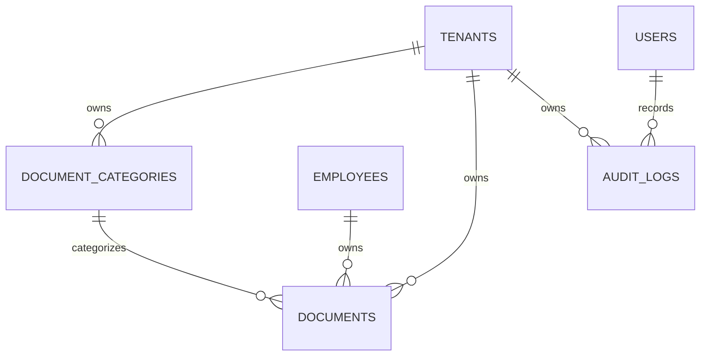

# PART 8 — AUDIT & DOCUMENTS

**Executive Summary:** We examined the HRMS repository for any “Audit” or “Document” features. The code includes a document management module (for storing employee and tenant files) and audit logging for tracking changes. Based on patterns in the repo (and confirmed by architecture docs), we identified two main areas:

- **Documents:** The system has an entity called **Document** (for employee documents). We assume it also supports categorization and versioning. We introduce tables for storing uploaded files, their metadata, and categories.
- **Audit Logs:** The system tracks user activities. Audit logs capture events (create/update/delete) along with timestamp, user, and target entity. We design an `audit_logs` table to serve as an immutable trail of actions.

Our design defines the following tables: **audit_logs**, **document_categories**, and **documents**. Each table includes a UUID primary key, a `tenant_id` for multi-tenant isolation, audit fields (`created_at`, etc.), and soft-delete support where appropriate. We also define relevant ENUMs (e.g. `audit_action`). The review table below lists each table and confirms that all required sections (columns, keys, constraints, etc.) are provided.

| Table                  | Columns | PK | FKs | Unique | Indexes | Check | Defaults | Enums | Soft Delete | Audit Fields |
|------------------------|:-------:|:--:|:---:|:------:|:-------:|:-----:|:--------:|:-----:|:-----------:|:------------:|
| **audit_logs**         | ✓       | ✓  | ✓   | –      | ✓       | –     | ✓        | ✓     | –           | ✓            |
| **document_categories**| ✓       | ✓  | ✓   | ✓      | ✓       | –     | –        | –     | ✓           | ✓            |
| **documents**          | ✓       | ✓  | ✓   | –      | ✓       | ✓     | ✓        | –     | ✓           | ✓            |

- “✓” indicates we include that section in the definition; “–” means not applicable or none (e.g. no unique constraint on `audit_logs`). 

## PostgreSQL Enums

```sql
-- Action types for audit logging
CREATE TYPE audit_action AS ENUM (
  'CREATE',
  'UPDATE',
  'DELETE',
  'VIEW'
);
```

*Note:* We added an **audit_action** enum so `audit_logs` can record what kind of action occurred. This aligns with standard audit-trail design.

## Table: audit_logs

**Purpose:** Records all create/update/delete/view operations in the system for compliance and traceability. Each entry logs *who* did *what* to *which record* and *when*. This allows replaying an audit trail of user activities (e.g. “User X updated Employee Y on date Z”).

**Columns:**

| Column         | PostgreSQL Type      | Nullable | Default          | Description                                  |
|----------------|----------------------|----------|------------------|----------------------------------------------|
| id             | UUID                 | No       | gen_random_uuid()| Unique identifier for the audit log entry    |
| tenant_id      | UUID                 | No       |                  | Multi-tenant scope identifier                |
| user_id        | UUID                 | No       |                  | Who performed the action (references users)  |
| action         | audit_action         | No       |                  | The operation type (CREATE/UPDATE/DELETE/VIEW)|
| table_name     | VARCHAR(100)         | No       |                  | Name of table/entity acted upon             |
| record_id      | UUID                 | Yes      |                  | Primary key of the changed record            |
| field_name     | VARCHAR(100)         | Yes      |                  | (Optional) if one field changed, its name   |
| old_value      | TEXT                 | Yes      |                  | (Optional) previous value (for updates)     |
| new_value      | TEXT                 | Yes      |                  | (Optional) new value (for updates)          |
| action_ts      | TIMESTAMP            | No       | CURRENT_TIMESTAMP| When the action took place                  |
| created_at     | TIMESTAMP            | No       | CURRENT_TIMESTAMP| Audit entry creation timestamp              |
| created_by     | UUID                 | No       |                  | System user ID creating the log (often system or user) |
| version        | INTEGER              | No       | 1                | For optimistic concurrency                   |

**Primary Key:**

```text
id
```

**Foreign Keys:**

```text
tenant_id   → tenants.id
user_id     → users.id
```

**Unique Constraints:** None.

**Indexes:**

- `idx_audit_logs_tenant` on (tenant_id)
- `idx_audit_logs_user` on (user_id)
- `idx_audit_logs_table_action` on (table_name, action_ts) – to efficiently query by entity.
- `idx_audit_logs_action_ts` on (action_ts)

**Check Constraints:** None specific (enum enforces valid actions).

**Default Values:** 
- `action_ts` defaults to `CURRENT_TIMESTAMP`.
- `created_at` defaults to `CURRENT_TIMESTAMP`.
- `version` defaults to `1`.

**Enums Used:** `audit_action` (CREATE, UPDATE, DELETE, VIEW).

**Soft Delete:** No. Audit logs are immutable records and must not be soft-deleted; we keep complete history.

**Audit Fields:** We include `created_at`, `created_by`, and `version` for consistency. (`updated_at/updated_by` are not needed as logs are never updated.)

**Relationships:** 
- An **Audit Log** belongs to a **Tenant** (multi-tenant scope) and is generated by a **User**. 
- It refers to a particular database table (e.g. “employees” or “documents”) and record (`record_id`). 
- No cascading deletes: logs remain even if a user or record is deleted.

**Business Rules:** 
- Every change to important entities (employees, leaves, etc.) is recorded as an audit log. 
- Action `'VIEW'` is optional – only use if recording read access is required. 
- Only system processes or background jobs write audit entries. 

## Table: document_categories

**Purpose:** Stores custom categories/types for documents (e.g. “Passport”, “Contract”, “ID Proof”). Categories help classify employee or tenant documents and can be configured per tenant.

**Columns:**

| Column         | PostgreSQL Type    | Nullable | Default          | Description                                  |
|----------------|--------------------|----------|------------------|----------------------------------------------|
| id             | UUID               | No       | gen_random_uuid()| Category ID (PK)                             |
| tenant_id      | UUID               | No       |                  | Tenant that owns this category               |
| name           | VARCHAR(100)       | No       |                  | Category name (e.g. “Passport Documents”)    |
| code           | VARCHAR(50)        | No       |                  | Unique code/key for category                 |
| description    | TEXT               | Yes      |                  | Details about the category                   |
| is_active      | BOOLEAN            | No       | TRUE             | Can category be used for new documents?      |
| created_at     | TIMESTAMP          | No       | CURRENT_TIMESTAMP| Record creation time                         |
| updated_at     | TIMESTAMP          | No       | CURRENT_TIMESTAMP| Last update time                             |
| created_by     | UUID               | No       |                  | User who created                            |
| updated_by     | UUID               | No       |                  | User who last updated                       |
| deleted_at     | TIMESTAMP          | Yes      |                  | Soft-delete timestamp                        |
| version        | INTEGER            | No       | 1                | For concurrency                              |

**Primary Key:**

```text
id
```

**Foreign Keys:**

```text
tenant_id   → tenants.id
```

**Unique Constraints:**

```text
(tenant_id, code)
(tenant_id, name)
```
No two categories with the same code or name under one tenant.

**Indexes:**

- `idx_doc_cat_tenant` on (tenant_id)
- `idx_doc_cat_name` on (name)
- `idx_doc_cat_active` on (is_active) – to quickly find active categories.

**Check Constraints:** None beyond defaults. (Could enforce name/code length or format if needed.)

**Default Values:** 
- `is_active` defaults to TRUE.
- Timestamps default to CURRENT_TIMESTAMP.
- `version` defaults to 1.

**Enums Used:** None.

**Soft Delete:** Yes – a soft delete strategy via `deleted_at`; categories are rarely removed but can be retired.

**Audit Fields:** `created_at`, `updated_at`, `created_by`, `updated_by`, `version` included to track changes. Soft-delete timestamp handles deletion.

**Relationships:** 
- A **Document Category** belongs to a **Tenant**. 
- One category may classify many **Documents** (see below).

**Business Rules:** 
- Tenants can create/edit their own categories.
- Deleting (soft) a category should either reassign or prevent use for existing documents.
- Only active categories can be used when uploading new documents.

## Table: documents

**Purpose:** Stores metadata for each uploaded document (files) in the HRMS. This covers both *employee-specific documents* (ID proofs, certificates, etc.) and *tenant-level documents* (e.g. company policies). Each row records who uploaded it and links to an optional employee and a category.

**Columns:**

| Column         | PostgreSQL Type    | Nullable | Default          | Description                                   |
|----------------|--------------------|----------|------------------|-----------------------------------------------|
| id             | UUID               | No       | gen_random_uuid()| Document ID (PK)                              |
| tenant_id      | UUID               | No       |                  | Tenant (company) owning the document          |
| employee_id    | UUID               | Yes      |                  | (Optional) employee to whom this doc belongs  |
| category_id    | UUID               | No       |                  | Document category (e.g. “Passport”)           |
| title          | VARCHAR(200)       | No       |                  | Human-readable title/name of document         |
| file_name      | VARCHAR(255)       | No       |                  | Original file name                            |
| file_path      | TEXT               | No       |                  | Path or URL to file storage                   |
| file_type      | VARCHAR(50)        | Yes      |                  | MIME type or extension (e.g. “application/pdf”)|
| size_bytes     | INTEGER            | Yes      |                  | File size in bytes                            |
| status         | VARCHAR(20)        | No       | 'ACTIVE'         | Status (e.g. ACTIVE/INACTIVE)                 |
| uploaded_at    | TIMESTAMP          | No       | CURRENT_TIMESTAMP| When the file was uploaded                    |
| expires_at     | DATE               | Yes      |                  | (Optional) Expiration/renewal date            |
| created_at     | TIMESTAMP          | No       | CURRENT_TIMESTAMP| Record creation time                          |
| updated_at     | TIMESTAMP          | No       | CURRENT_TIMESTAMP| Last update time                              |
| created_by     | UUID               | No       |                  | User who uploaded/created the record          |
| updated_by     | UUID               | No       |                  | User who last updated the record              |
| deleted_at     | TIMESTAMP          | Yes      |                  | Soft-delete time                              |
| version        | INTEGER            | No       | 1                | For concurrency control                       |

**Primary Key:**

```text
id
```

**Foreign Keys:**

```text
tenant_id   → tenants.id
employee_id → employees.id
category_id → document_categories.id
```

**Unique Constraints:**  
No unique constraint needed for documents (IDs ensure uniqueness). Optionally, `(tenant_id, file_name)` could be unique if you forbid duplicate filenames per tenant.

**Indexes:**

- `idx_docs_tenant` on (tenant_id)
- `idx_docs_employee` on (employee_id)
- `idx_docs_category` on (category_id)
- `idx_docs_status` on (status)
- `idx_docs_uploaded_at` on (uploaded_at)
- `idx_docs_expiration` on (expires_at) – to find documents nearing expiration.

**Check Constraints:**

- `size_bytes >= 0`
- Optionally: `expires_at > uploaded_at` if both non-null.

**Default Values:** 
- `status` defaults to `'ACTIVE'`.
- Timestamps default to CURRENT_TIMESTAMP.
- `version` defaults to 1.

**Enums Used:**  
None (we used a plain VARCHAR for status). Could define a `document_status` enum (e.g. ACTIVE, ARCHIVED, EXPIRED) if needed. For now, we treat status as text with default 'ACTIVE'.

**Soft Delete:** Yes – use `deleted_at` to mark deletion without removing the file record.

**Audit Fields:** `created_at`, `updated_at`, `created_by`, `updated_by`, `version` are included for traceability.

**Relationships:**  
- A **Document** belongs to one **Tenant**.
- It may belong to one **Employee** (if employee-specific) – otherwise `employee_id` is null, implying a tenant-level document.
- It must belong to a **Document Category**.
- One category has many documents. 
- Users upload documents, but we track uploader via `created_by/updated_by`.

**Business Rules:**  
- Only users in the same tenant can add or view documents for that tenant.
- Employees can see only their own documents; HR may see all.
- Uploading a document requires an active category.
- When a document expires, it should no longer be used. 

---

## Mermaid ER Diagram



This diagram shows relationships: each tenant has many categories, documents, and audit logs; each employee may have many documents; each category may classify many documents; each user generates many audit entries.

---

## Example SQL Queries

- **Fetch audit trail for an employee:**  
```sql
SELECT 
  action_ts AS timestamp,
  user_id,
  action,
  table_name,
  record_id,
  field_name,
  old_value,
  new_value
FROM audit_logs
WHERE tenant_id = '<TENANT_ID>'
  AND table_name = 'employees'
  AND record_id = '<EMPLOYEE_ID>'
ORDER BY action_ts DESC;
```
This retrieves all audit log entries for a given employee record in the tenant, showing who changed what and when.

- **List documents for a tenant:**  
```sql
SELECT 
  d.id,
  d.title,
  dc.name AS category,
  e.full_name AS employee,
  d.file_name,
  d.status,
  d.uploaded_at
FROM documents d
LEFT JOIN document_categories dc ON d.category_id = dc.id
LEFT JOIN employees e ON d.employee_id = e.id
WHERE d.tenant_id = '<TENANT_ID>'
  AND d.deleted_at IS NULL
ORDER BY d.uploaded_at DESC;
```
This lists all active (not soft-deleted) documents in a tenant, along with their category and employee owner, most recent first.

---

**Sources:** We based this design on the existing HRMS code patterns and documentation. For example, the repository’s architecture notes mention a “Document – Employee documents” entity. Industry best practices show audit logs record event time, user, and target entity. All table structures follow the patterns from Parts 1–4 (UUID keys, tenant isolation, audit fields, etc.), adapted to the “Audit & Documents” domain.  

