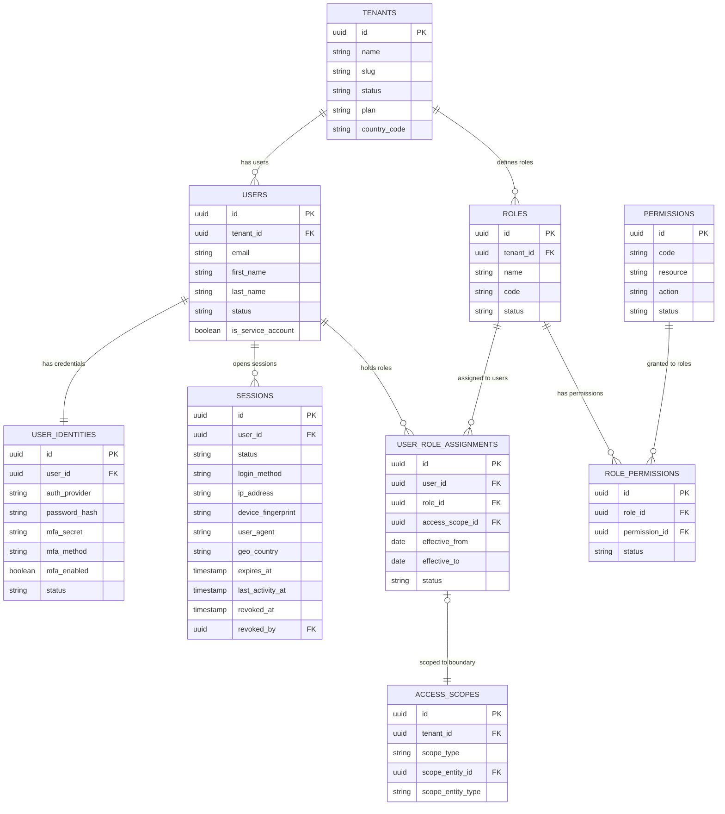
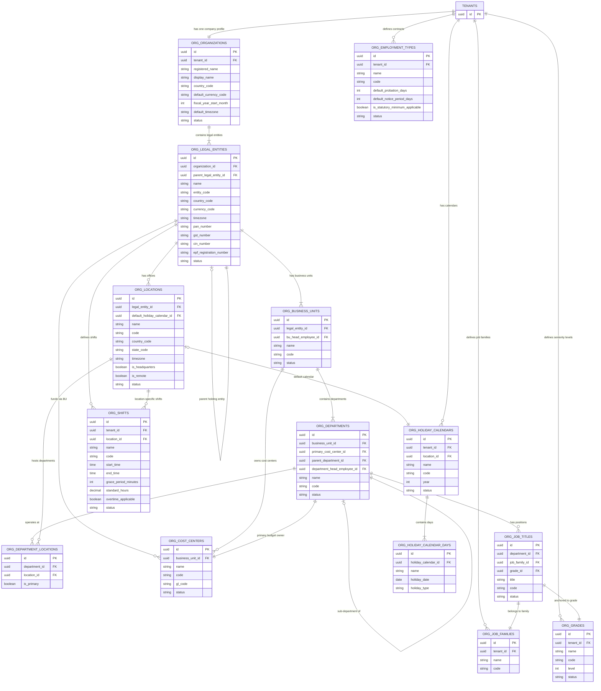
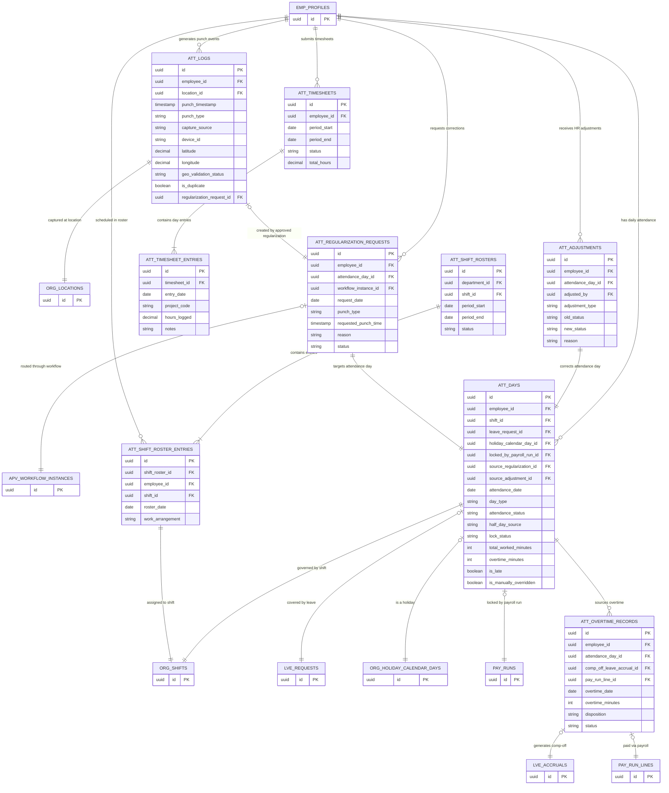
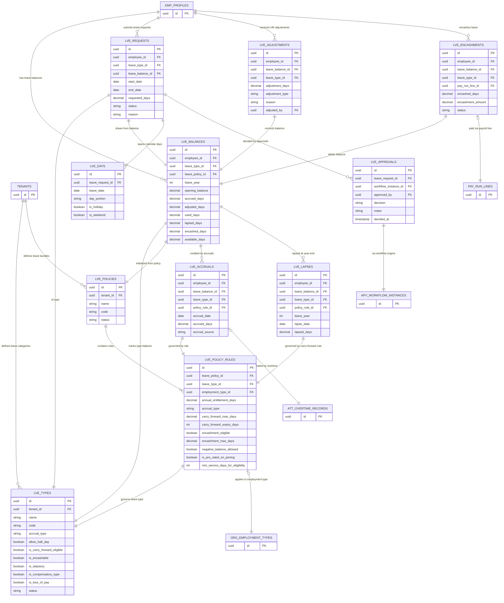
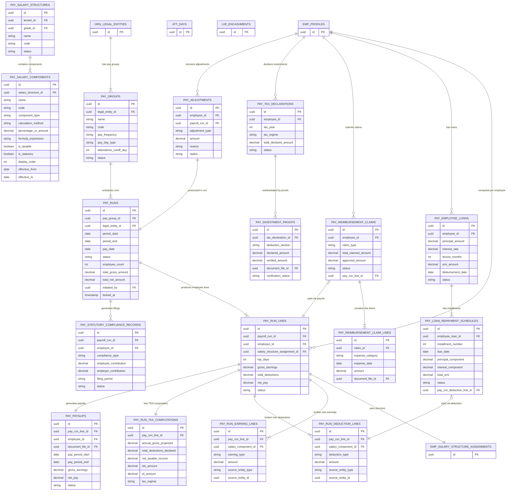
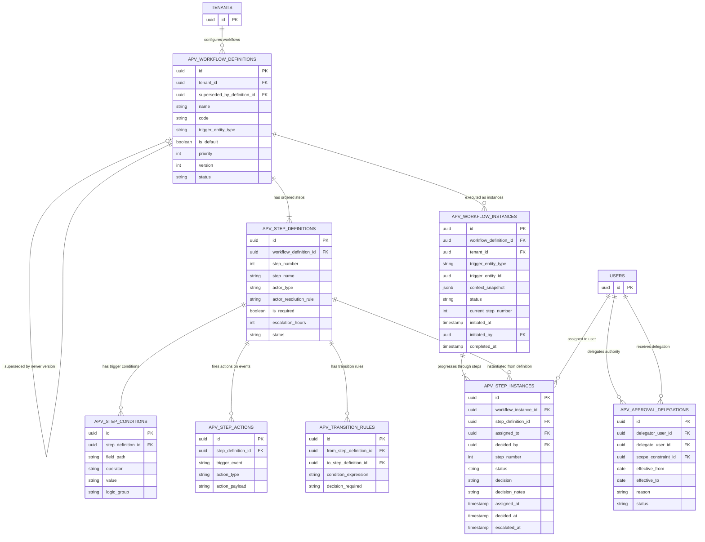
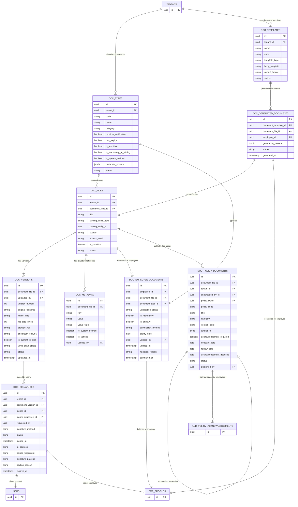
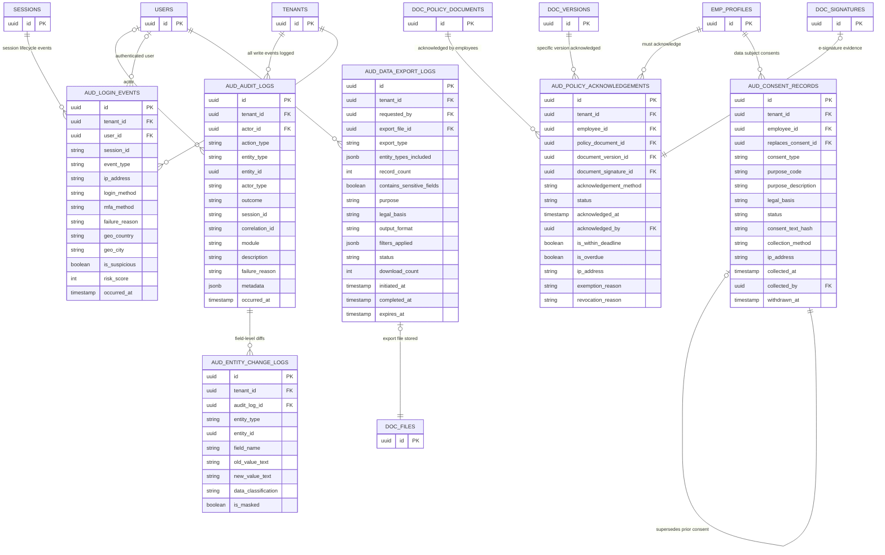

# Evolve HRMS — Entity Relationship Diagram

**Classification:** Internal Engineering Reference  
**Status:** Pre-Implementation  
**Incorporates:** All corrections from `docs/domain-model-review.md`  
**Scope:** All 13 modules, ~95 entities

---

## How to Read This Document

### Notation Guide

| Symbol | Meaning |
|--------|---------|
| `PK` | Primary key — UUID v7, column named `id` |
| `FK` | Foreign key |
| `\|\|--\|\|` | Exactly one to exactly one (1:1) |
| `\|\|--o{` | Exactly one to zero or more (1:N — child is optional) |
| `\|\|--\|{` | Exactly one to one or more (1:N — child is mandatory) |
| `o\|--o{` | Zero or one to zero or more (optional parent to many) |
| `o{--o{` | Zero or more to zero or more (M:N — requires junction) |

### Implicit columns omitted from all diagrams

Every entity in the platform carries these columns. They are not repeated in individual entity blocks:

| Column | Type | Description |
|--------|------|-------------|
| `tenant_id` | uuid FK | Multi-tenancy anchor — FK to `tenants.id` |
| `created_at` | timestamp | UTC creation timestamp |
| `updated_at` | timestamp | UTC last-modified timestamp |
| `created_by` | uuid FK | FK to `users.id` — who created the record |
| `updated_by` | uuid FK | FK to `users.id` — who last modified the record |
| `deleted_at` | timestamp | Soft-delete timestamp; null = active |
| `deleted_by` | uuid FK | FK to `users.id` — who soft-deleted |

### Cross-module stubs

When a diagram references an entity owned by another module, it is shown as a minimal stub containing only its PK. The full definition appears in that module's own diagram.

---

## Module 1 — Platform Core & IAM

### Relationship Explanations — Platform Core & IAM

| Relationship | Type | Description |
|---|---|---|
| Tenant → User | 1:N | Every User belongs to exactly one Tenant. All access, data, and roles are tenant-scoped. No cross-tenant users. |
| Tenant → Role | 1:N | Roles are tenant-specific. The same role name (e.g., "HR Admin") can exist in multiple tenants independently. |
| User → User Identity | 1:1 | Each User has exactly one Identity record holding credentials (password hash, MFA secret, SSO tokens). Separated so security operations don't touch the HR data record. |
| User → Session | 1:N | A User can have multiple active Sessions simultaneously (desktop + mobile). Each Session carries a `session_id` that correlates Audit Logs and Login Events for that authentication context. |
| User → User Role Assignment | 1:N | A User can hold multiple Roles simultaneously (e.g., HR Admin + Payroll Viewer). Each assignment is optionally scoped to an org boundary. |
| Role → User Role Assignment | 1:N | A Role can be assigned to many Users. |
| User Role Assignment → Access Scope | N:1 (optional) | An optional org boundary constraint on the role assignment. A Manager role scoped to "Engineering Dept" can only act on Engineering employees. A Super Admin role is unscoped. |
| Role → Role Permission | 1:N | Each Role bundles one or more Permissions. Permissions are never assigned to Users directly — always via Roles. |
| Permission → Role Permission | 1:N | A Permission (e.g., `leave:approve`) can appear in multiple Roles. |

---

## Module 2 — Organization

### Relationship Explanations — Organization

| Relationship | Type | Description |
|---|---|---|
| Tenant → Organization | 1:1 | Exactly one company profile per tenant. Organization holds brand identity — name, logo, timezone, fiscal year. Statutory numbers were removed (per review §3.1) and live only on Legal Entity. |
| Organization → Legal Entity | 1:N (mandatory) | A tenant always has at least one Legal Entity (auto-created at onboarding). Multi-entity groups (subsidiaries) add more. Payroll, statutory filings, and employees are all Legal Entity-scoped. |
| Legal Entity → Legal Entity (self) | optional N:1 | `parent_legal_entity_id` self-reference models holding company structures (e.g., Acme India subsidiary reporting to Acme Group). Allows unlimited depth but no cycles. |
| Legal Entity → Business Unit | 1:N (mandatory) | Business Units belong to one Legal Entity, establishing the payroll and compliance boundary for all employees below. |
| Business Unit → Department | 1:N (mandatory) | Every Department belongs to one Business Unit. The BU is the strategic P&L unit; the Department is the functional team. |
| Department → Department (self) | optional N:1 | `parent_department_id` self-reference enables sub-departments (e.g., "Backend Engineering" within "Engineering"). No cycles permitted. |
| Department ↔ Location (junction) | M:N via `org_department_locations` | A Department may operate from multiple offices; a Location may house multiple Departments. The junction records which locations a department's employees are distributed across. `is_primary` marks the department's primary site. |
| Legal Entity → Location | 1:N | Locations (offices, remote hubs) belong to one Legal Entity. This drives statutory state-level compliance (Professional Tax) and payroll currency. |
| Location → Holiday Calendar | optional N:1 | Each Location has a default Holiday Calendar for the current year. This default is applied to all employees at the location unless overridden on their Location Assignment. |
| Business Unit → Cost Center | 1:N | Cost Centers are Financial accountability units owned by a Business Unit. Used for GL integration and payroll cost posting. |
| Department → Cost Center (primary) | N:1 (mandatory) | Every Department has a primary Cost Center for budget attribution. A Department may be funded by multiple Cost Centers via Cost Center Assignments on individual employees. |
| Tenant → Grade | 1:N | Grades (L1–L8, etc.) are tenant-wide seniority levels independent of department or legal entity. |
| Job Title → Job Family | N:1 | Job Titles are grouped into Job Families (e.g., "Software Engineer" and "Principal Engineer" both belong to the "Engineering" job family) for career pathing and compensation band management. |
| Job Title → Grade | N:1 | Each Job Title is anchored to a Grade, establishing the seniority expectation for that position. |
| Department → Job Title | 1:N | A Department lists the positions (Job Titles) it contains. One Job Title belongs to one Department. |
| Tenant → Employment Type | 1:N | Employment Types (Full-Time, Contract, Intern) are tenant-wide. They govern probation periods, notice periods, and statutory minimum applicability. |
| Tenant → Holiday Calendar | 1:N | Calendars are created per tenant per location per year. |
| Holiday Calendar → Holiday Calendar Day | 1:N (mandatory) | A calendar is useless without its day entries. Each Day record is one non-working date with a name and type (national/regional/optional). |
| Legal Entity → Shift | 1:N | Shifts belong to a Legal Entity (and optionally a specific Location within it) to reflect location-specific working hours. |

---

## Module 3 — Employee Domain

```mermaid
erDiagram
    EMP_PROFILES {
        uuid id PK
        uuid user_id FK
        string employee_code
        string first_name
        string last_name
        string status
        date joining_date
        uuid profile_photo_document_file_id FK
    }

    EMP_PERSONAL_DETAILS {
        uuid id PK
        uuid employee_id FK
        date date_of_birth
        string gender
        string marital_status
        string nationality
        string pan_number
        string aadhaar_number_masked
        string passport_number
        date passport_expiry_date
        string uan_number
        boolean physically_challenged
    }

    EMP_EMPLOYMENT_RECORDS {
        uuid id PK
        uuid employee_id FK
        uuid legal_entity_id FK
        uuid employment_type_id FK
        uuid pay_group_id FK
        date joining_date
        date effective_from
        date effective_to
        string employment_stage
        int notice_period_days
        date last_working_date
        string exit_type
        uuid offer_letter_document_file_id FK
    }

    EMP_EXIT_RECORDS {
        uuid id PK
        uuid employee_id FK
        uuid employment_record_id FK
        date resignation_date
        date last_working_date
        string exit_type
        string exit_reason
        string clearance_status
        string fnf_status
        decimal fnf_amount
        boolean rehire_eligibility
    }

    EMP_DEPT_ASSIGNMENTS {
        uuid id PK
        uuid employee_id FK
        uuid department_id FK
        date effective_from
        date effective_to
        string transfer_reason
    }

    EMP_GRADE_ASSIGNMENTS {
        uuid id PK
        uuid employee_id FK
        uuid grade_id FK
        date effective_from
        date effective_to
        string change_type
    }

    EMP_JOB_TITLE_ASSIGNMENTS {
        uuid id PK
        uuid employee_id FK
        uuid job_title_id FK
        date effective_from
        date effective_to
    }

    EMP_LOCATION_ASSIGNMENTS {
        uuid id PK
        uuid employee_id FK
        uuid location_id FK
        uuid holiday_calendar_id FK
        date effective_from
        date effective_to
        string work_arrangement
        string relocation_type
    }

    EMP_COST_CENTER_ASSIGNMENTS {
        uuid id PK
        uuid employee_id FK
        uuid cost_center_id FK
        decimal allocation_percent
        date effective_from
        date effective_to
        boolean is_primary
    }

    EMP_SHIFT_ASSIGNMENTS {
        uuid id PK
        uuid employee_id FK
        uuid shift_id FK
        date effective_from
        date effective_to
    }

    EMP_LEAVE_POLICY_ASSIGNMENTS {
        uuid id PK
        uuid employee_id FK
        uuid leave_policy_id FK
        date effective_from
        date effective_to
        string assignment_reason
    }

    EMP_MANAGER_ASSIGNMENTS {
        uuid id PK
        uuid employee_id FK
        uuid manager_employee_id FK
        string reporting_type
        date effective_from
        date effective_to
    }

    EMP_EMERGENCY_CONTACTS {
        uuid id PK
        uuid employee_id FK
        string full_name
        string relationship
        string primary_phone
        boolean is_primary
    }

    EMP_ADDRESSES {
        uuid id PK
        uuid employee_id FK
        string address_type
        string address_line_1
        string city
        string state_province
        string country_code
        string postal_code
    }

    EMP_CONTACTS {
        uuid id PK
        uuid employee_id FK
        string work_phone
        string personal_phone
        string personal_email
    }

    EMP_EDUCATION {
        uuid id PK
        uuid employee_id FK
        string institution
        string degree
        string field_of_study
        int year_of_passing
        string grade_or_percentage
        string verification_status
    }

    EMP_WORK_EXPERIENCE {
        uuid id PK
        uuid employee_id FK
        string employer_name
        string designation
        date start_date
        date end_date
        boolean is_verified
    }

    EMP_BANK_ACCOUNTS {
        uuid id PK
        uuid employee_id FK
        string account_holder_name
        string bank_name
        string ifsc_code
        string account_number_masked
        string account_type
        boolean is_primary
        string verification_status
    }

    EMP_SALARY_STRUCTURE_ASSIGNMENTS {
        uuid id PK
        uuid employee_id FK
        uuid salary_structure_id FK
        decimal ctc_amount
        decimal gross_amount
        decimal basic_amount
        date effective_from
        date effective_to
    }

    EMP_CUSTOM_FIELD_DEFINITIONS {
        uuid id PK
        uuid tenant_id FK
        string entity_type
        string field_name
        string field_type
        boolean is_required
        string status
    }

    EMP_CUSTOM_FIELD_VALUES {
        uuid id PK
        uuid employee_id FK
        uuid field_definition_id FK
        string value
    }

    EMP_PROFILES ||--|| EMP_PERSONAL_DETAILS : "has sensitive PII"
    EMP_PROFILES ||--|{ EMP_EMPLOYMENT_RECORDS : "has engagement records"
    EMP_EMPLOYMENT_RECORDS o|--|| EMP_EXIT_RECORDS : "resolved by exit"
    EMP_PROFILES ||--o{ EMP_DEPT_ASSIGNMENTS : "placed in departments"
    EMP_PROFILES ||--o{ EMP_GRADE_ASSIGNMENTS : "holds grades"
    EMP_PROFILES ||--o{ EMP_JOB_TITLE_ASSIGNMENTS : "holds job titles"
    EMP_PROFILES ||--o{ EMP_LOCATION_ASSIGNMENTS : "based at locations"
    EMP_PROFILES ||--o{ EMP_COST_CENTER_ASSIGNMENTS : "cost attributed to"
    EMP_PROFILES ||--o{ EMP_SHIFT_ASSIGNMENTS : "works shifts"
    EMP_PROFILES ||--o{ EMP_LEAVE_POLICY_ASSIGNMENTS : "governed by leave policy"
    EMP_PROFILES ||--o{ EMP_MANAGER_ASSIGNMENTS : "reports to managers"
    EMP_PROFILES ||--o{ EMP_MANAGER_ASSIGNMENTS : "manages subordinates"
    EMP_PROFILES ||--o{ EMP_EMERGENCY_CONTACTS : "has emergency contacts"
    EMP_PROFILES ||--o{ EMP_ADDRESSES : "has addresses"
    EMP_PROFILES ||--o{ EMP_CONTACTS : "has contact details"
    EMP_PROFILES ||--o{ EMP_EDUCATION : "has qualifications"
    EMP_PROFILES ||--o{ EMP_WORK_EXPERIENCE : "has work history"
    EMP_PROFILES ||--o{ EMP_BANK_ACCOUNTS : "has bank accounts"
    EMP_PROFILES ||--o{ EMP_SALARY_STRUCTURE_ASSIGNMENTS : "assigned structures"
    EMP_PROFILES ||--o{ EMP_CUSTOM_FIELD_VALUES : "has custom attributes"
    EMP_CUSTOM_FIELD_VALUES ||--|| EMP_CUSTOM_FIELD_DEFINITIONS : "defined by"
```

### Relationship Explanations — Employee Domain

| Relationship | Type | Description |
|---|---|---|
| Employee Profile → Personal Details | 1:1 | Sensitive PII (DOB, PAN, Aadhaar, passport) is stored in a separate table to enable row-level access control. Standard employee operational data remains on Profile. The JOIN is only executed when the requesting user holds `employee:profile:view_sensitive` permission. |
| Employee Profile → Employment Record | 1:N (mandatory) | Each engagement with the organization (initial hire, rehire, inter-company transfer) produces one Employment Record. Exactly one has `effective_to IS NULL` (the active contract). This is the source of the employee's Legal Entity, Employment Type, and Pay Group (new per review §2.1 and §7.1). |
| Employment Record → Exit Record | optional 1:1 | When an employee is separated, one Exit Record is created against the closing Employment Record. It captures clearance workflows, FNF settlement, and rehire eligibility — operational exit concerns separated from the contractual closure on Employment Record. |
| Employee Profile → [All Assignment entities] | 1:N | Seven effective-dated assignment dimensions track the employee's organizational position independently. Each dimension (Department, Grade, Job Title, Location, Cost Center, Shift, Leave Policy) has its own table so a change to one dimension does not force a new row in all others. Exactly one row per dimension has `effective_to IS NULL` (current assignment). |
| Employee Profile → Manager Assignment (employee side) | 1:N | Tracks who this employee reports to over time (effective-dated). One active solid-line assignment at all times. |
| Employee Profile → Manager Assignment (manager side) | 1:N | The same entity tracks all employees reporting to this person. The `manager_employee_id` FK self-references Employee Profile. |
| Employee Profile → Emergency Contact | 1:N (up to 3) | Emergency contact persons. One must be `is_primary = true`. Access gated by `employee:emergency_contacts:view` permission. |
| Employee Profile → Employee Address | 1:N (by type) | Up to three addresses: `current`, `permanent`, `correspondence`. Each type has at most one active record. Soft-deleted when updated to preserve history for statutory filings. |
| Employee Profile → Employee Contact | 1:1 | A single record holding work phone, personal phone, and personal email. Unlike Address, Contact is updated in-place (versioning is handled by the audit trail, not by new rows). |
| Employee Profile → Education | 1:N | Append-only educational qualification history. Each record is independently verifiable. |
| Employee Profile → Work Experience | 1:N | Prior employment entries. Append-only. May be marked verified or unverified. |
| Employee Profile → Bank Account | 1:N | Multiple bank accounts are possible but exactly one must be `is_primary = true` for payroll disbursement. Account numbers are stored masked. |
| Employee Profile → Salary Structure Assignment | 1:N | Effective-dated assignments of a Salary Structure template to the employee, with the actual CTC, gross, and basic amounts for this individual. Payroll uses the assignment active on the last day of the pay period. |
| Employee Profile → Custom Field Values | 1:N | Tenant-defined extra attributes attached to the employee record (e.g., blood group, employee category, team). Each value references its Definition for type and validation rules. |
| Custom Field Value → Custom Field Definition | N:1 | The Definition is the schema (field name, type, whether mandatory). The Value is the per-employee instance. |

---

## Module 4 — Attendance

### Relationship Explanations — Attendance

| Relationship | Type | Description |
|---|---|---|
| Employee Profile → Attendance Log | 1:N | One Log per punch event — a single day produces multiple logs (in, out, break-start, break-end). Immutable append-only records. The raw evidence layer. |
| Attendance Log → Location | N:1 (optional) | The Location where the punch was captured (relevant for geo-fence validation on mobile punches). Null for web portal or backdated entries. |
| Employee Profile → Attendance Day | 1:N | One Day record per employee per calendar date from joining onwards. Computed from that day's Attendance Logs and compared against Shift expectations. The business-meaningful layer consumed by Payroll and Leave. |
| Attendance Day → Shift | N:1 | The shift applicable on this date. Resolved from Shift Roster Entry (day-specific override) or Employee Shift Assignment (standing default). Determines the expected hours, grace period, and half-day thresholds. |
| Attendance Day → Leave Request | optional N:1 | Set when `attendance_status = on_leave`. References the approved Leave Request that covers this date. If the leave is retrospectively rejected, the FK is cleared and the day is recomputed. |
| Attendance Day → Holiday Calendar Day | optional N:1 | Set when `day_type = holiday`. References the specific public holiday entry. Used to classify the day and suppress absence alerts. |
| Attendance Day → Payroll Run | optional N:1 | `locked_by_payroll_run_id` FK added per review (§7.3). Set when the Payroll Run initiation locks this day. Provides traceability: which run consumed this attendance record. |
| Attendance Day → Overtime Record | 1:N | An Attendance Day where `overtime_minutes > 0` and overtime is approved generates one or more Overtime Records. A day could in theory produce multiple records (different overtime approval blocks). |
| Shift Roster → Shift Roster Entry | 1:N (mandatory) | A Roster header (team/dept, period) contains N day-specific entries. Each entry assigns one employee to one shift on one date. Roster Entries override the standing Shift Assignment for that date. |
| Overtime Record → Leave Accrual | optional 1:1 | When overtime disposition is `comp_off`, the approved Overtime Record triggers creation of a Leave Accrual record for the Comp-Off Leave Type. The `comp_off_leave_accrual_id` FK (added per review §7.5) closes the traceability chain. |
| Overtime Record → Pay Run Line | optional N:1 | When overtime disposition is `paid`, the Overtime Record is paid as an earning line in the next Payroll Run. The `pay_run_line_id` FK (added per review §7.4) is set when payroll processes it. |
| Attendance Adjustment → Attendance Day | N:1 | HR-initiated direct correction to an Attendance Day. Sets `source_adjustment_id` on the Day and records old/new status. No workflow approval required (HR authority). |
| Regularization Request → Attendance Day | N:1 | Employee-initiated correction request. Must pass through an Approval Workflow before the Attendance Day is updated. Also creates backdated Attendance Log records on approval. |
| Regularization Request → Workflow Instance | optional N:1 | The approval workflow for employee-initiated regularizations. The workflow engine is entity-agnostic; it receives `entity_type = regularization_request`. |
| Employee Profile → Timesheet | 1:N | One Timesheet per employee per period (weekly/monthly). Used in project-tracking enabled tenants for billable hours attribution. |
| Timesheet → Timesheet Entry | 1:N (mandatory) | Each entry records hours logged against a project or task on a specific date. |

---

## Module 5 — Leave

### Relationship Explanations — Leave

| Relationship | Type | Description |
|---|---|---|
| Tenant → Leave Type | 1:N | Leave Types are the vocabulary of absence. They are tenant-wide master data — the same "Annual Leave" type is used across all leave policies. |
| Tenant → Leave Policy | 1:N | Leave Policies are named entitlement bundles. Multiple policies coexist (Standard Policy, Probation Policy, Contract Policy) for different employee groups. |
| Leave Policy → Leave Policy Rule | 1:N (mandatory) | Each Rule configures one Leave Type within the Policy — how many days, accrual pattern, carry-forward cap, encashment eligibility. A Policy with no Rules is inoperative. |
| Leave Policy Rule → Leave Type | N:1 | The Rule references the Leave Type it configures. The same Leave Type can have different Rules in different Policies (24 days Annual Leave in Standard, 6 days in Probation). |
| Leave Policy Rule → Employment Type | optional N:1 | When set, this Rule applies only to employees of the specified Employment Type within the Policy. Allows a single Policy to have different entitlements for Full-Time vs. Contract employees. |
| Employee Profile → Leave Balance | 1:N | One Balance per leave type per leave year per employee. The Balance is the running ledger showing opening, accrued, adjusted, used, lapsed, encashed, and available days. |
| Leave Balance → Leave Type | N:1 | Each Balance belongs to one Leave Type. |
| Leave Balance → Leave Policy | N:1 | The Policy that initialized this Balance. Used to retrieve the applicable Rule for accrual and carry-forward calculations. |
| Leave Balance → Leave Accrual | 1:N | Each scheduled accrual event (monthly, or upfront year-start) creates one Accrual record crediting the Balance. These are the debit/credit event records behind the ledger invariant. |
| Leave Accrual → Leave Policy Rule | N:1 | The specific Rule that drove this accrual (determines the daily rate for monthly accruals). |
| Leave Accrual → Overtime Record | optional N:1 | When an Overtime Record is approved with `disposition = comp_off`, it generates a Leave Accrual for the Comp-Off Leave Type. This FK closes the traceability from attendance to leave credit. |
| Employee Profile → Leave Request | 1:N | Each application for time off. One Request per contiguous absence period. |
| Leave Request → Leave Balance | N:1 | The Request checks the Balance at submission. On approval, `used_days` is incremented on the Balance. |
| Leave Request → Leave Day | 1:N (mandatory) | Each calendar date within the leave period has its own Day record. Days that fall on weekends or holidays are flagged but still recorded for sandwich rule and carry-forward calculations. |
| Leave Request → Leave Approval | 1:N | One or more approval decisions on the Request (depending on how many workflow steps it passes through). The Approval records the decision maker, decision, timestamp, and notes. |
| Leave Approval → Workflow Instance | N:1 | The Workflow Engine drives the approval routing. The Leave module calls `WorkflowEngine.initiate(leave_request)` and receives back a Workflow Instance ID. |
| Leave Balance → Leave Adjustment | 1:N | HR-initiated manual corrections to a Balance (e.g., crediting leave for an ad-hoc company event, correcting an accrual error). Each Adjustment records the delta and reason. |
| Leave Encashment → Leave Balance | N:1 | Encashment converts unused days to money. The Balance's `encashed_days` is incremented and the corresponding Pay Run Earning Line is created in the next Payroll Run. |
| Leave Encashment → Pay Run Line | optional N:1 | `pay_run_line_id` FK (added per review §7.4). Set when the Payroll Run processes the encashment. Closes the traceability chain from encashment approval to payment. |
| Leave Balance → Leave Lapse | 1:N | Year-end lapse events. When unused carry-forward days expire, one Lapse record is created debiting the Balance. This was a missing entity (review §2.4) — now defined with a back-reference to the Policy Rule that governed the carry-forward cap. |

---

## Module 6 — Payroll

### Relationship Explanations — Payroll

| Relationship | Type | Description |
|---|---|---|
| Legal Entity → Pay Group | 1:N | Pay Groups are Legal Entity-scoped because pay currency, statutory rules, and pay calendars all vary per entity. Employees in different countries cannot share a Pay Group. |
| Pay Group → Payroll Run | 1:N | One Run per pay period per Pay Group. Exactly one Run per Pay Group may be in a non-`locked` state at any time. The Run is the audit-locked financial record of what was paid for that period. |
| Salary Structure → Salary Component | 1:N (mandatory) | A Structure template is only useful when populated with Components. Each Component defines one earning or deduction line — its name, calculation method (% of CTC, % of Basic, fixed, formula, statutory), and sequencing. |
| Payroll Run → Pay Run Line | 1:N (mandatory) | One Line per employee included in the Run. The Line is the summary record: gross, deductions, net pay, LOP days. |
| Pay Run Line → Salary Structure Assignment | N:1 | The Salary Structure Assignment active on the pay period end date drives the component calculations for this employee's Line. |
| Pay Run Line → Pay Run Earning Line | 1:N (mandatory) | Each earning component (Basic, HRA, LTA, etc.) evaluated for this employee generates one Earning Line. The sum of all Earning Lines equals `gross_earnings` on the Pay Run Line. |
| Pay Run Line → Pay Run Deduction Line | 1:N (mandatory) | Each deduction component (PF, ESIC, TDS, PT, LOP Deduction, EMI) generates one Deduction Line. The sum equals `total_deductions`. The invariant `net_pay = gross - deductions` is enforced at computation and locked. |
| Pay Run Line → Pay Run Tax Computation | 1:1 | Exactly one TDS computation record per employee per run. Holds the annualized projection logic, applied regime (old vs. new), and computed TDS amount that feeds into the TDS Deduction Line. |
| Pay Run Line → Payslip | 1:1 | The Payslip is the employee-facing summary generated after the Run is approved. It references the Document File of the generated payslip PDF via `document_file_id`. |
| Payroll Run → Statutory Compliance Record | 1:N | After the Run is locked, compliance records are generated for PF, ESIC, PT, and TDS — one record per employee per compliance type. These feed statutory filing workflows. |
| Employee Loan → Loan Repayment Schedule | 1:N (mandatory) | A loan is amortized into monthly installments at disbursement. Each installment is one Schedule record. |
| Loan Repayment Schedule → Pay Run Deduction Line | optional N:1 | Each month, the EMI installment due in that pay period is collected via a Deduction Line in the Payroll Run. The FK is set when the installment is processed in payroll. |
| Reimbursement Claim → Reimbursement Claim Line | 1:N (mandatory) | Each individual expense item in a reimbursement claim is one Line (category, date, amount, receipt). |
| Reimbursement Claim → Pay Run Line | optional N:1 | When an approved claim is paid in a Payroll Run, `pay_run_line_id` is set. The claim amount flows into a Pay Run Earning Line as a non-taxable reimbursement earning. |
| Tax Declaration → Investment Proof | 1:N | Employees declare tax-saving investments under various sections (80C, 80D). Each declared investment can have proofs attached. The verified amounts feed into the TDS computation. |
| Pay Run Earning/Deduction Lines → source entity (polymorphic) | N:1 (polymorphic) | `source_entity_type` and `source_entity_id` form a polymorphic reference identifying what generated this line — a Salary Component, an Overtime Record, a Leave Encashment, a Reimbursement Claim, or a Payroll Adjustment. Every line is traceable to its source event. |

---

## Module 7 — Workflow Engine

### Relationship Explanations — Workflow Engine

| Relationship | Type | Description |
|---|---|---|
| Tenant → Workflow Definition | 1:N | Each tenant configures their own approval workflows. A Definition is the reusable blueprint for one process (e.g., "Standard Leave Approval", "High-Value Expense Approval"). |
| Workflow Definition → Workflow Definition (self) | optional N:1 | `superseded_by_definition_id` self-reference tracks version history. When a workflow is updated, a new Definition is created and the old one references the new via this FK. In-flight Instances remain pinned to their original Definition version. |
| Workflow Definition → Step Definition | 1:N (mandatory) | A Definition is composed of an ordered sequence of Steps. Each Step describes one approval stage — who the approver is, what conditions make the step active, what actions fire on decision, and escalation rules. |
| Step Definition → Step Condition | 1:N | Conditions on a Step determine whether the step is executed (e.g., "if requested_days > 10") or skipped for a given workflow instance. |
| Step Definition → Step Action | 1:N | Actions define what the engine does when specific events occur on the step (on_approved, on_rejected, on_escalation). Typical actions: notify user, update entity status, call webhook. |
| Step Definition → Transition Rule | 1:N | Rules defining which step to move to after this step completes based on decision outcome. Enables branching workflows. |
| Workflow Definition → Workflow Instance | 1:N | Each time the engine is called with `initiate(entity_type, entity_id)`, a new Instance is created against the matching Definition. The Instance is the live execution. |
| Workflow Instance → Step Instance | 1:N | Each Step that the Instance passes through creates a Step Instance record. The Step Instance captures who it was assigned to, their decision, and timing. |
| Step Definition → Step Instance | 1:N | A Step Definition can produce many Step Instances across many Workflow Instances over time. The Definition is the template; the Instance is the execution record. |
| User → Approval Delegation | 1:N (as delegator) | A User can set up delegation periods when they will be unavailable. During the delegation, pending Step Instances assigned to the delegator are redirected to the delegate. |
| User → Approval Delegation | 1:N (as delegate) | A User can receive delegated authority from one or more delegators simultaneously. |
| Approval Delegation → Access Scope | optional N:1 | Added per review (§8.3). The delegation can carry a scope constraint, limiting the delegated authority to a specific org boundary (the delegate only acts on records within the specified scope). |

---

## Module 8 — Documents

### Relationship Explanations — Documents

| Relationship | Type | Description |
|---|---|---|
| Document Type → Document File | 1:N | Every uploaded file is classified under exactly one Document Type. The Type determines verification requirements, expiry rules, sensitivity, and the expected metadata schema. |
| Document File → Document Version | 1:N (mandatory) | Every logical document has at least one Version (the initial upload). Additional uploads create new Versions. `is_current_version = true` marks the active version. Per review §5.1, `Document File` no longer holds `current_version_id` to eliminate the bidirectional FK cycle — the current version is derived via query. |
| Document File → Document Metadata | 1:N | Structured key-value attributes specific to this document (government ID number, issuing authority, expiry date). Keys are validated against the Document Type's `metadata_schema`. |
| Document File → Employee Document | 1:N | One Document File can be associated with an employee. The Employee Document record adds employment context: verification status, expiry tracking, submission method, and primary flag. |
| Document File → Policy Document | optional 1:1 | A Document File whose `owning_entity_type = policy` is wrapped in a Policy Document record that manages the publication lifecycle, audience scope, and acknowledgement requirements. |
| Document Version → Document Signature | 1:N | Signature events are always against a specific Document Version — not the logical Document File. A new Version requires a new Signature; old Signatures remain as immutable evidence for the version they covered. |
| Document Signature → User | N:1 | The User account of the signer. Captures who signed regardless of whether they are an employee. |
| Document Signature → Employee Profile | optional N:1 | When the signer is an employee, `signer_employee_id` is set for HR-facing lookups. Null for external signers (e.g., a candidate signing an offer letter before they have an employee record). |
| Policy Document → Policy Document (self) | optional N:1 | `superseded_by_id` self-reference chains policy versions. Publishing a new version atomically sets the old version's FK to point forward. Auditors can traverse the chain from any version to the current one. |
| Policy Document → Policy Acknowledgement | 1:N | Every applicable employee generates one Policy Acknowledgement record per Policy Document (per review §6.3, the Acknowledgement also carries `document_version_id`). |
| Document Template → Generated Document | 1:N | Templates are the reusable blueprints for system-generated letters (offer letter, experience letter, appointment letter). Each merge with an employee's data produces a Generated Document. |
| Generated Document → Document File | 1:1 | The rendered output is stored in the Documents module as a Document File (with Document Version). This makes generated documents subject to the same access control, versioning, and signature capabilities as uploaded documents. |

---

## Module 9 — Audit & Compliance

### Relationship Explanations — Audit & Compliance

| Relationship | Type | Description |
|---|---|---|
| Tenant → Audit Log | 1:N | Every write operation anywhere in the platform produces one Audit Log record scoped to the tenant. Audit Logs are INSERT-only — the application database role has no UPDATE or DELETE rights on this table. |
| User → Audit Log | optional N:N | `actor_id` is set for human-initiated actions; null for system/integration actions where `actor_type = system`. A User can produce many Audit Logs over time. |
| Audit Log → Entity Change Log | 1:N | For every field that changed in an update operation, one Change Log record is created in the same database transaction as the Audit Log. Sensitive fields (`data_classification = sensitive_pii`) are stored masked; `is_masked = true` is permanent and irrevocable. |
| Session → Login Event | 1:N | A Session anchors all authentication events for one login-to-logout sequence. The `session_id` on Login Events is the same value stored on the Session record and referenced on all Audit Logs produced during that session. |
| User → Login Event | optional N:N | Null for failed logins where the user account could not be resolved. `attempted_identifier` stores a SHA-256 hash of the submitted credential for pattern analysis without storing plaintext. |
| Employee Profile → Policy Acknowledgement | 1:N | One Acknowledgement record per employee per Policy Document version. The system creates `status = pending` records for all applicable employees when a policy is published. If the deadline passes without acknowledgement, the system automatically transitions to `status = overdue`. |
| Policy Document → Policy Acknowledgement | 1:N | All acknowledgements for every version of this policy. HR can query how many employees have acknowledged the current published version. |
| Document Version → Policy Acknowledgement | N:1 | `document_version_id` FK (added per review §6.3 and §7.6) records the exact file content version the employee acknowledged. This is the non-repudiable content reference for regulatory audits — proves the employee saw a specific version of the text. |
| Document Signature → Policy Acknowledgement | optional 1:1 | When `acknowledgement_method = e_signature`, the Policy Acknowledgement references the Document Signature that captures the cryptographic signing event. The Signature lives in the Documents module; the Acknowledgement is the compliance evidence record in the Audit module. |
| Employee Profile → Consent Record | 1:N | One Consent Record per employee per consent purpose at any time. Withdrawal does not delete the original; it creates a new record with `status = withdrawn` linked via `replaces_consent_id`. The complete consent history is the chain of these records. |
| Consent Record → Consent Record (self) | optional N:1 | `replaces_consent_id` creates the consent version chain. Each withdrawal or renewal adds a new record at the head of the chain. No record is ever deleted — regulators require the full history. |
| User → Data Export Log | optional N:1 | `requested_by` is set for human-initiated exports; null for automated integration pull events. |
| Data Export Log → Document File | optional N:1 | For retained exports (files stored in the document store), the export log references the Document File. For streamed exports (data sent directly without storage), this FK is null. |

---

## Cross-Module Relationship Map

This section documents every FK dependency that crosses a module boundary. These are the relationships that require coordination between module teams during implementation.

### Platform Core is referenced by everything

| Foreign Key Location | References | Cardinality | Description |
|---|---|---|---|
| Every entity | `tenants.id` | N:1 | Platform-wide multi-tenancy anchor. Implicit on every table. |
| Every entity | `users.id` (created_by/updated_by/deleted_by) | N:1 | Audit columns. Implicit on every table. |

### IAM ← Employee

| FK on | References | Description |
|---|---|---|
| `emp_profiles.user_id` | `users.id` | Each employee has exactly one login account. The User is created first; the Employee Profile is then linked. The profile cannot outlive its User. |

### Organization → Employee (head assignments)

| FK on | References | Description |
|---|---|---|
| `org_business_units.bu_head_employee_id` | `emp_profiles.id` | The Business Unit Head. Nullable during initial setup; must be set before BU goes `active`. |
| `org_departments.department_head_employee_id` | `emp_profiles.id` | The Department Head. When this employee exits, the field becomes null and HR is alerted. |

### Employee → Organization

| FK on | References | Description |
|---|---|---|
| `emp_employment_records.legal_entity_id` | `org_legal_entities.id` | The Legal Entity formally employing this person for this engagement period. |
| `emp_employment_records.employment_type_id` | `org_employment_types.id` | The employment contract type (Full-Time, Contract, Intern). |
| `emp_employment_records.pay_group_id` | `pay_groups.id` | Added per review (§2.1, §7.1). The Pay Group this employee is processed under. Changes with the Employment Record. |
| `emp_dept_assignments.department_id` | `org_departments.id` | The department this employee belongs to for this period. |
| `emp_grade_assignments.grade_id` | `org_grades.id` | The seniority grade held during this period. |
| `emp_job_title_assignments.job_title_id` | `org_job_titles.id` | The job title held during this period. |
| `emp_location_assignments.location_id` | `org_locations.id` | Primary work location for this period. |
| `emp_location_assignments.holiday_calendar_id` | `org_holiday_calendars.id` | Per-employee calendar override. If null, the Location's default calendar applies. |
| `emp_cost_center_assignments.cost_center_id` | `org_cost_centers.id` | Cost center for payroll GL posting. Multiple active rows allowed for split allocation. |
| `emp_shift_assignments.shift_id` | `org_shifts.id` | Default shift for attendance computation. |
| `emp_leave_policy_assignments.leave_policy_id` | `lve_policies.id` | The Leave Policy governing entitlements for this period. |
| `emp_salary_structure_assignments.salary_structure_id` | `pay_salary_structures.id` | The Salary Structure template driving pay computation. |

### Employee → Documents

| FK on | References | Description |
|---|---|---|
| `emp_profiles.profile_photo_document_file_id` | `doc_files.id` | Profile photo stored as a Document File. FK replaces the old plain `photo_url` string per review §4.5. |
| `emp_employment_records.offer_letter_document_file_id` | `doc_files.id` | The offer letter for this engagement. FK points directly to Document File per review §6.8. |

### Attendance → Employee, Organization, Leave, Payroll

| FK on | References | Description |
|---|---|---|
| `att_logs.employee_id` | `emp_profiles.id` | Every punch event belongs to one employee. |
| `att_logs.location_id` | `org_locations.id` | Capture location for geo-fence validation. |
| `att_days.employee_id` | `emp_profiles.id` | Daily attendance record owner. |
| `att_days.shift_id` | `org_shifts.id` | The shift whose parameters govern this day's computation. |
| `att_days.leave_request_id` | `lve_requests.id` | Set when the day is covered by approved leave. |
| `att_days.holiday_calendar_day_id` | `org_holiday_calendar_days.id` | Set when the day is a public holiday. |
| `att_days.locked_by_payroll_run_id` | `pay_runs.id` | The payroll run that locked this attendance day. Added per review §7.3. |
| `att_overtime_records.attendance_day_id` | `att_days.id` | The day on which overtime was worked. |
| `att_overtime_records.comp_off_leave_accrual_id` | `lve_accruals.id` | The Leave Accrual created when overtime is compensated as comp-off. Added per review §7.5. |
| `att_overtime_records.pay_run_line_id` | `pay_run_lines.id` | The payroll line when overtime is paid in cash. Added per review §7.4. |
| `att_regularization_requests.workflow_instance_id` | `apv_workflow_instances.id` | The approval workflow for employee-initiated attendance corrections. |

### Leave → Employee, Organization, Attendance, Payroll, Workflow

| FK on | References | Description |
|---|---|---|
| `lve_balances.employee_id` | `emp_profiles.id` | Leave balance owner. |
| `lve_balances.leave_type_id` | `lve_types.id` | The leave category this balance tracks. |
| `lve_balances.leave_policy_id` | `lve_policies.id` | The policy that initialized this balance. |
| `lve_accruals.policy_rule_id` | `lve_policy_rules.id` | The rule that drove this accrual event. |
| `lve_requests.employee_id` | `emp_profiles.id` | The employee applying for leave. |
| `lve_requests.leave_type_id` | `lve_types.id` | The category of leave requested. |
| `lve_approvals.workflow_instance_id` | `apv_workflow_instances.id` | The approval workflow instance driving the decision. |
| `lve_encashments.pay_run_line_id` | `pay_run_lines.id` | The payroll line when encashment is paid. Added per review §7.4. |
| `lve_lapses.policy_rule_id` | `lve_policy_rules.id` | The carry-forward rule that governed the lapse. |

### Payroll → Employee, Organization, Attendance

| FK on | References | Description |
|---|---|---|
| `pay_groups.legal_entity_id` | `org_legal_entities.id` | Pay Groups are Legal Entity-scoped. |
| `pay_runs.pay_group_id` | `pay_groups.id` | The Pay Group this run processes. |
| `pay_run_lines.employee_id` | `emp_profiles.id` | The employee this line was computed for. |
| `pay_run_lines.salary_structure_assignment_id` | `emp_salary_structure_assignments.id` | The active assignment used to derive component amounts. |
| `pay_salary_structures.grade_id` | `org_grades.id` | Salary Structures are Grade-level templates. |

### Workflow Engine → All modules (as consumer)

The Workflow Engine is referenced by every module that requires approval routing:

| Module | Trigger Entity Type | Consumes |
|---|---|---|
| Leave | `leave_request` | `lve_approvals.workflow_instance_id` |
| Attendance | `regularization_request` | `att_regularization_requests.workflow_instance_id` |
| Payroll | `reimbursement_claim` | Pay module approval pathway |
| Payroll | `payroll_adjustment` | Payroll adjustment approval |
| Employee | `exit_record` | Exit clearance workflow |

### Documents ← All modules

| FK on | References | Description |
|---|---|---|
| `doc_employee_documents.employee_id` | `emp_profiles.id` | The employee this document is associated with. |
| `pay_payslips.document_file_id` | `doc_files.id` | The generated payslip PDF stored in the document store. |
| `pay_investment_proofs.document_file_id` | `doc_files.id` | Supporting proof documents for tax declarations. |
| `pay_reimbursement_claim_lines.document_file_id` | `doc_files.id` | Receipt images or expense documents for each claim line. |
| `aud_data_export_logs.export_file_id` | `doc_files.id` | The generated export file if it was retained. |

### Audit & Compliance ← All modules

| FK on | References | Description |
|---|---|---|
| `aud_audit_logs.actor_id` | `users.id` | The user who performed the audited action. |
| `aud_login_events.user_id` | `users.id` | The user who authenticated. |
| `aud_policy_acknowledgements.employee_id` | `emp_profiles.id` | The employee who acknowledged (or must acknowledge). |
| `aud_policy_acknowledgements.policy_document_id` | `doc_policy_documents.id` | The policy being acknowledged. |
| `aud_policy_acknowledgements.document_version_id` | `doc_versions.id` | The specific file version acknowledged. Added per review §6.3. |
| `aud_policy_acknowledgements.document_signature_id` | `doc_signatures.id` | The e-signature event (for signed acknowledgements). |
| `aud_consent_records.employee_id` | `emp_profiles.id` | The data subject. |

---

## Junction Tables Reference

The following junction tables implement Many-to-Many relationships in the model. Each requires its own PK (`id` UUID v7) and `tenant_id`.

| Junction Table | Left Entity | Right Entity | Additional Columns | Purpose |
|---|---|---|---|---|
| `org_department_locations` | `org_departments` | `org_locations` | `is_primary` | Tracks which locations a department operates from (review §4.2) |
| `user_role_assignments` | `users` | `roles` | `access_scope_id FK`, `effective_from`, `effective_to`, `status` | RBAC role grants with optional org boundary scoping |
| `role_permissions` | `roles` | `permissions` | `status` | Which permissions each role confers |

---

## Entity Count by Module

| Module | Entities | Table Prefix |
|---|---|---|
| Platform Core | 2 (Tenant, Organization) | _(none)_ |
| IAM | 7 (User, User Identity, Session, Role, Permission, User Role Assignment, Role Permission, Access Scope) | _(none)_ / `iam_` (future) |
| Organization | 14 (Legal Entity, Business Unit, Department, Department Locations, Location, Cost Center, Grade, Job Family, Job Title, Employment Type, Holiday Calendar, Holiday Calendar Day, Shift) + Leave Policy group | `org_` |
| Leave Config | 3 (Leave Type, Leave Policy, Leave Policy Rule) — moved from Org per review | `lve_` |
| Salary Config | 2 (Salary Structure, Salary Component) — moved from Org per review | `pay_` |
| Employee | 19 (Profile, Personal Details, Employment Record, 7 Assignments, Manager Assignment, Emergency Contact, Address, Contact, Education, Work Experience, Bank Account, Salary Structure Assignment, Custom Field Def, Custom Field Value, Exit Record) | `emp_` |
| Attendance | 9 (Log, Day, Shift Roster, Shift Roster Entry, Timesheet, Timesheet Entry, Overtime Record, Adjustment, Regularization Request) | `att_` |
| Leave (Transactions) | 8 (Balance, Accrual, Request, Day, Approval, Adjustment, Encashment, Lapse) | `lve_` |
| Payroll | 15 (Pay Group, Run, Run Line, Earning Line, Deduction Line, Tax Computation, Payslip, Employee Loan, Repayment Schedule, Reimbursement Claim, Claim Line, Tax Declaration, Investment Proof, Adjustment, Statutory Compliance Record) | `pay_` |
| Workflow Engine | 8 (Definition, Step Definition, Step Condition, Step Action, Workflow Instance, Step Instance, Transition Rule, Approval Delegation) | `apv_` |
| Documents | 9 (Type, File, Version, Metadata, Employee Document, Policy Document, Signature, Template, Generated Document) | `doc_` |
| Audit & Compliance | 6 (Audit Log, Entity Change Log, Login Event, Policy Acknowledgement, Consent Record, Data Export Log) | `aud_` |
| **Total** | **~102 entities** | |
